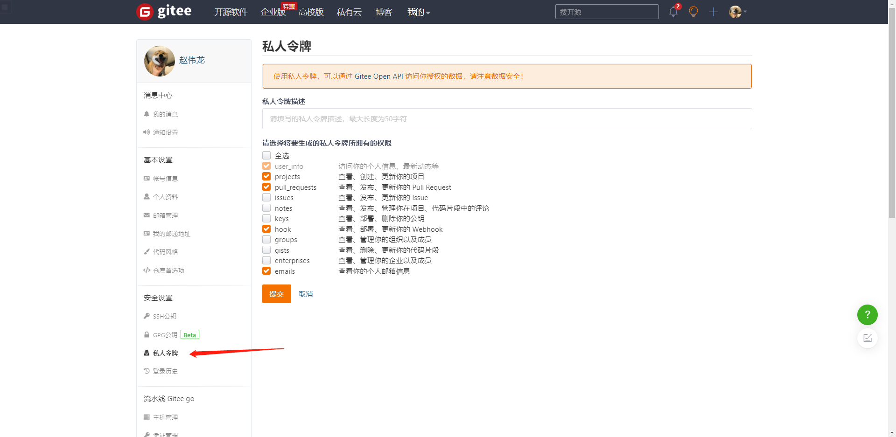

# Jenkins

项目地址:<https://github.com/zhaoweilong007/spring-boot-matrix/tree/main/docker>

下面演示使用Jenkins+docker+jib实现项目自动化构建部署并运行

准备环境：
- Jdk11
- gradle7.4.2
- docker20.10.14

## 部署jenkins

```shell
docker run -itd  -p 8080:8080 -p 50000:50000 -u root --name jenkins -v /home/zhaoweilong/jenkins_home:/var/jenkins_home -v /usr/bin/docker:/usr/bin/docker -v /var/run/docker.sock:/var/run/docker.sock jenkins/jenkins:lts
```

> 镜像为jenkins/jenkins:lts的长期支持版
>
> 修改下挂载目录，修改成你自己的，我自己是`/home/zhaoweilong/jenkins_home`
>
> `-u root` 以root用户执行，防止执行pipeline脚本时没有权限
>
> `-v /usr/bin/docker:/usr/bin/docker -v /var/run/docker.sock:/var/run/docker.sock`
> 将宿主机的docker命令映射到容器，这样就可以在容器中执行宿主机的docker命令
>
> 注意:镜像Jenkins使用的jdk版本为jdk11


查看Jenkins日志

```shell
docker logs -f jenkins
```

可以看到jenkins的初始化密码，复制下等下要用到

打开浏览器<http://localhost:8080>，可以看到Jenkins的启动页面正在初始化

然后选择推荐插件，设置用户名密码，进行到jenkins的页面


## 创建Springboot项目

使用gradle创建一个springboot项目

jib插件配置

```groovy
plugins {
    id 'com.google.cloud.tools.jib' version '3.2.1'
}

ext {
    //阿里云仓库地址
    set('registryUrl', "registry.cn-hangzhou.aliyuncs.com")
    //阿里云仓库名
    set('registryNamespace', "my_docker_dev")
    //阿里云仓库用户名及密码
    set('registryUsername', "冬天从不穿秋裤")
    set('registryPassword', "*******")
}
//写法一，读取全局的gradle.properties配置或者通过命令行参数-Pdocker_repo_username= 传递
def dockerUserName = project.properties['docker_repo_username']
def dockerPassWord = project.properties['docker_repo_password']

if (dockerUserName == null) {
    dockerUserName = "username"
}
if (dockerPassWord == null) {
    dockerPassWord = "password"
}

//写法二，通过命令行参数-Pdocker_repo_username= 传递
//def dockerUserName = project.findProperty('docker_repo_username')
//def dockerPassWord = project.findProperty("docker_repo_password")

// 使用jib插件自动构建镜像并上传到阿里云
jib {
    from {
        image = "adoptopenjdk/openjdk11:latest"
    }

    //推送的目标镜像仓库地址
    to {
        image = "${registryUrl}/${registryNamespace}/${project.name}"
        //镜像tag
        tags = ["latest", "${project.version}".toString()]
        //身份认证信息
        auth {
            username = dockerUserName
            password = dockerPassWord
        }
    }
    //镜像容器的配置信息
    container {
        /**
         * 设置jvm的启动参数
         * user.timezone - 解决Java程序的时区问题
         */
        jvmFlags = ['-Duser.timezone=Asia/Shanghai']
        mainClass = "com.zwl.springbootdocker.SpringbootDockerApplication"
        ports = ['8888']
    }
}


dependencies {
    implementation('org.springframework.boot:spring-boot-starter-web')
    testImplementation("org.springframework.boot:spring-boot-starter-test")
}

//打印docker 配置
task("dockerConfig") {
    doLast {
        println dockerUserName
        println dockerPassWord
    }
}
```

配置说明：

- `docker_repo_username`和`docker_repo_password`可以从启动参数读取
- `mainClass`修改为自己的启动类
- `ports` 修改为自己的端口

我这里使用的是jdk11，各位可以改成自己的jdk版本

```groovy
    from {
    image = "adoptopenjdk/openjdk11:latest"
}
```

最后修改docker仓库,我使用的是阿里云仓库

```groovy
ext {
    //阿里云仓库地址
    set('registryUrl', "registry.cn-hangzhou.aliyuncs.com")
    //阿里云仓库名
    set('registryNamespace', "my_docker_dev")
    //阿里云仓库用户名及密码
    set('registryUsername', "冬天从不穿秋裤")
    set('registryPassword', "*******")
}
```

执行命令构建上传镜像

```shell
./gradlew -Pdocker_repo_username=youname  -Pdocker_repo_password=youpassword jib
```

输出build success代表成功了，可以在自己阿里云的docker仓库查看

## 配置pipeline

这里git仓库使用gitee仓库进行演示,配置下gitee的webhook实现自动推送构建

在【插件管理】中安装gitee插件

在【系统管理】->【系统配置】->【Gitee 配置】项中配置


将下面生成的token填入上面的secret中


### 新建流水线任务


git仓库都要改成自己的刚刚创建的，推送到gitee上，如果是私有的就配置凭证

**Gitee WebHook 密码**点击生成后需要在gitee配置webhook


## 配置Jenkinsfile

在springboot的项目的根目录下新建`Jenkinsfile`文件

jenkinsfile文件示例

```
pipeline {
    agent any
    environment{
        DOCKER_REGISTER = 'registry.cn-hangzhou.aliyuncs.com'
        REGISTRY_NAMESPACE='my_docker_dev'
        IMAGE_NAME='docker'
    }
    stages{
      // 可以手动构建也可以配置自动构建，手动构建选择
      // stage('Source') {
      //      steps{
      //      git branch: 'main', url: 'https://gitee.com/zhao_weilong/spring-boot-matrix.git'
      //      }
      // }

        stage('Build') {
            steps {
                 sh './gradlew clean generateProto'
                 sh './gradlew build -x test'
            }
        }
        stage('Publish-release') {
        environment {
                               BITBUCKET_COMMON_CREDS = credentials('publisherID')
                           }
           steps {
                    sh './gradlew -Pdocker_repo_username=$BITBUCKET_COMMON_CREDS_USR  -Pdocker_repo_password=$BITBUCKET_COMMON_CREDS_PSW jib'
           }
        }
         stage("docker-run"){
                steps{
                      sh 'docker pull ${DOCKER_REGISTER}/${REGISTRY_NAMESPACE}/${IMAGE_NAME}:latest'
                      sh 'if test ! -z "$(docker ps -aq -f name=${IMAGE_NAME})";then \
                            echo "容器存在,停止并删除容器;" \
                            docker stop ${IMAGE_NAME};\
                            docker rm -f ${IMAGE_NAME};\
                            docker run -d -p 8888:8888 --name ${IMAGE_NAME} ${DOCKER_REGISTER}/${REGISTRY_NAMESPACE}/${IMAGE_NAME}:latest;\
                            fi'
                }
         }

        }
}
```

jenkinsfile语法查看官方文档说明，注意以下几点

```shell
        stage('Build') {
            steps {
                 sh './gradlew clean generateProto'
                 sh './gradlew build -x test'
            }
        }
```

这里的`sh './gradlew clean generateProto'`你们可以不要，这是我执行proto文件的插件，你们只需要执行build就行

```
stage('Publish-release') {
environment {
                       BITBUCKET_COMMON_CREDS = credentials('publisherID')
                   }
   steps {
            sh './gradlew -Pdocker_repo_username=$BITBUCKET_COMMON_CREDS_USR  -Pdocker_repo_password=$BITBUCKET_COMMON_CREDS_PSW jib'
   }
}
```

上面是执行jib推送镜像的操作步骤，其中`publisherID`是我jenkins配置全局凭证ID，需要自己在后台配置，选择username and password类型的凭证，用户名密码就对应docker仓库的

```
 stage("docker-run"){
        steps{
              sh 'docker pull ${DOCKER_REGISTER}/${REGISTRY_NAMESPACE}/${IMAGE_NAME}:latest'
              sh 'if test ! -z "$(docker ps -aq -f name=${IMAGE_NAME})";then \
                    echo "容器存在,停止并删除容器;" \
                    docker stop ${IMAGE_NAME};\
                    docker rm -f ${IMAGE_NAME};\
                    docker run -d -p 8888:8888 --name ${IMAGE_NAME} ${DOCKER_REGISTER}/${REGISTRY_NAMESPACE}/${IMAGE_NAME}:latest;\
                    fi'
        }
 }
```

这是运行docker容器的步骤，我的jenkins和应用是在同一个服务器所以执行就执行了。你们也可以使用ssh插件远程应用服务器执行脚本

其中`docker run -d -p 8888:8888 --name ${IMAGE_NAME} ${DOCKER_REGISTER}/${REGISTRY_NAMESPACE}/${IMAGE_NAME}:latest`
可以修改成自己的启动命令

环境变量定义在文件开始，可自行修改成自己的

```
    environment{
        //docker仓库地址
        DOCKER_REGISTER = 'registry.cn-hangzhou.aliyuncs.com'
        //docker namespace
        REGISTRY_NAMESPACE='my_docker_dev'
        //镜像名称
        IMAGE_NAME='docker'
    }
```

在jenkins的任务中执行build，不出意外执行完可以看到成功了


童鞋你学会了嘛