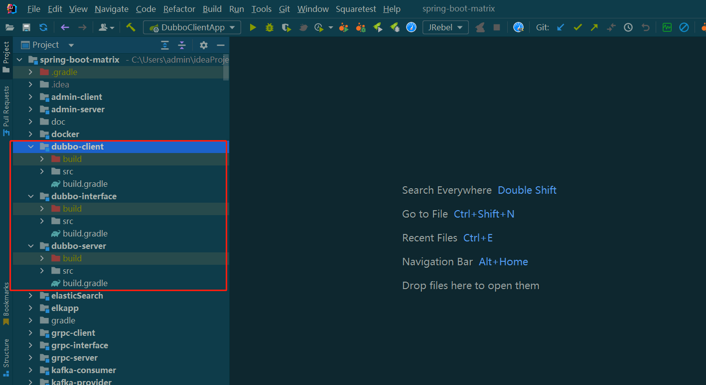
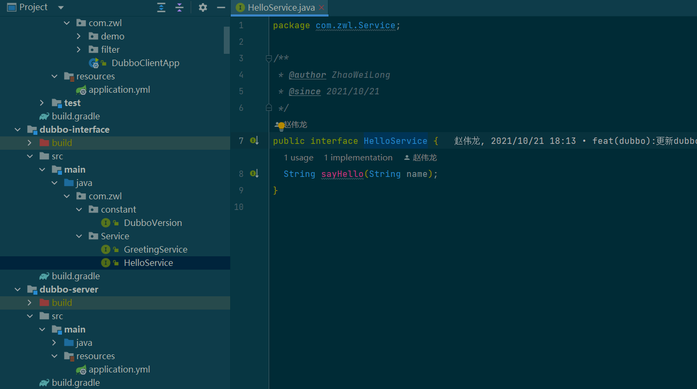
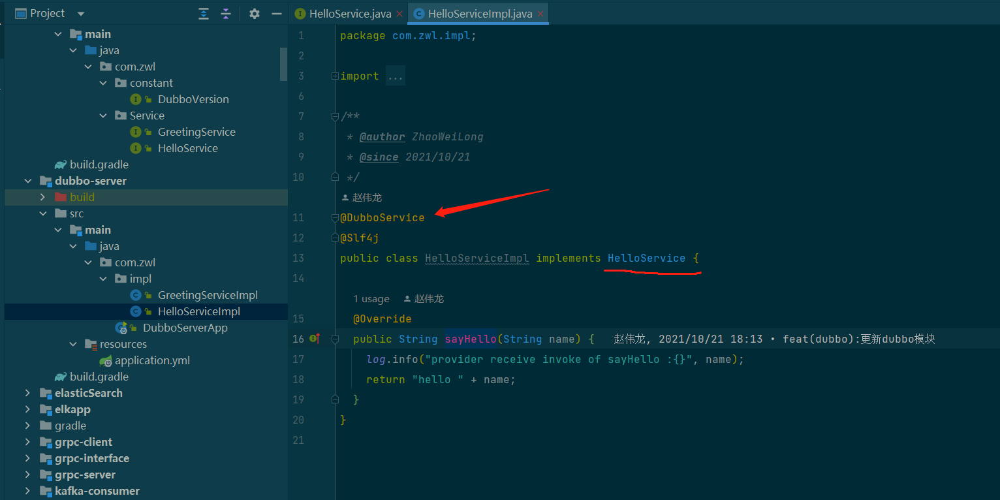
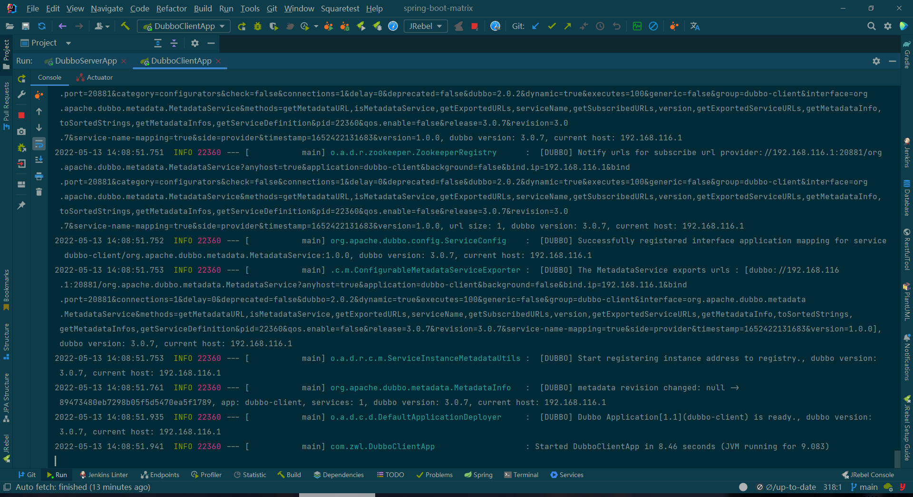
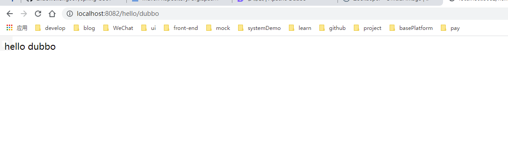

# Dubbo入门实践

> Apache Dubbo 是一款高性能、轻量级的开源服务框架
> Apache Dubbo 提供了六大核心能力：面向接口代理的高性能RPC调用，智能容错和负载均衡，服务自动注册和发现，高度可扩展能力，运行期流量调度，可视化的服务治理与运维。

下面使用dubbo+zookeeper实现rpc调用

**环境准备**

- Jdk11
- gradle7.4.2

由于项目依赖zookeeper组件，所以使用docker启动一个zookeeper服务

```shell
docker run -d -p 2181:2181 --name zookeeper zookeeper:latest
```

本github项目地址:<https://github.com/zhaoweilong007/spring-boot-matrix>

## 创建springboot项目

我这里创建了多模块项目。dubbo-client,dubbo-interface,dubbo-server



dubbo-interface为接口模块，包含相同依赖

```groovy
tasks.bootJar { enabled = false }
tasks.jar { enabled = true }


dependencies {
    api('org.apache.dubbo:dubbo-dependencies-zookeeper:3.0.7') {
        exclude group: 'log4j', module: 'log4j'
    }
    api('org.apache.dubbo:dubbo-spring-boot-starter') {
        exclude group: 'log4j', module: 'log4j'
    }
    api('org.apache.curator:curator-x-discovery:5.2.1') {
        exclude group: 'log4j', module: 'log4j'
    }
    api 'org.springframework.boot:spring-boot-starter-web'
}
```

`dubbo-dependencies-zookeeper` dubbo与zookeeper的依赖

`dubbo-spring-boot-starter` dubbo与springboot集成的依赖

`curator-x-discovery` 服务发现的依赖

异常三个依赖都排除了log4j的依赖，或者启动的时候会出现错误日志

dubbo-server依赖配置

```groovy
dependencies {
    implementation(project(":dubbo-interface"))
}
```

application.yml配置,需要配置zookeeper地址，使用的协议、端口等

```yaml
spring:
  application:
    name: dubbo-server
server:
  port: 8083
dubbo:
  application:
    name: ${spring.application.name}
  registry:
    address: zookeeper://${zookeeper.address:127.0.0.1}:2181
    simplified: true
  protocol:
    name: dubbo
    port: 20880
  provider:
    timeout: 1000
    token: true
```

dubbo-client依赖配置，跟上面类似

```groovy
dependencies {
    implementation(project(":dubbo-interface"))
    testImplementation("org.springframework.boot:spring-boot-starter-test")
}
```

application.yml配置,跟上面类似，主要协议、端口要跟服务提供者一致

```yaml
spring:
  application:
    name: dubbo-client
server:
  port: 8082
dubbo:
  registry:
    address: zookeeper://${zookeeper.address:127.0.0.1}:2181
  application:
    name: dubbo-client
  consumer:
    timeout: 1000
  protocol:
    name: dubbo
    port: 20880
```

在dubbo-client和dubbo-server的启动类都加上`@EnableDubbo`注解，开启dubbo服务

在duboo-interface新建接口



由dubbo-server实现该接口,注意实现类需要加上`@DubboService`注解，注入dubbo服务



在dubbo-client中增加一个controller类

使用`@DubboReference`注解引入dubbo服务

```java
/**
 * @author ZhaoWeiLong
 * @since 2021/10/21
 */
@RestController
@Slf4j
public class HelloController {

    @DubboReference
    private HelloService helloService;

    @DubboReference(
            interfaceClass = GreetingService.class,
            version = DubboVersion.VERSION,
            timeout = 3000)
    private GreetingService greetingService;

    @GetMapping("/hello/{name}")
    public String sayHello(@PathVariable("name") String name) {
        return helloService.sayHello(name);
    }

    @GetMapping("/greet/{name}")
    public String greeting(@PathVariable("name") String name) {
        return greetingService.greeting(name);
    }

    @GetMapping("/replyGreet/{name}")
    public String replyGreet(@PathVariable("name") String name) {
        return greetingService.replyGreeting(name);
    }

    @GetMapping("/completedFuture/{name}")
    public String completedFuture(@PathVariable("name") String name) throws Exception {
        CompletableFuture<String> future = greetingService.greeting(name, new byte[]{});
        return future.get();
    }
}

```

分别启动dubbo-server、dubbo-client服务，控制台正常输出dubbo的注册信息了



访问dubbo-client接口，dubbo调用成功



目前dubbo最新版本为dubbo3，新的Triple 协议，是对grpc协议的一个扩展，完全兼容GRPC，还不不了解grpc，快去看我的grpc实践教程吧，基于hTTP2协议+Protobuf序列化的构建的RPC

到此为止，一个基本的dubbo的服务就搭建完成了，除此之外，dubbo还有其他的特性，可以在[dubbo官网](https://dubbo.apache.org/zh/)查看详细文档