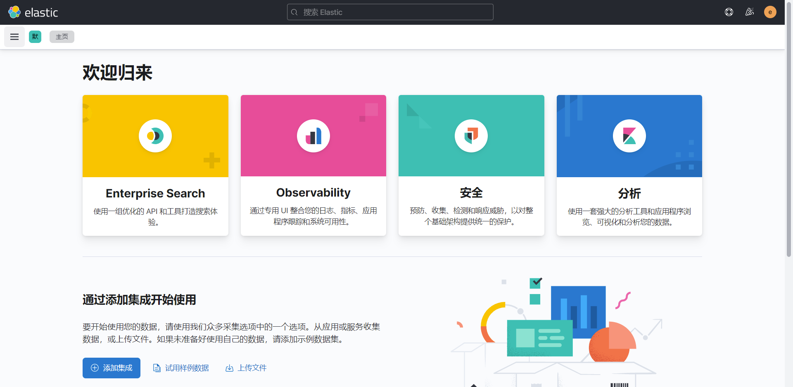
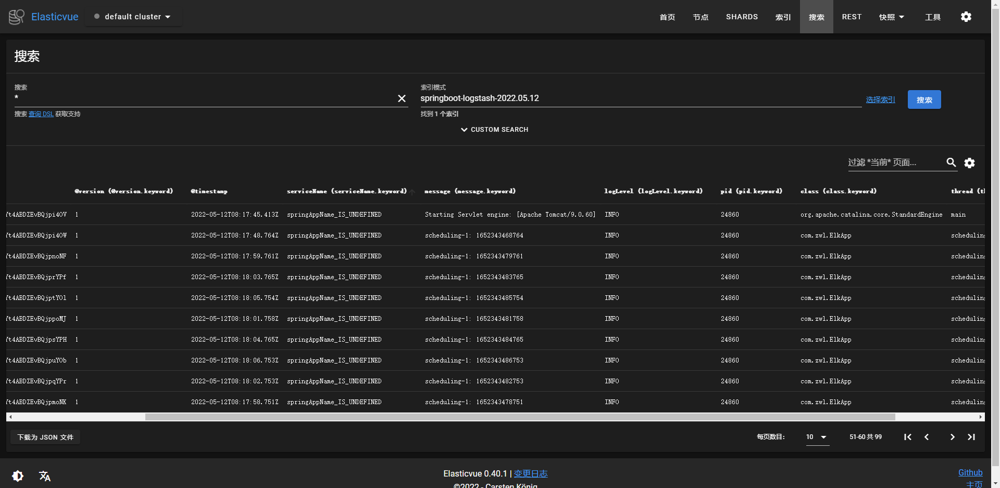
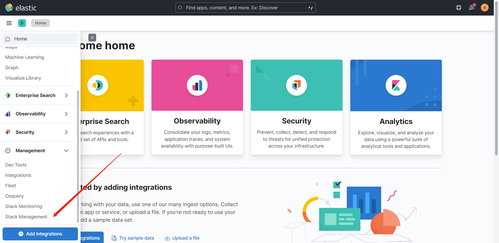
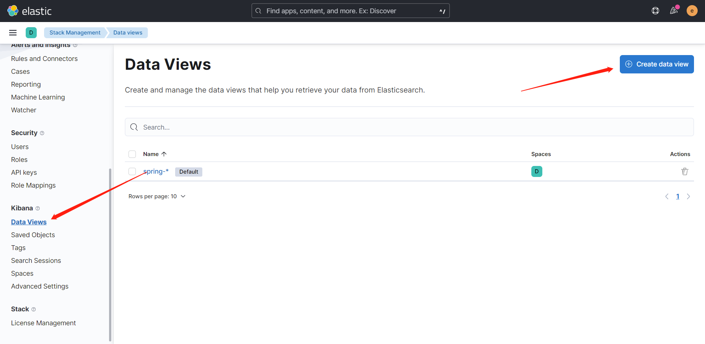
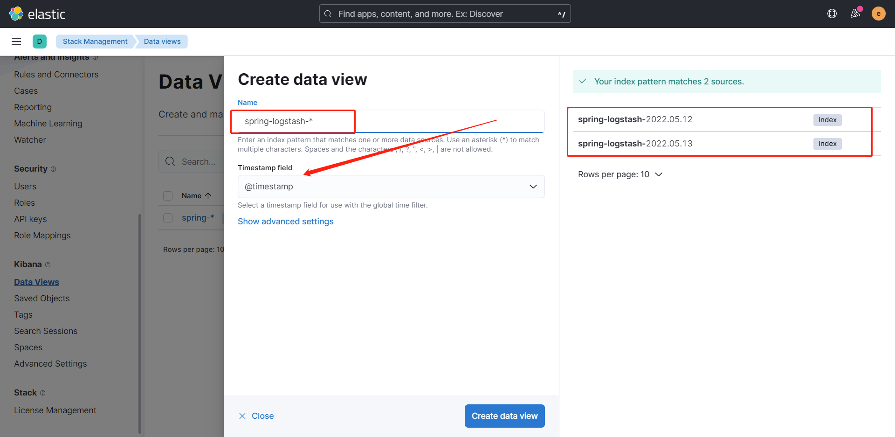
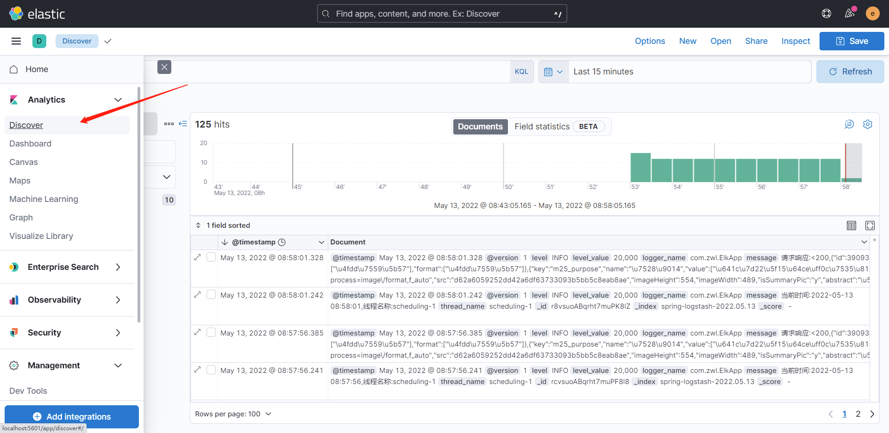

# ELK实践

github项目地址：<https://github.com/zhaoweilong007/spring-boot-matrix/tree/main/elkapp>

> “ELK” 是三个开源项目的首字母缩写，这三个项目分别是：Elasticsearch、Logstash 和 Kibana。用来储存日志，分析日志，展示日志。

- Elasticsearch 是一个搜索和分析引擎.
- Logstash 是服务器端数据处理管道，能够同时从多个来源采集数据，转换数据，然后将数据发送到诸如 Elasticsearch 等“存储库”中。
- Kibana 则可以让用户在 Elasticsearch 中使用图形和图表对数据进行可视化。
- Beats,轻量型数据采集器 ：Beats 平台集合了多种单一用途数据采集器。它们从成百上千或成千上万台机器和系统向 Logstash 或 Elasticsearch 发送数据。

> ELK现在又叫做**`Elastic Stack`**,下面演示使用docker部署ELK，使用logstash收集Springboot日志，并在Kibana进行展示

## docker部署

使用docker-compose部署

使用[docker-elk](<https://github.com/deviantony/docker-elk>)项目部署，已经帮我们写好了脚本了，拿来即用

克隆项目

```shell
git clone https://github.com/deviantony/docker-elk.git
```

修改logstash的logstash.conf文件配置

```
input {
	beats {
		port => 5044
	}

	tcp {
	    mode => "server"
		port => 5000
		codec => json_lines
	}
}

## Add your filters / logstash plugins configuration here

output {
	elasticsearch {
		hosts => "elasticsearch:9200"
		user => "elastic"
		password => "${LOGSTASH_INTERNAL_PASSWORD}"
		index => "spring-logstash-%{+YYYY.MM.dd}"
	}
}

```

input是logstash的输入，默认有beats，增加了tcp输入配置，通过tcp连接收集日志

output输出到elasticsearch中，其中输出到index索引为spring-logstash-开头就是存放日志的

在项目目录下启动运行

```shell
docker-compose up
```

正常包含了kibana、elasticsearch、logstash三个组件，extensions下包含扩展组件可以自行启动

如filebeat

```shell
docker-compose -f docker-compose.yml -f /extensions/filebeat/filebeat-compose.yml up
```

访问kibana:<http://localhost:5601>，默认用户elastic，密码在setup文件中.env文件配置的密码，默认是change，可自行更改

kibana首页


如果不是中文，可以更改kibana的配置文件

kibana/config//kibana.yml加入

```shell
i18n.locale: "zh-CN"
```

到这里elk基本部署完成，更多可以参考<https://github.com/deviantony/docker-elk>文档说明

## 收集springboot日志

### 项目配置

使用logstash收集springboot日志到elasticSearch中

新建springboot项目，加入以下依赖

```groovy
dependencies {
    implementation('org.springframework.boot:spring-boot-starter-web')
    implementation 'net.logstash.logback:logstash-logback-encoder:7.1.1'
}
```

这是主要使用logstash-logback-encoder来进行集成logstash，项目地址:<https://github.com/logfellow/logstash-logback-encoder#tcp-appenders>

resources下新增logback-spring.xml配置文件,destination修改成自己地址

```xml
<?xml version="1.0" encoding="UTF-8"?>
<configuration>
    <include resource="org/springframework/boot/logging/logback/base.xml"/>
    <appender name="stash" class="net.logstash.logback.appender.LogstashTcpSocketAppender">
        <destination>192.168.2.56:5000</destination>
        <!-- encoder is required -->
        <!-- 日志输出编码 -->
        <encoder charset="UTF-8"
                 class="net.logstash.logback.encoder.LoggingEventCompositeJsonEncoder">
            <providers>
                <timestamp>
                    <timeZone>GMT+8</timeZone>
                </timestamp>
                <pattern>
                    <pattern>
                        {
                        "logLevel": "%level",
                        "serviceName": "${springAppName:-}",
                        "pid": "${PID:-}",
                        "thread": "%thread",
                        "class": "%logger{40}",
                        "message": "%message"
                        }
                    </pattern>
                </pattern>
            </providers>
        </encoder>
    </appender>
    <root level="INFO">
        <appender-ref ref="stash"/>
        <appender-ref ref="CONSOLE"/>
    </root>
</configuration>
```

LogstashTcpSocketAppender就是tcp的方式

我再springboot增加了一个定时输出日志的任务

```java

@SpringBootApplication
@Slf4j
@EnableScheduling
public class ElkApp {
    public static void main(String[] args) {
        SpringApplication.run(ElkApp.class, args);
    }

    @Scheduled(fixedRate = 1000)
    public void test() {
        log.info(Thread.currentThread().getName() + ": " + System.currentTimeMillis());
    }
}
```

启动应用，没有异常就代表启动正常了，如果提示连接失败，自己检查下IP端口配置有没有问题

在resource下我还新建了一个logback-access.xml用于收集事件日志，但是好像没生效，感兴趣的可以自己尝试下

chrome使用Elasticsearch-Head插件可以连接到es中，可以看到有一个spring-logstash-xxxx.xx.xx的索引，就是我们前面配置的索引名称

也可以安装`Elasticvue`插件查看



### kibana数据展示

打开kibana，找到以下问题



新增一个数据试图



配置匹配规则。如`spring-logstash-*`,匹配所有以spring-logstash开头的索引



在discovery面板配置，可以展示数据，也可以自己配置数据面板




> 到这里ELK收集Springboot日志就完成了，你学废了嘛，不理解的地方建议大家多看官方文档，或者是官方文档的翻译版，我使用的ELK版本为当时最新的8.2.0版本