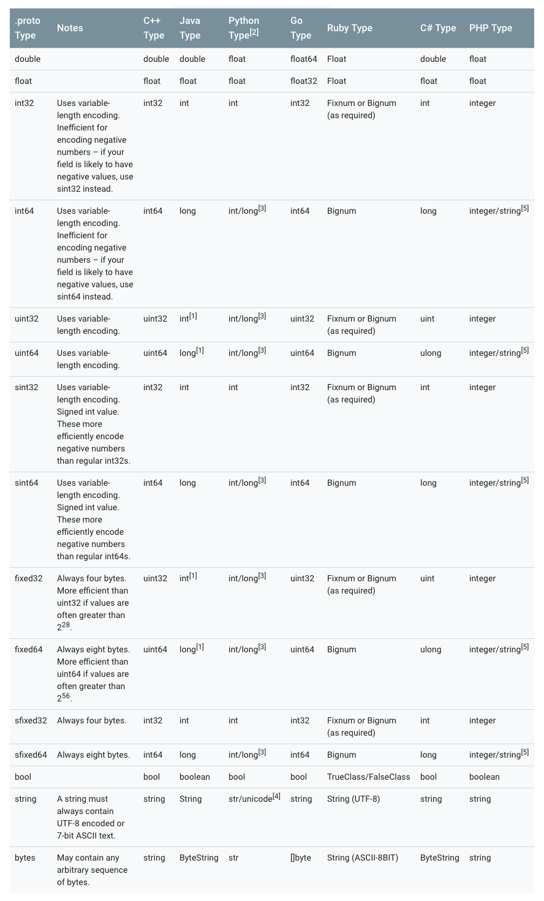
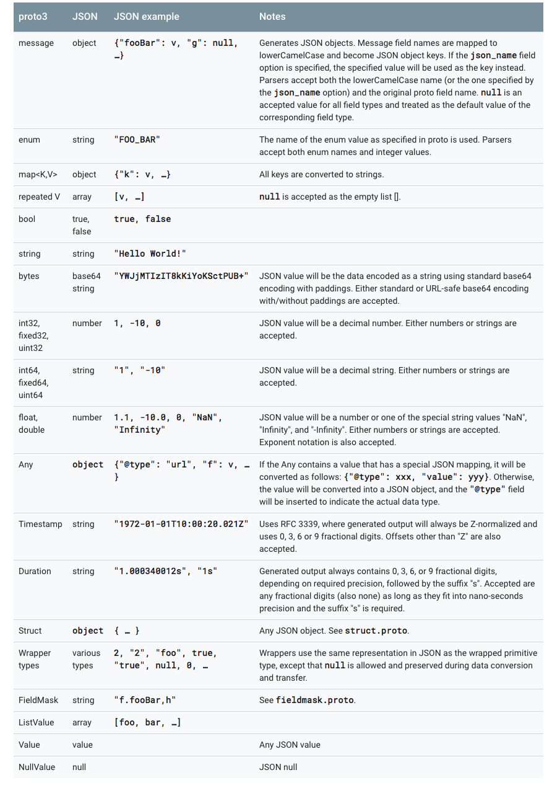
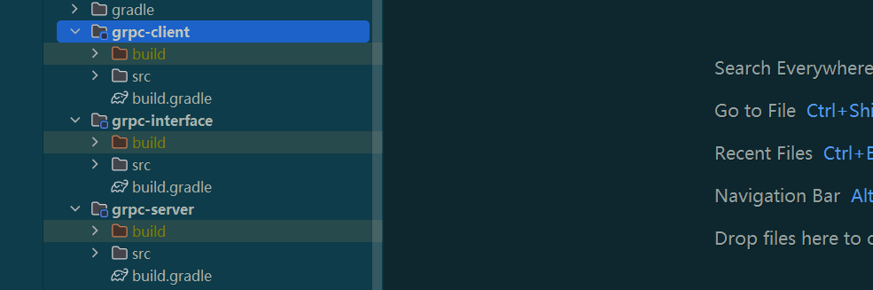
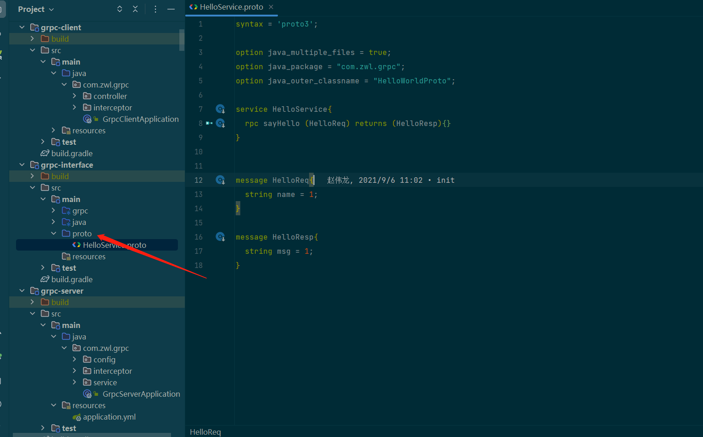
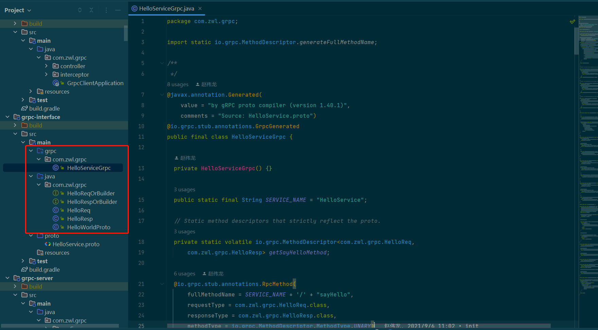
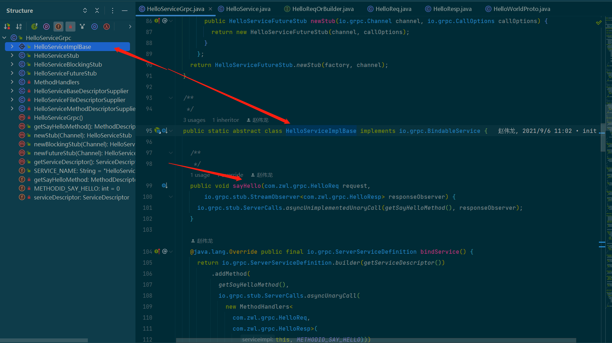
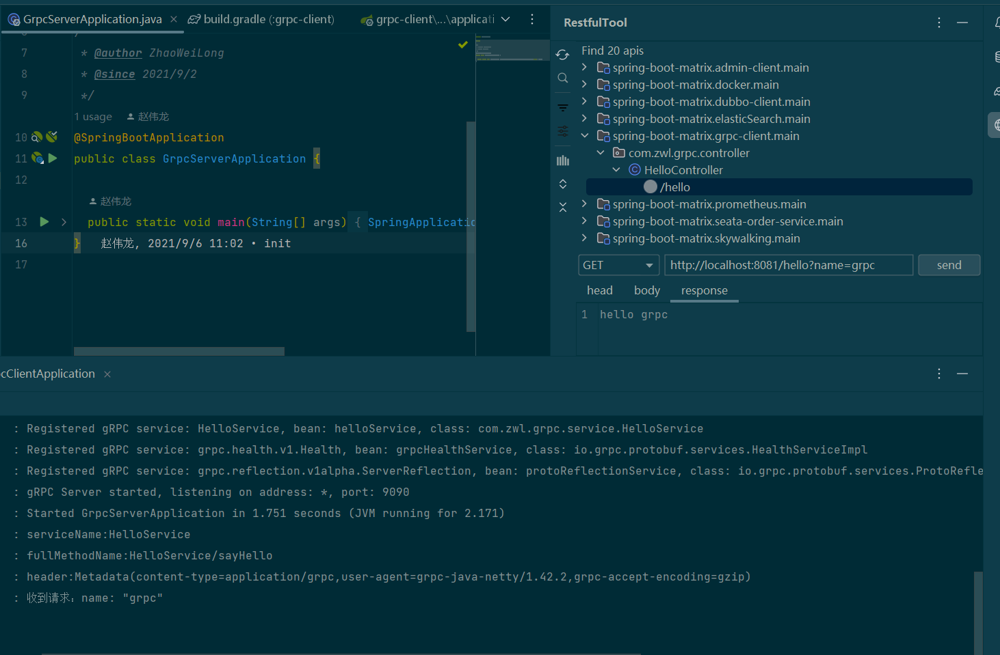

<!-- START doctoc generated TOC please keep comment here to allow auto update -->
<!-- DON'T EDIT THIS SECTION, INSTEAD RE-RUN doctoc TO UPDATE -->
**Table of Contents**  *generated with [DocToc](https://github.com/thlorenz/doctoc)*

- [grpc入门实践](#grpc%E5%85%A5%E9%97%A8%E5%AE%9E%E8%B7%B5)
  - [grpc介绍](#grpc%E4%BB%8B%E7%BB%8D)
  - [protoBuffer](#protobuffer)
    - [安装protoBuffer工具](#%E5%AE%89%E8%A3%85protobuffer%E5%B7%A5%E5%85%B7)
    - [protoBuffer数据格式](#protobuffer%E6%95%B0%E6%8D%AE%E6%A0%BC%E5%BC%8F)
    - [字段编码](#%E5%AD%97%E6%AE%B5%E7%BC%96%E7%A0%81)
    - [保留字段](#%E4%BF%9D%E7%95%99%E5%AD%97%E6%AE%B5)
    - [枚举](#%E6%9E%9A%E4%B8%BE)
    - [JSON Mapping](#json-mapping)
    - [嵌套](#%E5%B5%8C%E5%A5%97)
    - [扩展](#%E6%89%A9%E5%B1%95)
    - [option](#option)
    - [定义Services](#%E5%AE%9A%E4%B9%89services)
      - [一元rpc](#%E4%B8%80%E5%85%83rpc)
      - [服务端流式rpc](#%E6%9C%8D%E5%8A%A1%E7%AB%AF%E6%B5%81%E5%BC%8Frpc)
      - [客户端流式rpc](#%E5%AE%A2%E6%88%B7%E7%AB%AF%E6%B5%81%E5%BC%8Frpc)
      - [双向流式rpc](#%E5%8F%8C%E5%90%91%E6%B5%81%E5%BC%8Frpc)
  - [整合springboot](#%E6%95%B4%E5%90%88springboot)
    - [grpc-interface](#grpc-interface)
    - [grpc-server](#grpc-server)
    - [grpc-client](#grpc-client)
  - [相关资料](#%E7%9B%B8%E5%85%B3%E8%B5%84%E6%96%99)

<!-- END doctoc generated TOC please keep comment here to allow auto update -->

# grpc入门实践


项目地址:<https://github.com/zhaoweilong007/spring-boot-matrix/tree/main/grpc-interface>

## grpc介绍

> 一个高性能、开源的通用 RPC 框架
> gRPC 是一个现代开源的高性能远程过程调用 (RPC)框架
> 可以在任何环境中运行。它可以通过对负载平衡、跟踪、健康检查和身份验证的可插拔支持有效地连接数据中心内和跨数据中心的服务。它也适用于分布式计算的最后一英里，将设备、移动应用程序和浏览器连接到后端服务。


grpc是基于http2协议和protoBuffer序列化的一种RPC框架，通过protoBuffer定义服务，生成服务调用代码，支持多语言使用

## protoBuffer

> gRPC 默认使用 protocol buffers，这是 Google 开源的一套成熟的结构数据序列化机制（当然也可以使用其他数据格式如
> JSON）。体积比json小，传输快

### 安装protoBuffer工具

- windows使用scoop安装

```shell
scoop install protobuf
```

安装成功可以使用`protoc`命令

可以通过protoc生成对应的代码文件

```shell
protoc --proto_path=IMPORT_PATH --cpp_out=DST_DIR --java_out=DST_DIR --python_out=DST_DIR path/to/file.proto
```

IMPORT_PATH声明了一个.proto文件所在的具体目录。如果忽略该值，则使用当前目录。如果有多个目录则可以 对--proto_path
写多次，它们将会顺序的被访问并执行导入。-I=IMPORT_PATH是它的简化形式

### protoBuffer数据格式

目前 protocol buffers 最新版本是 proto3，与老的版本 proto2 还是有些区别的。这两个版本的 API 不完全兼容

通过`.proto`文件后缀来区分文件类型，在 proto 中，所有结构化的数据都被称为 message。

```protobuf

syntax = "proto3";

message helloWorld{
  string name = 1;
  optional int32 age = 2;
  repeated string friends = 3 ;
  map<string, helloWorld> map_friends = 4;
  oneof ext{
    string desc = 5;
    int32 msgId = 6;
  };
}
```

`syntax = "proto3"` 表示使用proto3语法，如果不声明，默认使用proto2语法格式

`message helloWorld{}` 用于定义一个名称为helloWorld的消息体，一个proto文件中可以包含多个消息体

`string name = 1` 定义一个name的String的字段，字段编号等于1，其他同理

`optional` 标记这个字段为可选的，可以设置默认值，如果没有设置，则使用默认值

`repeated` 表示数组，可以有多个值

`map<string, helloWorld> map_friends = 4` 表示一个map，key是string，value是helloWorld类型

`oneof ext{}`。如果你的消息中有很多可选字段， 并且同时至多一个字段会被设置

**protobuf数据类型对应如下：**



### 字段编码

每个消息定义中的每个字段都有唯一的编号。这些字段编号用于标识消息二进制格式中的字段，并且在使用消息类型后不应更改。请注意，范围
1 到 15 中的字段编号需要一个字节进行编码，包括字段编号和字段类型（具体原因见 Protocol Buffer 编码原理 这一章节）。范围 16 至
2047 中的字段编号需要两个字节。所以你应该保留数字 1 到 15 作为非常频繁出现的消息元素。请记住为将来可能添加的频繁出现的元素留出一些空间

### 保留字段

如果您通过完全删除某个字段或将其注释掉来更新消息类型，那么未来的用户可以在对该类型进行自己的更新时重新使用该字段号。如果稍后加载到了的旧版本
.proto 文件，则会导致服务器出现严重问题，例如数据混乱，隐私错误等等。确保这种情况不会发生的一种方法是指定删除字段的字段编号（或名称，这也可能会导致
JSON 序列化问题）为 reserved。如果将来的任何用户试图使用这些字段标识符，Protocol Buffers 编译器将会报错。

```protobuf
message Foo {
  reserved 2, 15, 9 to 11;
  reserved "foo", "bar";
}
```

### 枚举

在 message 中可以嵌入枚举类型。

```protobuf
syntax = "proto3";
message SearchRequest {
  string query = 1;
  int32 page_number = 2;
  int32 result_per_page = 3;
  enum Corpus {
    UNIVERSAL = 0;
    WEB = 1;
    IMAGES = 2;
    LOCAL = 3;
    NEWS = 4;
    PRODUCTS = 5;
    VIDEO = 6;
  }
  Corpus corpus = 4;
}
```

枚举类型需要注意的是，一定要有 0 值。

- 枚举为 0 的是作为零值，当不赋值的时候，就会是零值。
- 为了和 proto2 兼容。在 proto2 中，零值必须是第一个值。

### JSON Mapping



### 嵌套

“组”是指在消息定义中嵌套信息的另一种方法。比如，在SearchResponse中包含若干Result的另一种方法是 ：

```protobuf
message SearchResponse {
  repeated group Result = 1 {
    required string url = 2;
    optional string title = 3;
    repeated string snippets = 4;
  }
}
```

也可以使用多层嵌套

```protobuf
message Outer {// Level 0
  message MiddleAA {// Level 1
    message Inner {// Level 2
      required int64 ival = 1;
      optional bool  booly = 2;
    }
  }
  message MiddleBB {// Level 1
    message Inner {// Level 2
      required int32 ival = 1;
      optional bool  booly = 2;
    }
  }
}
```

### 扩展

通过扩展，可以将一个范围内的字段标识号声明为可被第三方扩展所用。然后，其他人就可以在他们自己的.proto文件中为该消息类型声明新的字段，而不必去编辑原始文件了。看个具体例子：

```protobuf
message Foo {
  // ...
  extensions 100 to 199;
}
```

在消息Foo中，范围[100,199]之内的字段标识号被保留为扩展用。现在，其他人就可以在他们自己的.proto文件中添加新字段到Foo里了，但是添加的字段标识号要在指定的范围内——例如

```
extend Foo {
  optional int32 bar = 126;
}
```

### option

在定义.proto文件时能够标注一系列的options。Options并不改变整个文件声明的含义，但却能够影响特定环境下处理方式。完整的可用选项可以在google/protobuf/descriptor.proto找到。

- java_package 这个选项表明生成java类所在的包
- java_outer_classname 该选项表明想要生成Java类的名称。如果在.proto文件中没有明确的java_outer_classname定义，生成的class名称将会根据.proto文件的名称采用驼峰式的命名方式进行生成
- optimize_for 可以被设置为 SPEED, CODE_SIZE,or LITE_RUNTIME。这些值将通过如下的方式影响C++及java代码的生成：
- packed (field option) 如果该选项在一个整型基本类型上被设置为真，则采用更紧凑的编码方式
- deprecated (field option) 如果该选项被设置为true，表明该字段已经被弃用了，在新代码中不建议使用。在多数语言中，这并没有实际的含义。在java中，它将会变成一个
  @Deprecated注释

### 定义Services

如果要使用 RPC（远程过程调用）系统的消息类型，可以在 .proto 文件中定义 RPC 服务接口，protocol buffer 编译器将使用所选语言生成服务接口代码和
stubs

支持四种通信方式

#### 一元rpc

客户端向服务器发送单个请求并获得单个响应,就像正常的函数调用一样

```protobuf
service FooService {
  rpc Bar(BarRequest) returns (BarResponse) {}
}
```

#### 服务端流式rpc

服务器流式 RPC，其中客户端向服务器发送请求并获取流以读回一系列消息。客户端从返回的流中读取，直到没有更多消息为止。gRPC 保证单个
RPC 调用中的消息顺序。

```protobuf
service FooService {
  rpc Bar(BarRequest) returns (stream BarResponse) {}
}
```

#### 客户端流式rpc

客户端流式 RPC，其中客户端写入一系列消息并将它们发送到服务器，再次使用提供的流。一旦客户端完成了消息的写入，它就会等待服务器读取它们并返回它的响应。gRPC
再次保证了单个 RPC 调用中的消息顺序。

```protobuf
service FooService {
  rpc Bar(stream BarRequest) returns (BarResponse) {}
}
```

#### 双向流式rpc

双向流式
RPC，双方使用读写流发送一系列消息。这两个流独立运行，因此客户端和服务器可以按照他们喜欢的任何顺序读取和写入：例如，服务器可以在写入响应之前等待接收所有客户端消息，或者它可以交替读取消息然后写入消息，或其他一些读取和写入的组合。保留每个流中消息的顺序。

```protobuf
service FooService {
  rpc Bar(stream BarRequest) returns (stream BarResponse) {}
}
```

## 整合springboot

项目环境：

- jDK8
- gradle7.4.2
- springboot2.7.0

创建三个模块

- grpc-interface grpc接口，用于生成grpc接口文件
- grpc-client grpc客户端
- grpc-server grpc服务端





### grpc-interface

模块中定义protoc文件，使用gradle的protobuf插件生成java代码

build.gradle配置

```
plugins {
    id 'com.google.protobuf' version '0.8.17'
}

tasks.bootJar { enabled = false }
tasks.jar { enabled = true }

ext {
    javaxAnnotationVersion = '1.3.2'
    grpcProtobufVersion = '1.40.1'
}

dependencies {
    implementation "javax.annotation:javax.annotation-api:${javaxAnnotationVersion}"
    implementation "io.grpc:grpc-protobuf:${grpcProtobufVersion}"
    implementation "io.grpc:grpc-stub:${grpcProtobufVersion}"
}

protobuf {
    protoc {
        artifact = "com.google.protobuf:protoc:3.17.3"
    }
    generatedFilesBaseDir = "$projectDir/src"
    clean {
        delete "$projectDir/src/main/java/com/zwl/grpc"
        delete "$projectDir/src/main/grpc"
    }
    plugins {
        grpc {
            artifact = 'io.grpc:protoc-gen-grpc-java:1.40.1'
        }
    }
    generateProtoTasks {
        all()*.plugins {
            grpc {

            }
        }
    }
}
```

protobuf的配置中：

- generatedFilesBaseDir指定代码生成的文件路径，为项目的src路径
- clean 会在每次生成执行清除任务，删除指定的文件夹
- generateProtoTasks 可以设置生成的proto文件的一些动作


proto文件存在的目录默认在src/main/protc文件夹下




上面定义了一个helloService的proto文件

- 定义了两个消息体HelloReq、HelloResp

- 定义了一个名为HelloService的grpc接口，包含一个一元的sayHello方法


执行命令生成代码

```shell
gradle generateProto
```

也可以在gradle的工具栏找到task,直接双击即可


生成后会在你配置中指定的文件下找到生成的代码



生成的`HelloServiceGrpc`类中就包含定义的grpc接口HelloService,可以看到是个抽象类，后续服务端需要实现此类





### grpc-server

grpc的服务模块


build.gradle依赖:

```
dependencies {
    implementation('net.devh:grpc-server-spring-boot-starter')
    implementation(project(":grpc-interface"))
    implementation('org.springframework.boot:spring-boot-starter-web')
}
```

主要使用了`grpc-server-spring-boot-starter`依赖进行自动装配，通过注解的方式进行注入，然后也引入了grpc-interface模块，这样就包含了grpc生成的java代码，可以共用


配置grpc服务

```java
@Configuration(proxyBeanMethods = false)
public class GrpcServerConfig {

  @Bean
  public GrpcServerConfigurer keepAliveServerConfiguration() {
    return serverBuilder -> {
      ((NettyServerBuilder) serverBuilder)
          .keepAliveTime(30, TimeUnit.SECONDS)
          .keepAliveTimeout(5, TimeUnit.SECONDS)
          .permitKeepAliveWithoutCalls(true);
    };
  }

  @Bean
  @Scope(
     scopeName = GrpcRequestScope.GRPC_REQUEST_SCOPE_NAME,
     proxyMode = ScopedProxyMode.TARGET_CLASS)
  public ScopedBean myScopedBean() {
   return new ScopedBean();
  }

  public static class ScopedBean {}
}
```

application.yml配置

```yaml
spring:
  application:
    name: local-grpc-server
server:
  port: 8080
  servlet:
    context-path: /grpc
grpc:
  server:
    port: 9090
    enable-keep-alive: true
    health-service-enabled: true
```

grpc配置以grpc.server开头


实现HelloService接口

```java

package com.zwl.grpc.service;

import com.zwl.grpc.HelloReq;
import com.zwl.grpc.HelloResp;
import com.zwl.grpc.HelloServiceGrpc;
import com.zwl.grpc.config.GrpcServerConfig.ScopedBean;
import io.grpc.stub.StreamObserver;
import lombok.extern.slf4j.Slf4j;
import net.devh.boot.grpc.server.service.GrpcService;
import org.springframework.beans.factory.annotation.Autowired;

/**
 * @author ZhaoWeiLong
 * @since 2021/9/6
 */
@GrpcService
@Slf4j
public class HelloService extends HelloServiceGrpc.HelloServiceImplBase {

  // grpc的上下文对象，适用于单个请求
  @Autowired ScopedBean scopedBean;

  @Override
  public void sayHello(HelloReq request, StreamObserver<HelloResp> responseObserver) {
    log.info("收到请求：{}", request);
    HelloResp resp = HelloResp.newBuilder().setMsg("hello " + request.getName()).build();
    responseObserver.onNext(resp);
    responseObserver.onCompleted();
  }
}

```

使用`@GrpcService`注解声明grpc服务，会自动注入spring中

sayHello方法有两个参数，request是我们在proto文件中定义的请求参数，responseObserver是请求响应对象，通过该对象向客户端发送请求


定义一个全局拦截器，记录日志

```java
package com.zwl.grpc.interceptor;

import io.grpc.Metadata;
import io.grpc.ServerCall;
import io.grpc.ServerCall.Listener;
import io.grpc.ServerCallHandler;
import io.grpc.ServerInterceptor;
import lombok.extern.slf4j.Slf4j;
import net.devh.boot.grpc.server.interceptor.GrpcGlobalServerInterceptor;

/**
 * @author ZhaoWeiLong
 * @since 2021/9/6
 */
@GrpcGlobalServerInterceptor
@Slf4j
public class LogInterceptor implements ServerInterceptor {

  @Override
  public <ReqT, RespT> Listener<ReqT> interceptCall(
      ServerCall<ReqT, RespT> call, Metadata headers, ServerCallHandler<ReqT, RespT> next) {
    log.info("serviceName:{}", call.getMethodDescriptor().getServiceName());
    log.info("fullMethodName:{}", call.getMethodDescriptor().getFullMethodName());
    log.info("header:{}", headers);
    return next.startCall(call, headers);
  }
}

```


启动服务


```
  .   ____          _            __ _ _
 /\\ / ___'_ __ _ _(_)_ __  __ _ \ \ \ \
( ( )\___ | '_ | '_| | '_ \/ _` | \ \ \ \
 \\/  ___)| |_)| | | | | || (_| |  ) ) ) )
  '  |____| .__|_| |_|_| |_\__, | / / / /
 =========|_|==============|___/=/_/_/_/
 :: Spring Boot ::                (v2.7.0)

2022-06-15 10:50:22.495  INFO 836620 --- [           main] com.zwl.grpc.GrpcServerApplication       : Starting GrpcServerApplication using Java 17.0.3 on DESKTOP-1L1P8PA with PID 836620 (C:\Users\admin\ideaProject\spring-boot-matrix\grpc-server\build\classes\java\main started by admin in C:\Users\admin\ideaProject\spring-boot-matrix)
2022-06-15 10:50:22.498  INFO 836620 --- [           main] com.zwl.grpc.GrpcServerApplication       : No active profile set, falling back to 1 default profile: "default"
2022-06-15 10:50:23.362  INFO 836620 --- [           main] o.s.b.w.embedded.tomcat.TomcatWebServer  : Tomcat initialized with port(s): 8080 (http)
2022-06-15 10:50:23.371  INFO 836620 --- [           main] o.apache.catalina.core.StandardService   : Starting service [Tomcat]
2022-06-15 10:50:23.371  INFO 836620 --- [           main] org.apache.catalina.core.StandardEngine  : Starting Servlet engine: [Apache Tomcat/9.0.63]
2022-06-15 10:50:23.460  INFO 836620 --- [           main] o.a.c.c.C.[Tomcat].[localhost].[/grpc]   : Initializing Spring embedded WebApplicationContext
2022-06-15 10:50:23.460  INFO 836620 --- [           main] w.s.c.ServletWebServerApplicationContext : Root WebApplicationContext: initialization completed in 900 ms
2022-06-15 10:50:23.746  INFO 836620 --- [           main] g.s.a.GrpcServerFactoryAutoConfiguration : Detected grpc-netty-shaded: Creating ShadedNettyGrpcServerFactory
2022-06-15 10:50:23.850  INFO 836620 --- [           main] o.s.b.w.embedded.tomcat.TomcatWebServer  : Tomcat started on port(s): 8080 (http) with context path '/grpc'
2022-06-15 10:50:23.891  INFO 836620 --- [           main] n.d.b.g.s.s.AbstractGrpcServerFactory    : Registered gRPC service: HelloService, bean: helloService, class: com.zwl.grpc.service.HelloService
2022-06-15 10:50:23.891  INFO 836620 --- [           main] n.d.b.g.s.s.AbstractGrpcServerFactory    : Registered gRPC service: grpc.health.v1.Health, bean: grpcHealthService, class: io.grpc.protobuf.services.HealthServiceImpl
2022-06-15 10:50:23.891  INFO 836620 --- [           main] n.d.b.g.s.s.AbstractGrpcServerFactory    : Registered gRPC service: grpc.reflection.v1alpha.ServerReflection, bean: protoReflectionService, class: io.grpc.protobuf.services.ProtoReflectionService
2022-06-15 10:50:24.037  INFO 836620 --- [           main] n.d.b.g.s.s.GrpcServerLifecycle          : gRPC Server started, listening on address: *, port: 9090
2022-06-15 10:50:24.046  INFO 836620 --- [           main] com.zwl.grpc.GrpcServerApplication       : Started GrpcServerApplication in 2.095 seconds (JVM running for 2.577)

```

通过日志可以看到rpc服务正常启动，监听端口9090


### grpc-client


build.gradle配置:

```
dependencies {
    implementation 'org.springframework.boot:spring-boot-starter-web'
    implementation 'net.devh:grpc-client-spring-boot-starter'
    implementation(project(":grpc-interface"))
}
```

跟grpc-server差不多，只不过这里的是`grpc-client-spring-boot-starter`客户端吧的依赖


application.yml:

```yaml
spring:
  application:
    name: local-grpc-client
server:
  port: 8081
grpc:
  client:
    local-grpc-server:
      address: 'static://127.0.0.1:9090'
      enableKeepAlive: true
      keepAliveWithoutCalls: true
      negotiationType: plaintext
    GLOBAL:
      enable-keep-alive: true
      keep-alive-without-calls: true
```

配置grpc服务器的地址相关配置，当然在微服务中，这些都不可能是写死的，grpc可以通过服务注册中心去动态配置。这里只做演示，就没有引入服务注册中心了


写一个controller接口调用：

```java
package com.zwl.grpc.controller;

import com.zwl.grpc.HelloReq;
import com.zwl.grpc.HelloResp;
import com.zwl.grpc.HelloServiceGrpc.HelloServiceBlockingStub;
import net.devh.boot.grpc.client.inject.GrpcClient;
import org.springframework.web.bind.annotation.RequestMapping;
import org.springframework.web.bind.annotation.RequestParam;
import org.springframework.web.bind.annotation.RestController;

/**
 * @author ZhaoWeiLong
 * @since 2021/9/6
 */
@RestController
public class HelloController {

  @GrpcClient("local-grpc-server")
  private HelloServiceBlockingStub helloServiceBlockingStub;

  @RequestMapping("/hello")
  public String each(@RequestParam("name") String name) {
    HelloResp helloResp =
        helloServiceBlockingStub.sayHello(HelloReq.newBuilder().setName(name).build());
    return helloResp.getMsg();
  }
}


```

`@GrpcClient`注解注入grpc服务，value的值就是配置文件中配置的服务名称


启动客户端，服务端没启动的情况可以正常启动，只有调用的时候会报连接异常

```
2022-06-15 11:01:29.224  INFO 843684 --- [           main] com.zwl.grpc.GrpcClientApplication       : Starting GrpcClientApplication using Java 17.0.3 on DESKTOP-1L1P8PA with PID 843684 (C:\Users\admin\ideaProject\spring-boot-matrix\grpc-client\build\classes\java\main started by admin in C:\Users\admin\ideaProject\spring-boot-matrix)
2022-06-15 11:01:29.226  INFO 843684 --- [           main] com.zwl.grpc.GrpcClientApplication       : No active profile set, falling back to 1 default profile: "default"
2022-06-15 11:01:29.982  INFO 843684 --- [           main] o.s.b.w.embedded.tomcat.TomcatWebServer  : Tomcat initialized with port(s): 8081 (http)
2022-06-15 11:01:29.991  INFO 843684 --- [           main] o.apache.catalina.core.StandardService   : Starting service [Tomcat]
2022-06-15 11:01:29.992  INFO 843684 --- [           main] org.apache.catalina.core.StandardEngine  : Starting Servlet engine: [Apache Tomcat/9.0.63]
2022-06-15 11:01:30.090  INFO 843684 --- [           main] o.a.c.c.C.[Tomcat].[localhost].[/]       : Initializing Spring embedded WebApplicationContext
2022-06-15 11:01:30.090  INFO 843684 --- [           main] w.s.c.ServletWebServerApplicationContext : Root WebApplicationContext: initialization completed in 824 ms
2022-06-15 11:01:30.183  INFO 843684 --- [           main] n.d.b.g.c.a.GrpcClientAutoConfiguration  : Detected grpc-netty-shaded: Creating ShadedNettyChannelFactory + InProcessChannelFactory
2022-06-15 11:01:30.587  INFO 843684 --- [           main] o.s.b.w.embedded.tomcat.TomcatWebServer  : Tomcat started on port(s): 8081 (http) with context path ''
2022-06-15 11:01:30.596  INFO 843684 --- [           main] com.zwl.grpc.GrpcClientApplication       : Started GrpcClientApplication in 1.711 seconds (JVM running for 2.266)

```


调用接口,可以看到响应成功




以上就是grpc的简单使用,如果有问题可以在下方评论区留言


## 相关资料

- [grpc官网](https://grpc.io/)
- [grpc-spring-boot-starter](https://github.com/yidongnan/grpc-spring-boot-starter)
- [protobuf-gradle-plugin](https://github.com/google/protobuf-gradle-plugin)