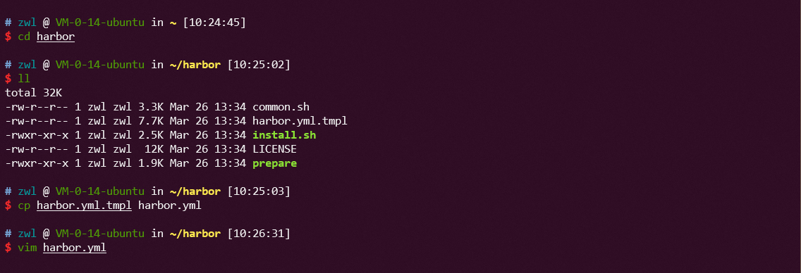
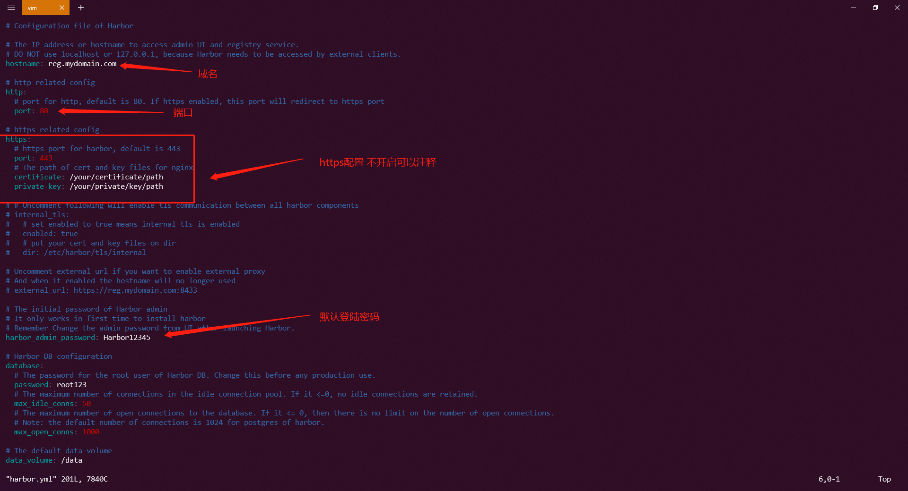
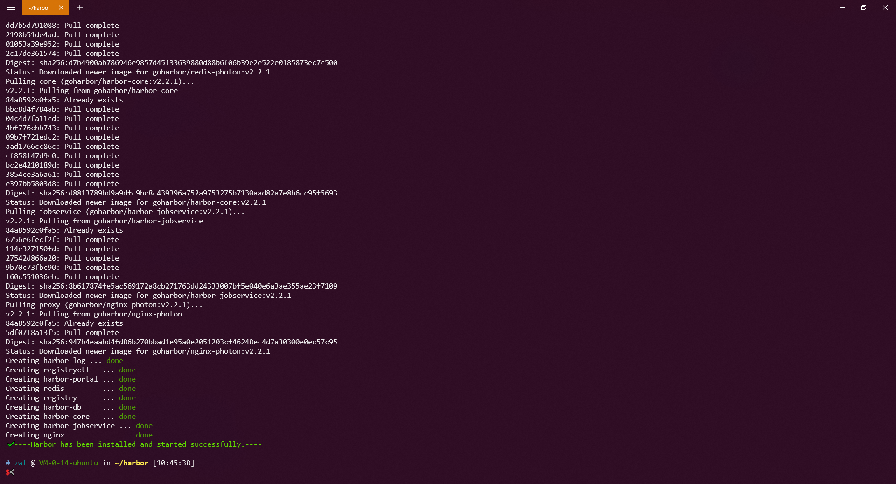
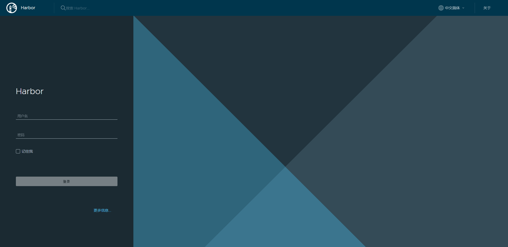
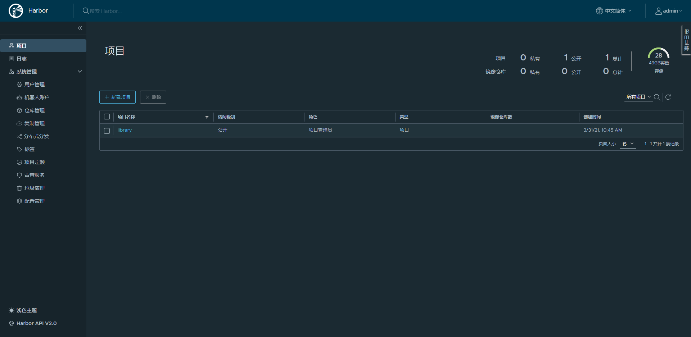
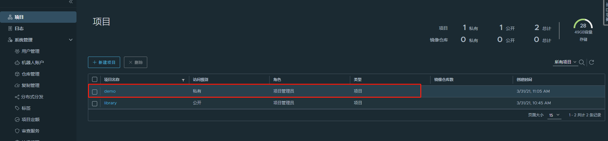
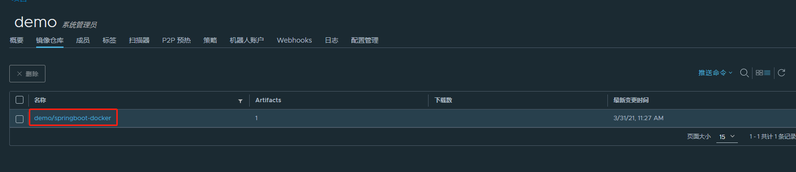

# 使用harbor搭建docker私有仓库
> 一般公司都有自己docker私有仓库，而harbor就是其中之一，下面教你使用harbor搭建私有的docker仓库

## 环境准备

- Docker engine :Version 17.06.0-ce+ or higher
- Docker Compose : Version 1.18.0 or higher
- Openssl : Latest is preferred

## 安装
harbor可以在线安装和离线安装，不过方法都一样

- [下载harbor安装包](https://github.com/goharbor/harbor/releases) 在线或者离线都可以

使用`curl`下载

~~~shell
curl -LJO https://github.com/goharbor/harbor/releases/download/v2.2.1/harbor-online-installer-v2.2.1.tgz
~~~

- 解压harbor压缩包

~~~shell
tar xvf harbor-online-installer-version.tgz
~~~
或者

~~~shell
tar xvf harbor-offline-installer-version.tgz
~~~

- 进入harbor目录，赋值harbor.yml.tmp1的配置文件为harbor.yml

- 修改配置文件，修改域名、端口、https证书配置、默认密码等

- 以管理员的身份执行install.sh

~~~shell
sudo ./install.sh
~~~

我这里使用的是在线安装，执行时会下载镜像

- 打开浏览器访问harbor，`http://域名:端口` 域名和端口为自己配置的，账号默认为admin，密码默认为Harbor12345

可以看到harbor的管理界面了，到此harbor部署成功了！

## 开始上传镜像到harbor

!> 如果你使用的是http协议，那需要在docker的配置文件中增加所信任的http地址

在`"insecure-registries"`属性中，增加你的harbor地址，然后重启docker

如：
 ` "insecure-registries": ["http://域名:端口"] `

- 登陆到你的harbor

~~~cmd
docker login harbor地址
~~~

- 首先在harbor的管理界面新建一个项目

- 将镜像打包

~~~cmd
docker tag source:tag target:tag
~~~

- push镜像

可以看到已经推送成功了

其他配置可以详细查看[官方文档](https://goharbor.io/)