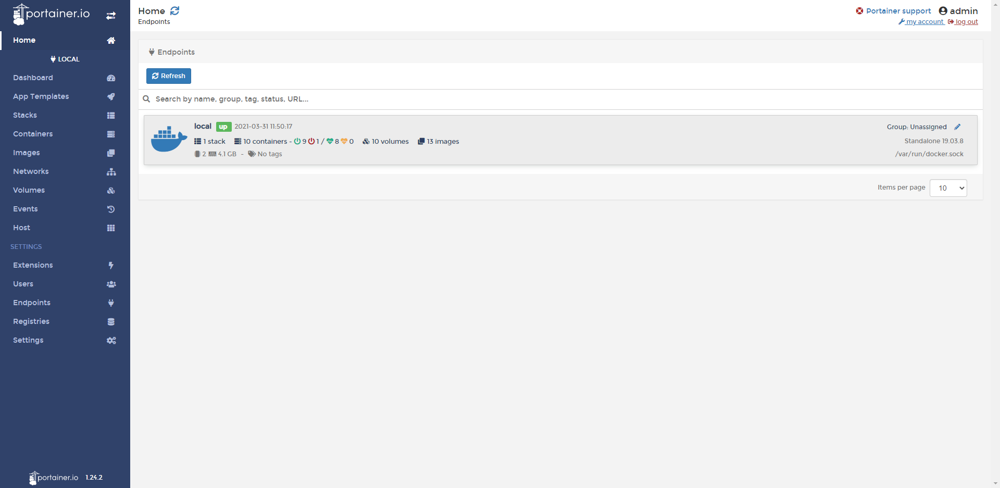
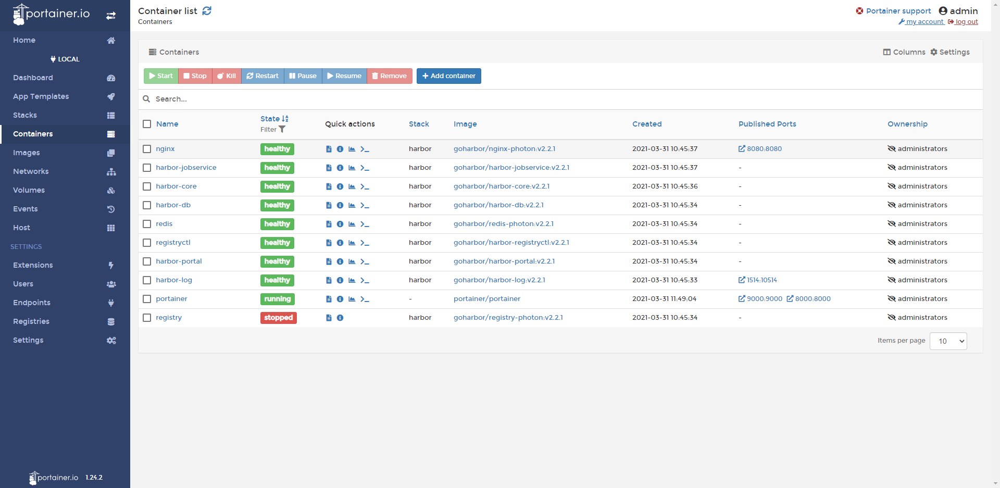
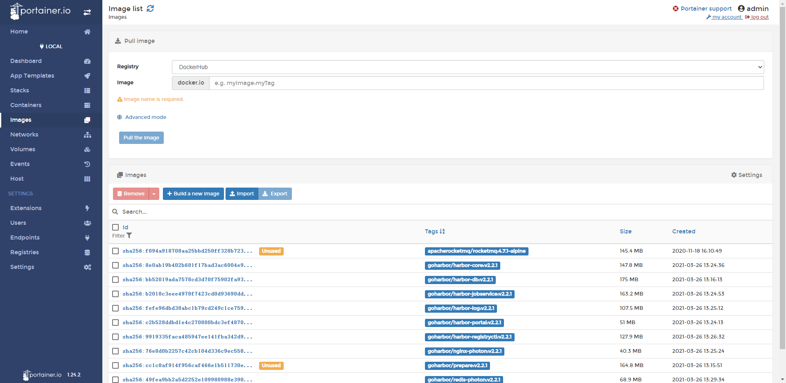

# Portainer管理docker镜像容器

> docker的一款GUI的管理工具，支持对docker进行启动、停止、部署、删除等等操作，界面美观，功能强大

## 部署

部署非常简单，拉取portainer镜像，运行即可，[docker hub文档](https://hub.docker.com/r/portainer/portainer)

- linux部署

~~~shell
docker pull portainer/portainer
~~~

~~~shell
docker volume create portainer_data
~~~

~~~shell
docker run -d -p 8000:8000 -p 9000:9000 --name=portainer --restart=always -v /var/run/docker.sock:/var/run/docker.sock -v portainer_data:/data portainer/portainer-ce
~~~

window部署请看[window](https://documentation.portainer.io/v2.0/deploy/ceinstalldocker/)

- 启动成功访问 http://localhost:9000 出现管理界面，第一次需要你设置密码

管理docker容器

管理docker镜像
