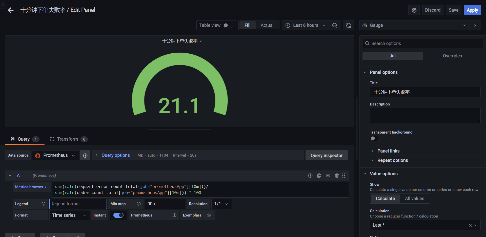
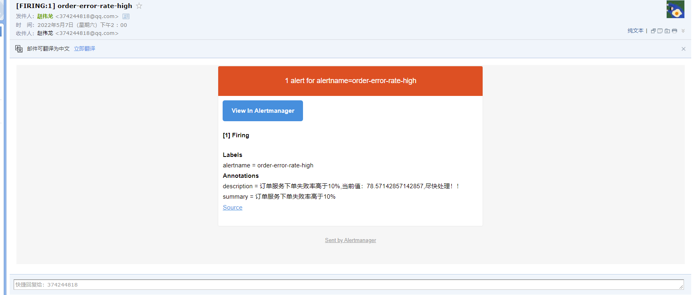
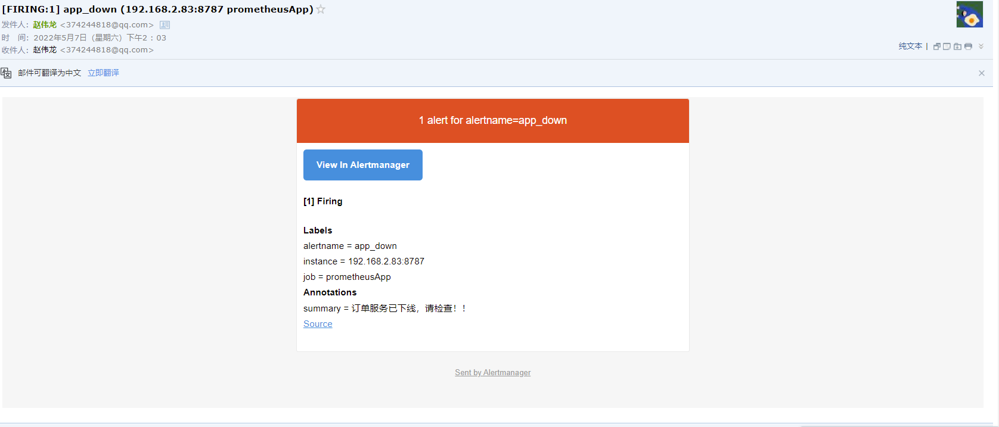

# Prometheus实践

本项目github地址:<https://github.com/zhaoweilong007/spring-boot-matrix/tree/main/prometheus>

**Prometheus负责收集数据，Grafana负责展示数据。其中采用Prometheus 中的 Exporter含：**

- Node Exporter，负责收集 host 硬件和操作系统数据
- cAdvisor，负责收集容器数据
- AlertManager，负责告警管理

## 安装

### docker部署

**docker-compose.yml配置文件**

```yaml
version: '3.7'

networks:
  monitor:
    driver: bridge

services:
  prometheus:
    image: prom/prometheus
    container_name: prometheus
    hostname: prometheus
    volumes:
      - ./config/prometheus.yml:/etc/prometheus/prometheus.yml
      - ./config/node_down.yml:/etc/prometheus/node_down.yml
    ports:
      - 9090:9090
    links:
      - cadvisor:cadvisor
      - alertmanager:alertmanager
    depends_on:
      - cadvisor
    networks:
      - monitor
    restart: always

  node-exporter:
    image: prom/node-exporter
    container_name: node-exporter
    hostname: node-exporter
    ports:
      - 9100:9100
    networks:
      - monitor
    restart: always

  alertmanager:
    image: prom/alertmanager
    container_name: alertmanager
    hostname: alertmanager
    ports:
      - 9093:9093
    volumes:
      - ./config/alertmanager.yml:/etc/alertmanager/alertmanager.yml
    networks:
      - monitor
    restart: always

  cadvisor:
    image: google/cadvisor
    container_name: cadvisor
    hostname: cadvisor
    ports:
      - 8080:8080
    networks:
      - monitor
    restart: always

  grafana:
    image: grafana/grafana
    depends_on:
      - prometheus
    ports:
      - 3000:3000
    networks:
      - monitor
    restart: always
```

在docker-compose.yml文件目录下，文件config文件夹，增加以下三个配置文件

**prometheus.yml**

```yaml
# my global config
global:
  scrape_interval: 15s # Set the scrape interval to every 15 seconds. Default is every 1 minute.
  evaluation_interval: 15s # Evaluate rules every 15 seconds. The default is every 1 minute.
  # scrape_timeout is set to the global default (10s).

# Alertmanager configuration
alerting:
  alertmanagers:
    - static_configs:
        - targets: [ '192.168.2.83:9093' ]
          # - alertmanager:9093

# Load rules once and periodically evaluate them according to the global 'evaluation_interval'.
rule_files:
  - "node_down.yml"
  # - "first_rules.yml"
  # - "second_rules.yml"

# A scrape configuration containing exactly one endpoint to scrape:
# Here it's Prometheus itself.
scrape_configs:
  # The job name is added as a label `job=<job_name>` to any timeseries scraped from this config.
  - job_name: 'prometheus'
    static_configs:
      - targets: [ '192.168.2.83:9090' ]

  - job_name: 'cadvisor'
    static_configs:
      - targets: [ '192.168.2.83:8080' ]

  - job_name: 'node'
    scrape_interval: 8s
    static_configs:
      - targets: [ '192.168.2.83:9100' ]
```

ps: 其中IP设置成本地IP，scrape_configs配置就是prometheus的指标，每个job对应一个指标

**alertmanager.yml**

```yaml
global:
  #全局邮箱配置
  smtp_smarthost: 'smtp.qq.com:465'
  smtp_from: '374244818@qq.com'
  smtp_auth_username: '374244818@qq.com'
  smtp_auth_password: '*****'
  smtp_require_tls: false

route:
  group_by: [ 'alertname' ]
  # 分组等待的时间
  group_wait: 10s
  # 前后两组发送告警的间隔时间
  group_interval: 10s
  # 重复发送告警时间。默认为 1h
  repeat_interval: 10m
  #告警接收器
  receiver: live-monitoring

#告警接收器配置
receivers:
  - name: 'live-monitoring'
    email_configs:
      - to: '374244818@qq.com'
        send_resolved: true # 发送已解决通知
```

**node_down.yml**

```yaml
groups:
  - name: node_down
    rules:
      - alert: InstanceDown
        expr: up == 0
        for: 1m
        labels:
          user: test
        annotations:
          summary: "Instance {{ $labels.instance }} down"
          description: "{{ $labels.instance }} of job {{ $labels.job }} has been down for more than 1 minutes."
      - alert: demo-rule-01 # 告警名称
        expr: up{job="prometheus"} < 2 # 告警条件
        for: 10s # 查询时间间隔
        labels:
          severity: critical # 告警级别
        annotations: # 注释，用于完善告警详情
          summary: "{{$labels.job}}: 示例提示" # 概要
          description: "示例描述" # 描述
```

启动容器

```shell
docker-compose up -d
```

打开浏览器

访问prometheus <http://127.0.0.1:9090/>,


查看prometheus的targets，<http://127.0.0.1:9090/targets>,可以看到注册的指标


访问grafana <http://127.0.0.1:3000/>,默认账号admin/admin


访问alertmanager <http://localhost:9093/>


### grafana配置

**配置数据源**

在configuration配置dataSources


选择save&test 成功后back，就可以看到配置好的数据源了

**配置仪表盘**

仪表盘可以自己配置，也可以选择网上的导入，Grafana 提供了 Dashboard 市场<https://grafana.com/grafana/dashboards/> ，提供了大量直接可用的 Dashboard

这里我们导入[Go Metrics](https://grafana.com/grafana/dashboards/10826)，url:https://grafana.com/grafana/dashboards/10826


注意选择datasources为之前新增的prometheus数据源


自己还可以接入其他的dashboard

### 热更新prometheus配置

热更新加载方法有两种：

- kill -HUP pid
- curl -X POST http://IP/-/reload

### 常用alert告警规则

可以在<https://awesome-prometheus-alerts.grep.to/>查看现有的规则配置

- 磁盘几乎已满（剩余 < 10%）

```yaml
  # Please add ignored mountpoints in node_exporter parameters like
  # "--collector.filesystem.ignored-mount-points=^/(sys|proc|dev|run)($|/)".
  # Same rule using "node_filesystem_free_bytes" will fire when disk fills for non-root users.
  - alert: HostOutOfDiskSpace
    expr: (node_filesystem_avail_bytes * 100) / node_filesystem_size_bytes < 10 and ON (instance, device, mountpoint) node_filesystem_readonly == 0
    for: 2m
    labels:
      severity: warning
    annotations:
      summary: Host out of disk space (instance {{ $labels.instance }})
      description: "Disk is almost full (< 10% left)\n  VALUE = {{ $value }}\n  LABELS = {{ $labels }}"

```

- CPU 负载 > 80%

```yaml
  - alert: HostHighCpuLoad
    expr: 100 - (avg by(instance) (rate(node_cpu_seconds_total{mode="idle"}[2m])) * 100) > 80
    for: 0m
    labels:
      severity: warning
    annotations:
      summary: Host high CPU load (instance {{ $labels.instance }})
      description: "CPU load is > 80%\n  VALUE = {{ $value }}\n  LABELS = {{ $labels }}"

```

- JVM 内存已满（> 80%）

```yaml
  - alert: JvmMemoryFillingUp
    expr: (sum by (instance)(jvm_memory_used_bytes{area="heap"}) / sum by (instance)(jvm_memory_max_bytes{area="heap"})) * 100 > 80
    for: 2m
    labels:
      severity: warning
    annotations:
      summary: JVM memory filling up (instance {{ $labels.instance }})
      description: "JVM memory is filling up (> 80%)\n  VALUE = {{ $value }}\n  LABELS = {{ $labels }}"

```

## 项目接入

### 添加依赖

```groovy
dependencies {
    implementation('org.springframework.boot:spring-boot-starter-web')
    implementation('org.springframework.boot:spring-boot-starter-actuator')
    implementation 'io.micrometer:micrometer-registry-prometheus:1.8.5'
}
```

启动项目，访问<http://127.0.0.1:8787/actuator/prometheus>,可以看到应用的 Prometheus 所需的格式的 Metrics 指标数据

再之前的`prometheus.yml`配置文件中增加job节点

```yaml
- job_name: 'prometheusApp'
# 采集地址
metrics_path: '/actuator/prometheus'
# 目标服务器
static_configs:
  - targets: [ '192.168.2.83:8787' ]
```

IP和端口注意修改成自己的


使用请求方式更新配置文件，然后刷新页面可以看到已经有了


导入springboot的仪表盘 <https://grafana.com/grafana/dashboards/10280>


导入JVM仪表盘 <https://grafana.com/grafana/dashboards/11955>


以上就是springboot集成prometheus，当然功能远不止如此，更多功能查看官网的文档吧

### 埋点监控，自定义仪表盘

通过MeterRegistry自定义指标，springboot默认自动注册了MeterRegistry的实现类

```java

@Component
public class PrometheusMonitor implements InitializingBean {

    /** 描述：请求错误次数 */
    @Getter
    @Setter
    private Counter requestErrorCount;

    /** 描述：下单次数 */
    @Getter
    @Setter
    private Counter orderCount;

    /** 下单总金额 */
    @Getter
    @Setter
    private DistributionSummary orderAmount;

    private final MeterRegistry registry;

    @Autowired
    public PrometheusMonitor(MeterRegistry registry) {
        this.registry = registry;
    }

    @Override
    public void afterPropertiesSet() {
        requestErrorCount = registry.counter("request_error_count", "reqErrorTotal", "error");
        orderCount = registry.counter("order_count", "orderTotal", "order");
        orderAmount = registry.summary("order_amount", "orderAmount", "amount");
    }
}
```

在controller中记录指标

```java

@RestController
@Slf4j
@RequiredArgsConstructor
public class ReqController {

    private final PrometheusMonitor monitor;

    /** 模拟下单请求 */
    @GetMapping("/order")
    public String order(@RequestParam(required = false, defaultValue = "0") Long orderId) {
        log.info("orderId: {}", orderId);

        if (orderId <= 0) {
            throw new RuntimeException("orderId必须大于0");
        }

        // 记录下单次数
        monitor.getOrderCount().increment();

        Random random = new Random();
        int amount = random.nextInt(100);
        // 记录下单总金额
        monitor.getOrderAmount().record(amount);
        return "success";
    }
}

```

异常处理

```java

@RestControllerAdvice
@RequiredArgsConstructor
public class GlobalExceptionHandler {

    private final PrometheusMonitor monitor;

    @ExceptionHandler(value = Exception.class)
    public String exceptionHandler(Exception e) {
        // 记录请求失败次数
        monitor.getRequestErrorCount().increment();
        return e.getMessage();
    }
}

```

配置仪表盘




配置应用告警,在之前的node_down.yml配置文件中增加alert节点

```yaml
  - alert: app_down
    expr: up{job="prometheusApp"} == 0
    for: 10s
    annotations:
      summary: "订单服务已下线，请检查！！"
  # 10分钟内下单失败率是否大于10
  - alert: order-error-rate-high
    expr: sum(rate(request_error_count_total{job="prometheusApp"}[10m]))/sum(rate(order_count_total{job="prometheusApp"}[10m])) * 100 >10
    for: 10s
    annotations:
      summary: "订单服务下单失败率高于10%"
      description: "订单服务下单失败率高于10%,当前值：{{$value}},尽快处理！！"

```

然后自己测试下发送错误请求，以及关闭应用，可以收到告警邮件了





### 资料

prometheus官网:<https://prometheus.io/>

prometheus中文参考:<https://yunlzheng.gitbook.io/prometheus-book/>

dashboard仪表盘：<https://grafana.com/grafana/dashboards/>

prometheus alert告警集：<https://awesome-prometheus-alerts.grep.to/>

参考blog:
<https://www.iocoder.cn/Spring-Boot/Prometheus-and-Grafana/?github>，

<https://juejin.cn/post/6844903809517371406>
