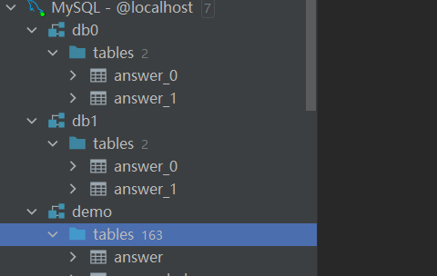
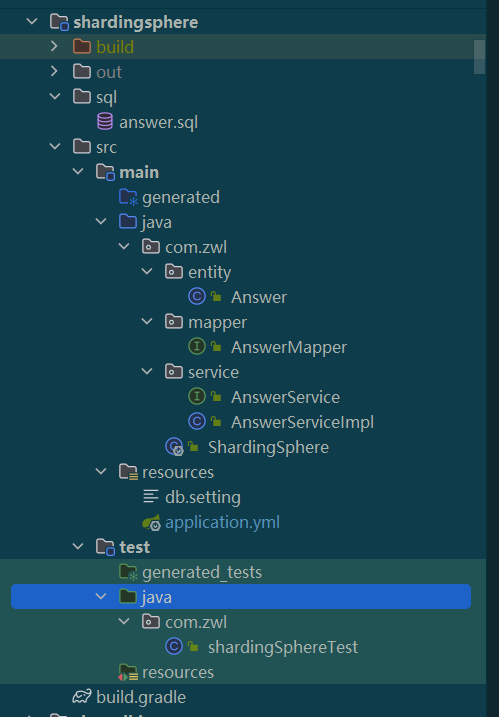
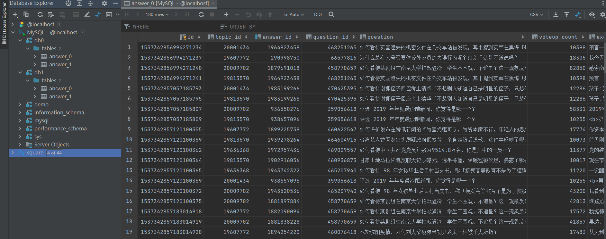

# Sharding-JDBC实践

## 相关概念

sharding-jdbc是由ShardingSphere开源的一款分库分表的数据库中间件，定位为轻量级Java框架，在Java的JDBC层提供的额外服务。 它使用客户端直连数据库，以jar包形式提供服务，无需额外部署和依赖，可理解为增强版的JDBC驱动，完全兼容JDBC和各种ORM框架。

- 适用于任何基于JDBC的ORM框架，如：JPA, Hibernate, Mybatis, Spring JDBC Template或直接使用JDBC。
- 支持任何第三方的数据库连接池，如：DBCP, C3P0, BoneCP, Druid, HikariCP等。
- 支持任意实现JDBC规范的数据库。目前支持MySQL，Oracle，SQLServer，PostgreSQL以及任何遵循SQL92标准的数据库。


sharding-jdbc最早是当当网的一款分库分表框架，2017年对外开源，经过社区的开源贡献，ShardingSphere已经在2020年4月16日从Apache孵化器毕业，成为Apache顶级项目,逛网地址：<https://shardingsphere.apache.org/>

### 分库分表

**垂直拆分**

按业务切分，将表按照功能模块、关系密切程度划分出来，部署到不同的库上。例如用户相关、教务相关、cc业务相关、报表相关等

垂直分表是对数据表进行垂直拆分的一种方式，常见是把一个多字段的大表按常用字段和非常用字段进行拆分，每个表里面的数据记录数一般情况下是相同的，只是字段不一样，使用主键关联

**水平拆分**

当一个表中的数据量过大时，我们可以把该表的数据按照某种规则，例如userID散列，进行划分，然后存储到多个结构相同的表，和不同的库上


分表分表存在的问题：

- 事务问题
- 跨库跨表join

### 数据分片

#### 逻辑表
水平拆分的数据库（表）的相同逻辑和数据结构表的总称。例：订单数据根据主键尾数拆分为10张表，分别是t_order_0到t_order_9，他们的逻辑表名为t_order。

#### 绑定表
指分片规则一致的主表和子表。例如：t_order表和t_order_item表，均按照order_id分片，则此两张表互为绑定表关系。绑定表之间的多表关联查询不会出现笛卡尔积关联，关联查询效率将大大提升

#### 广播表
指所有的分片数据源中都存在的表，表结构和表中的数据在每个数据库中均完全一致。适用于数据量不大且需要与海量数据的表进行关联查询的场景，例如：字典表

#### 数据节点
数据分片的最小单元。由数据源名称和数据表组成，例：ds_0.t_order_0。

#### 分片键
用于分片的数据库字段，是将数据库(表)水平拆分的关键字段。例：将订单表中的订单主键的尾数取模分片，则订单主键为分片字段。 SQL中如果无分片字段，将执行全路由，性能较差。 除了对单分片字段的支持，ShardingSphere也支持根据多个字段进行分片


#### 分片算法

- 精确分片算法
对应PreciseShardingAlgorithm，用于处理使用单一键作为分片键的=与IN进行分片的场景。需要配合StandardShardingStrategy使用。
- 范围分片算法
对应RangeShardingAlgorithm，用于处理使用单一键作为分片键的BETWEEN AND、>、<、>=、<=进行分片的场景。需要配合StandardShardingStrategy使用。
- 复合分片算法
对应ComplexKeysShardingAlgorithm，用于处理使用多键作为分片键进行分片的场景，包含多个分片键的逻辑较复杂，需要应用开发者自行处理其中的复杂度。需要配合ComplexShardingStrategy使用
- Hint分片算法
对应HintShardingAlgorithm，用于处理使用Hint行分片的场景。需要配合HintShardingStrategy使用

#### 分片策略

分片建和分片算法构成分片策略，目前支持5种分片策略

- 标准分片策略

对应StandardShardingStrategy。提供对SQL语句中的=, >, <, >=, <=, IN和BETWEEN AND的分片操作支持。StandardShardingStrategy只支持单分片键，提供PreciseShardingAlgorithm和RangeShardingAlgorithm两个分片算法。PreciseShardingAlgorithm是必选的，用于处理=和IN的分片。RangeShardingAlgorithm是可选的，用于处理BETWEEN AND, >, <, >=, <=分片，如果不配置RangeShardingAlgorithm，SQL中的BETWEEN AND将按照全库路由处理。

- 复合分片策略

对应ComplexShardingStrategy。复合分片策略。提供对SQL语句中的=, >, <, >=, <=, IN和BETWEEN AND的分片操作支持。ComplexShardingStrategy支持多分片键，由于多分片键之间的关系复杂，因此并未进行过多的封装，而是直接将分片键值组合以及分片操作符透传至分片算法，完全由应用开发者实现，提供最大的灵活度


- 行表达式分片策略


对应InlineShardingStrategy。使用Groovy的表达式，提供对SQL语句中的=和IN的分片操作支持，只支持单分片键。对于简单的分片算法，可以通过简单的配置使用，从而避免繁琐的Java代码开发，如: t_user_$->{u_id % 8} 表示t_user表根据u_id模8，而分成8张表，表名称为t_user_0到t_user_7

- Hint分片策略

对应HintShardingStrategy。通过Hint指定分片值而非从SQL中提取分片值的方式进行分片的策略。

- 不分片策略

对应NoneShardingStrategy。不分片的策略。


## 项目演示

项目环境

- JDK17
- Gradle7.4.2
- mysql8.0
- SpringBoot2.7.0

首先创建好对应的数据库和表

分别创建三个数据库，demo、db0、db1

demo数据库中导入我项目sql文件夹下事先准备好的数据answer.sql，只有一张answer表


在db0、db1分别创建answer_0、answer_1两张表，创建完大概是这样的

```sql
CREATE TABLE `answer`  (
  `id` bigint(20) NOT NULL AUTO_INCREMENT,
  `topic_id` int(11) NULL DEFAULT NULL,
  `answer_id` bigint(20) NULL DEFAULT NULL,
  `question_id` bigint(20) NULL DEFAULT NULL,
  `question` varchar(300) CHARACTER SET utf8mb4 COLLATE utf8mb4_general_ci NULL DEFAULT NULL,
  `voteup_count` int(11) NULL DEFAULT NULL,
  `excerpt` varchar(3000) CHARACTER SET utf8mb4 COLLATE utf8mb4_general_ci NULL DEFAULT NULL,
  `author_name` varchar(50) CHARACTER SET utf8mb4 COLLATE utf8mb4_general_ci NULL DEFAULT NULL,
  `create_date` date NULL DEFAULT NULL,
  `answer_url` varchar(255) CHARACTER SET utf8mb4 COLLATE utf8mb4_general_ci NULL DEFAULT NULL,
  `content` longtext CHARACTER SET utf8mb4 COLLATE utf8mb4_general_ci NULL,
  `is_god_replies` int(11) NULL DEFAULT 0,
  PRIMARY KEY (`id`) USING BTREE,
  INDEX `aid_index`(`answer_id`) USING BTREE
) ENGINE = InnoDB AUTO_INCREMENT = 1 CHARACTER SET = utf8mb4 COLLATE = utf8mb4_general_ci ROW_FORMAT = Dynamic;
```




### 搭建项目

gradle依赖：

```groovy
dependencies {
    implementation('org.springframework.boot:spring-boot-starter-web')
    implementation "org.apache.shardingsphere:shardingsphere-jdbc-core-spring-boot-starter"
    implementation("mysql:mysql-connector-java")
    implementation("com.baomidou:mybatis-plus-boot-starter")
    testImplementation("org.springframework.boot:spring-boot-starter-test")
}

```


这里使用了mybatis-plus插件，大家也可以使用其他的


使用插件生成对应dao、service、entity结构，项目结构是这样的，很简单，重点在于sharding-jdbc的spring配置





#### sharding-jdbc配置

写这边文章是sharding-jdbc最新的版本为5.1.1，读者也可以参考目前最新的版本文档


下面使用行表达式分片策略，

库：根据answer表中的topic_id % 2计算对应的库
表：根据answer表中的answer_id进行 % 2运算计算对应表


application.yml配置

```yaml
spring:
  application:
    name: shardingSphere
  sharding-sphere:
    props:
      sql-show: true
      sql-simple: true
      executor-size: 200
      check-table-metadata-enabled: true
    enabled: true
    datasource:
      names: db0,db1
      db0:
        type: com.zaxxer.hikari.HikariDataSource
        jdbc-url: jdbc:mysql://localhost:3306/db0?allowPublicKeyRetrieval=true&useUnicode=true&characterEncoding=UTF-8&autoReconnect=true&useSSL=false&zeroDateTimeBehavior=convertToNull&serverTimezone=Asia/Shanghai
        driver-class-name: com.mysql.cj.jdbc.Driver
        username: root
        password: 123456
      db1:
        type: com.zaxxer.hikari.HikariDataSource
        jdbc-url: jdbc:mysql://localhost:3306/db1?allowPublicKeyRetrieval=true&useUnicode=true&characterEncoding=UTF-8&autoReconnect=true&useSSL=false&zeroDateTimeBehavior=convertToNull&serverTimezone=Asia/Shanghai
        driver-class-name: com.mysql.cj.jdbc.Driver
        username: root
        password: 123456
    rules:
      sharding:
        #分片算法
        sharding-algorithms:
          table-inline:
            type: INLINE
            props:
              algorithm-expression: answer_$->{answer_id % 2}
          db-inline:
            type: INLINE
            props:
              algorithm-expression: db$->{topic_id % 2}
        # 主键生成策略
        keyGenerators:
          snowflake:
            #雪花算法
            type: SNOWFLAKE
            props:
              worker-id: 123
        tables:
          # 配置answer表
          answer:
            #数据节点行表达式
            actual-data-nodes: db$->{0..1}.answer_$->{0..1}
            # 分库策略
            database-strategy:
              standard:
                sharding-algorithm-name: db-inline
                sharding-column: topic_id
            # 主键序列化策略
            keyGenerateStrategy:
              column: id
              keyGeneratorName: snowflake
            # 分表策略
            table-strategy:
              standard:
                sharding-algorithm-name: table-inline
                sharding-column: answer_id
```


下面讲解下sharding-jdbc的配置


yaml解析说明

```yaml
spring:
  shardingsphere:
    datasource:
      <data-source-name>:
        driver-class-name: '#数据库驱动类名'
        password: '#数据库密码'
        type: '#数据库连接池类名称'
        url: '#数据库url连接'
        username: '#数据库用户名'
        xxx: '#数据库连接池的其它属性'
      names: '#数据源名称，多数据源以逗号分隔'
    props:
      executor:
        size: '#工作线程数量，默认值: CPU核数'
      sql:
        show: '#是否开启SQL显示，默认值: false'
    sharding:
      binding-tables:
      - '#绑定表规则列表'
      broadcast-tables:
      - '#广播表规则列表'
      default-data-source-name: '#未配置分片规则的表将通过默认数据源定位'
      default-database-strategy:
        xxx: '#默认数据库分片策略，同分库策略'
      default-key-generator:
        props:
          <property-name>: '#自增列值生成器属性配置, 比如SNOWFLAKE算法的worker.id与max.tolerate.time.difference.milliseconds'
        type: '#默认自增列值生成器类型，缺省将使用org.apache.shardingsphere.core.keygen.generator.impl.SnowflakeKeyGenerator。可使用用户自定义的列值生成器或选择内置类型：SNOWFLAKE/UUID'
      default-table-strategy:
        xxx: '#默认表分片策略，同分表策略'
      master-slave-rules:
        <master-slave-data-source-name>:
          load-balance-algorithm-class-name: '#详见读写分离部分'
          load-balance-algorithm-type: '#详见读写分离部分'
          master-data-source-name: '#详见读写分离部分'
          slave-data-source-names:
          - '#详见读写分离部分'
      tables:
        <logic-table-name>:
          actual-data-nodes: '#由数据源名 + 表名组成，以小数点分隔。多个表以逗号分隔，支持inline表达式。缺省表示使用已知数据源与逻辑表名称生成数据节点，用于广播表（即每个库中都需要一个同样的表用于关联查询，多为字典表）或只分库不分表且所有库的表结构完全一致的情况'
          database-strategy:
            complex:
              algorithm-class-name: '#复合分片算法类名称。该类需实现ComplexKeysShardingAlgorithm接口并提供无参数的构造器'
              sharding-columns: '#分片列名称，多个列以逗号分隔'
            hint:
              algorithm-class-name: '#Hint分片算法类名称。该类需实现HintShardingAlgorithm接口并提供无参数的构造器'
            inline:
              algorithm-expression: '#分片算法行表达式，需符合groovy语法'
              sharding-column: '#分片列名称'
            standard:
              precise-algorithm-class-name: '#精确分片算法类名称，用于=和IN。该类需实现PreciseShardingAlgorithm接口并提供无参数的构造器'
              range-algorithm-class-name: '#范围分片算法类名称，用于BETWEEN，可选。该类需实现RangeShardingAlgorithm接口并提供无参数的构造器'
              sharding-column: '#分片列名称'
          key-generator:
            column: '#自增列名称，缺省表示不使用自增主键生成器'
            props:
              <property-name>: '#属性配置, 注意：使用SNOWFLAKE算法，需要配置worker.id与max.tolerate.time.difference.milliseconds属性。若使用此算法生成值作分片值，建议配置max.vibration.offset属性'
            type: '#自增列值生成器类型，缺省表示使用默认自增列值生成器。可使用用户自定义的列值生成器或选择内置类型：SNOWFLAKE/UUID'
          table-strategy:
            xxx: '#省略'
```


sharding-jdbc配置主要由三大部分组成

- mode 模式配置
- props 	属性配置
- dataSource 数据源配置
- shardingRuleConfig 数据分片配置规则

##### mode

```yaml
mode (?): # 不配置则默认内存模式 type: # 运行模式类型。可选配置：Memory、Standalone、Cluster 
    repository (?): # 久化仓库配置。Memory 类型无需持久化
    overwrite: # 是否使用本地配置覆盖持久化配置
```

我这里直接使用的内存模式，也可以配置file、zookeeper、etcd模式


#### props

```yaml
    props:
      sql-show: true
      executor-size: 200
      check-table-metadata-enabled: true
```


- sql.show 是否开启SQL显示，默认值: false
- executor.size 工作线程数量，默认值: CPU核数
- max.connections.size.per.query 每个物理数据库为每次查询分配的最大连接数量。默认值: 1
- check.table.metadata.enabled 是否在启动时检查分表元数据一致性，默认值: false
- query.with.cipher.column 当存在明文列时，是否使用密文列查询，默认值: true
- allow.range.query.with.inline.sharding 当使用inline分表策略时，是否允许范围查询，默认值: false


##### dataSource

配置多个库，我这里配置了两个库，db0,db1，中间用逗号分隔，然后配置数据源

```yaml
    datasource:
      names: db0,db1
      db0:
        type: com.zaxxer.hikari.HikariDataSource
        jdbc-url: jdbc:mysql://localhost:3306/db0?allowPublicKeyRetrieval=true&useUnicode=true&characterEncoding=UTF-8&autoReconnect=true&useSSL=false&zeroDateTimeBehavior=convertToNull&serverTimezone=Asia/Shanghai
        driver-class-name: com.mysql.cj.jdbc.Driver
        username: root
        password: 123456
      db1:
        type: com.zaxxer.hikari.HikariDataSource
        jdbc-url: jdbc:mysql://localhost:3306/db1?allowPublicKeyRetrieval=true&useUnicode=true&characterEncoding=UTF-8&autoReconnect=true&useSSL=false&zeroDateTimeBehavior=convertToNull&serverTimezone=Asia/Shanghai
        driver-class-name: com.mysql.cj.jdbc.Driver
        username: root
        password: 123456
```


##### rule分片规则配置

- sharding-algorithms 分片算法配置

```yaml
        #分片算法
        sharding-algorithms:
          table-inline:
            type: INLINE
            props:
              algorithm-expression: answer_$->{answer_id % 2}
          db-inline:
            type: INLINE
            props:
              algorithm-expression: db$->{topic_id % 2}

```

上面定义了两个算法，一个table-inline作为表分片算法，db-inline作为库分片算法，type类型为INLINE，prop属性中algorithm-expression定义表达式

内置算法均通过 type 和props进行配置，其中 type 由算法定义在SPI 中，props用于传递算法的个性化，具体的type可选参数可参考官网文档，就不一一列举了

- keyGenerators 主键生成策略

```yaml
          snowflake:
            #雪花算法
            type: SNOWFLAKE
            props:
              worker-id: 123
```

这里使用了雪花算法生成主键id

- tables 表分片规则设置

```yaml
        tables:
          # 配置answer表
          answer:
            #数据节点行表达式
            actual-data-nodes: db$->{0..1}.answer_$->{0..1}
            # 分库策略
            database-strategy:
              standard:
                sharding-algorithm-name: db-inline
                sharding-column: topic_id
            # 主键序列化策略
            keyGenerateStrategy:
              column: id
              keyGeneratorName: snowflake
            # 分表策略
            table-strategy:
              standard:
                sharding-algorithm-name: table-inline
                sharding-column: answer_id

```

tables下为每个表的逻辑表名，如answer_0,asnwer_1,逻辑表名为answer

- actual-data-nodes 数据节点的表达式

- database-strategy 分库策略

```yaml
standard: # 用于单分片键的标准分片场景 
    shardingColumn: # 分片列名称 
    shardingAlgorithmName: # 分片算法名称 
complex: # 用于多分片键的复合分片场景 
    shardingColumns: # 分片列名称，多个列以逗号分隔 
    shardingAlgorithmName: # 分片算法名称
hint: # Hint 分片策略 
    shardingAlgorithmName: # 分片算法名称
none: # 不分片
```


我这是使用的是标准的单分片，shardingAlgorithmName对应的分片算法中的db-inline名称,sharding-column对应的字段名

- table-strategy 分表策略,同分库策略

- keyGenerateStrategy 主键生成策略

其他配置可以参考上面的yaml解析说明


#### 测试分库分表


先初始化demo数据库，导入准备好的数据，新建一个测试类进行插入测试，从demo的answer表中读取数据插入到db0和db1中


```java

@SpringBootTest
@RunWith(SpringRunner.class)
@Slf4j
public class shardingSphereTest {

    @Autowired
    AnswerMapper answerMapper;

    @Autowired
    AnswerService answerService;

    private List<Answer> list = Lists.newArrayList();

    @Before
    public void init() throws SQLException {
        list = JSON.parseArray(JSON.toJSONString(Db.use().findAll("answer")), Answer.class);
        log.info("init answer list,size:{}", list.size());
    }

    // todo 测试插入数据分库分表
    @Test
    public void testInsert() {
        list.forEach(answer -> answer.setId(null));

        boolean batch = answerService.saveBatch(list);
        log.info("批量插入：{}", batch);

        list.forEach(
                answer ->
                        log.info(
                                "topicId:{} % 2 = {},answerId:{} % 2 = {}",
                                answer.getTopicId(),
                                answer.getTopicId() % 2,
                                answer.getAnswerId(),
                                answer.getAnswerId() % 2));
    }

    @Test
    public void testSelect() {
        Random random = new Random();
        Answer answer = list.get(random.nextInt(list.size() - 1));
        Answer result = answerService.getOne(new QueryWrapper<>(answer));
        log.info("查询结果：{}", JSON.toJSONString(result));
    }
}
```




可以看到数据分别插入到不同的库和表中了，可以根据topicId和answerId一一对应


上面是使用配置的方式，也可以自行实现分片算法，还有其他功能如读写分离、分布式事务，配置中心、监控集成等