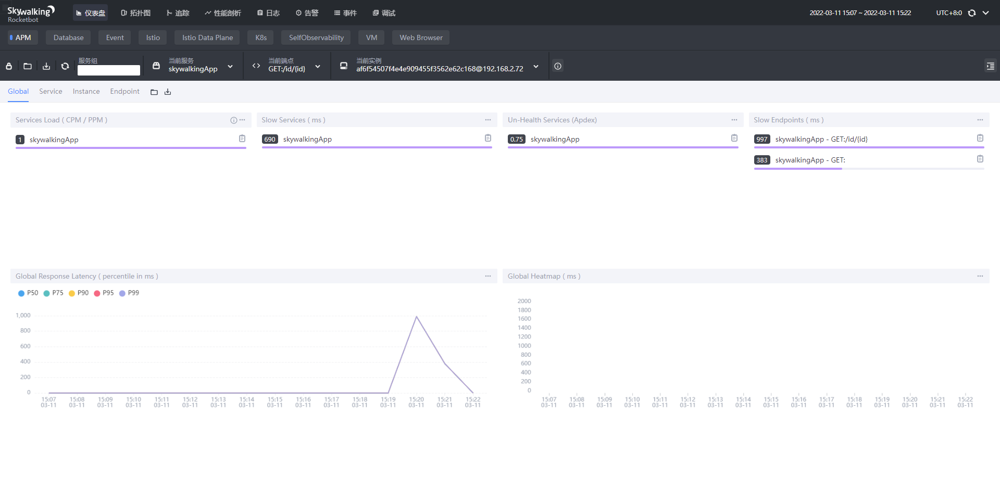

<!-- START doctoc generated TOC please keep comment here to allow auto update -->
<!-- DON'T EDIT THIS SECTION, INSTEAD RE-RUN doctoc TO UPDATE -->
**Table of Contents**  *generated with [DocToc](https://github.com/thlorenz/doctoc)*

- [SkyWalking 实战](#skywalking-%E5%AE%9E%E6%88%98)
  - [安装](#%E5%AE%89%E8%A3%85)
  - [引入依赖](#%E5%BC%95%E5%85%A5%E4%BE%9D%E8%B5%96)
  - [监控](#%E7%9B%91%E6%8E%A7)

<!-- END doctoc generated TOC please keep comment here to allow auto update -->

# SkyWalking 实战

## 安装

下载 [skyWalking-agent.jar](https://skywalking.apache.org/downloads/)
和 [apache-skywalking-apm](https://skywalking.apache.org/downloads/) 包

解压apache-skywalking-apm，再bin目录启动`startup.bat`

## 引入依赖

```groovy
//埋点监控依赖
implementation 'org.apache.skywalking:apm-toolkit-trace:8.9.0'
//logback日志整合
implementation 'org.apache.skywalking:apm-toolkit-logback-1.x:8.9.0'
//opentracing规范依赖
implementation 'org.apache.skywalking:apm-toolkit-opentracing:8.9.0'
```

## 监控

**idea 启动配置**


**JVM参数设置,路径换成skyWalking-agent.jar路径**
`-javaagent:C:\software\skywalking-agent\skywalking-agent.jar`

**环境变量设置**

应用名称

- SW_AGENT_NAME=skywalkingApp

收集服务地址

- SW_AGENT_COLLECTOR_BACKEND_SERVICES=127.0.0.1:11800

访问<http://localhost:8080> skywalking ui界面，可以看到应用服务的监控信息





查看阔朴图


以上对skywalking有个一个初步的了解，更新用法请查看官网说明

