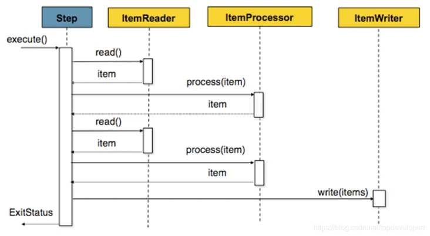

# Spring Batch


## 简介


Spring Batch 是一个轻量级，全面的批处理框架，旨在开发对企业系统日常运营至关重要的强大批处理应用程序。Spring Batch 构建了人们期望的 Spring Framework 特性（生产力，基于 POJO 的开发方法和一般易用性），同时使开发人员可以在必要时轻松访问和利用更高级的企业服务。Spring Batch 不是一个 schuedling 的框架。

Spring Batch 提供了可重用的功能，这些功能对于处理大量的数据至关重要，包括记录 / 跟踪，事务管理，作业处理统计，作业重启，跳过和资源管理。它还提供更高级的技术服务和功能，通过优化和分区技术实现极高容量和高性能的批处理作业。

Spring Batch 可用于两种简单的用例（例如将文件读入数据库或运行存储过程）以及复杂的大量用例（例如在数据库之间移动大量数据，转换它等等） 上）。大批量批处理作业可以高度可扩展的方式利用该框架来处理大量信息。

## 核心概念

### 架构


在 spring batch 中一个 job 可以定义很多的步骤 step，在每一个 step 里面可以定义其专属的 ItemReader 用于读取数据，ItemProcesseor 用于处理数据，ItemWriter 用于写数据，而每一个定义的 job 则都在 JobRepository 里面，我们可以通过 JobLauncher 来启动某一个 job。

### Job


一个 job 是我们运行的基本单位，它内部由 step 组成。job 本质上可以看成 step 的一个容器。一个 job 可以按照指定的逻辑顺序组合 step，并提供了我们给所有 step 设置相同属性的方法，例如一些事件监听，跳过策略。


Spring Batch 以 SimpleJob 类的形式提供了 Job 接口的默认简单实现，它在 Job 之上创建了一些标准功能。一个使用 java config 的例子代码如下


```java
@Bean
public Job footballJob() {
    return this.jobBuilderFactory.get("footballJob")
                     .start(playerLoad())
                     .next(gameLoad())
                     .next(playerSummarization())
                     .end()
                     .build();
}

```
### JobParamter

jobParamter用来处理批处理作业的参数

### Jobinstance

JobInstance就是Job执行的一个实例，是逻辑意义上的，比如每天执行一次，每天就会产生一个JobInstance，JobInstance必须是唯一的，由Job和JobParamter确定唯一性

JobInstance=Job+Jobparamter

### JobExecution

表达执行一次job任务

### Step

每一个 Step 对象都封装了批处理作业的一个独立的阶段。事实上，每一个 Job 本质上都是由一个或多个步骤组成。每一个 step 包含定义和控制实际批处理所需的所有信息。任何特定的内容都由编写 Job 的开发人员自行决定。


一个step可以分为item read->item process->item write，也可以是一个任务


### StepExecute
StepExecution 表示一次执行 Step, 每次运行一个 Step 时都会创建一个新的 StepExecution，类似于 JobExecution。但是，某个步骤可能由于其之前的步骤失败而无法执行。且仅当 Step 实际启动时才会创建 StepExecutio

### item read

ItemReader 是一个读数据的抽象，它的功能是为每一个 Step 提供数据输入。当 ItemReader 以及读完所有数据时，它会返回 null 来告诉后续操作数据已经读完。Spring Batch 为 ItemReader 提供了非常多的有用的实现类，比如 JdbcPagingItemReader，JdbcCursorItemReader 等等
### item process

item process是为读取到的数据进行处理的抽象

### item write
既然 ItemReader 是读数据的一个抽象，那么 ItemWriter 自然就是一个写数据的抽象，它是为每一个 step 提供数据写出的功能。写的单位是可以配置的，我们可以一次写一条数据，也可以一次写一个 chunk 的数据

### chunk

chunk意为块，将读取数据分成快，在达到指定大小的时候一次性写入，就不需要读一条处理一条写一条，这样大大提高了效率，如下图：




多次读取、处理数据，最后再一起写入

### JobRepository
JobRepository 是一个用于将上述 job，step 等概念进行持久化的一个类。它同时给 Job 和 Step 以及下文会提到的 JobLauncher 实现提供 CRUD 操作。

首次启动 Job 时，将从 repository 中获取 JobExecution，并且在执行批处理的过程中，StepExecution 和 JobExecution 将被存储到 repository 当中。

@EnableBatchProcessing注解可以为 JobRepository 提供自动配置
### JobLauncher
用于启动指定了 JobParameters 的 Job

### JobOpretor
用于检查和控制作业的底层接口，只能访问原始类型和集合类型。适用于命令行客户机(例如，为每个操作启动一个新进程)，或远程启动器(如JMX控制台)


## 项目演示


### 环境准备

- jdk17
- gradle7.4.2
- springboot2.7.0


gradle依赖

```grovvy
dependencies {
    implementation "org.springframework.boot:spring-boot-starter-batch:${springBootVersion}"
    implementation('org.springframework.boot:spring-boot-starter-jdbc')
    implementation('org.springframework.boot:spring-boot-starter-web')
    implementation('org.springframework.boot:spring-boot-starter-data-jpa')
    implementation('mysql:mysql-connector-java')
    testImplementation('org.springframework.boot:spring-boot-starter-test')
    testImplementation("org.springframework.batch:spring-batch-test")
}
```


application.yml配置
```yaml
spring:
  application:
    name: batch-app
  datasource:
    type: com.zaxxer.hikari.HikariDataSource
    url: jdbc:mysql://localhost:3306/spring_batch?allowPublicKeyRetrieval=true&useUnicode=true&characterEncoding=UTF-8&autoReconnect=true&useSSL=false&zeroDateTimeBehavior=convertToNull&serverTimezone=Asia/Shanghai
    driver-class-name: com.mysql.cj.jdbc.Driver
    username: root
    password: 123456
  batch:
    job:
      enabled: true
    jdbc:
      initialize-schema: always
      isolation-level-for-create: repeatable_read
  jpa:
    show-sql: true
    hibernate:
      ddl-auto: none
    open-in-view: true
server:
  port: 8082

```
主要配置jdbc、jpa

batch配置中

- job.enable为true，每次启动的时候都会自动执行job
- jdbc.initialize-schema 初始化数据库方式，会创建对应的数据库
- jdbc.isolation-level-for-create 事务级别


下面演示两个job，一个为demo的job，正常打印输出，一个为读取json文件写入数据库的job


### config

```java

@Configuration
@EnableBatchProcessing(modular = true)
@Slf4j
public class SpringBatchJobConfig {


    @Bean
    public GenericApplicationContextFactory demoJobContext() {
        return new GenericApplicationContextFactory(DemoBatchConfig.class);
    }

    @Bean
    public GenericApplicationContextFactory answerMigrationJobContext() {
        return new GenericApplicationContextFactory(BatchMigrationConfiguration.class);
    }
}

```

通过GenericApplicationContextFactory配置不同context环境


### DemoBatchConfig


```java
@Configuration
@Slf4j
public class DemoBatchConfig {
    @Autowired
    private JobBuilderFactory jobBuilderFactory;
    @Autowired
    private StepBuilderFactory stepBuilderFactory;

    @Bean
    public Job demoJob1() {
        return jobBuilderFactory.get("demoJob1").start(step1()).on(BatchStatus.COMPLETED.name()).to(step2()).end().build();
    }


    @Bean
    public Step step1() {
        return stepBuilderFactory.get("step1").tasklet(new Tasklet() {
            @Override
            public RepeatStatus execute(StepContribution contribution, ChunkContext chunkContext) throws Exception {
                log.info("step1 run ....");
                log.info("step1 chunkContext:{}", chunkContext);
                log.info("step1 stepContext :{}", chunkContext.getStepContext());
                return RepeatStatus.FINISHED;
            }
        }).build();
    }

    @Bean
    public Step step2() {
        return stepBuilderFactory.get("step2").tasklet(new Tasklet() {
            @Override
            public RepeatStatus execute(StepContribution contribution, ChunkContext chunkContext) throws Exception {
                log.info("step2 run ....");
                return RepeatStatus.FINISHED;
            }
        }).build();
    }

}
```


创建一个demoJob1的任务，步骤step1到step2，ste1和step2分别使用了tasklet任务，然后打印日志输出，比较简单，启动程序可以看到执行结果


### BatchMigrationConfiguration


```java
@Configuration
public class BatchMigrationConfiguration {
    @Autowired
    private JobBuilderFactory jobBuilderFactory;
    @Autowired
    private StepBuilderFactory stepBuilderFactory;
    @Autowired
    private AnswerDao answerDao;

    @Bean
    public Job answerMigrationJob(@Qualifier("answerMigrationStep") Step answerMigrationStep) {
        return this.jobBuilderFactory.get("answerMigrationJob")
                .start(answerMigrationStep)
                .build();
    }

    @Bean
    public Step answerMigrationStep(MultiResourceItemReader<Map<Integer, List<Answer>>> multiResourceItemReader,
                                    ItemWriter<List<Answer>> repositoryItemWriter,
                                    ReadAnswerListener readAnswerListener,
                                    WriteAnswerListener writeAnswerListener,
                                    ItemAnswerProcess itemAnswerProcess) {
        return this.stepBuilderFactory.get("answerMigrationStep")
                .<Map<Integer, List<Answer>>, List<Answer>>chunk(10)
                .reader(multiResourceItemReader)
                .listener(readAnswerListener)
                .processor(itemAnswerProcess)
                .writer(repositoryItemWriter)
                .listener(writeAnswerListener)
                //开启多线程处理
                .taskExecutor(new SimpleAsyncTaskExecutor("spring-batch-answer-migration"))
                .build();
    }

    @Bean
    public MultiResourceItemReader<Map<Integer, List<Answer>>> multiResourceItemReader() throws Exception {
        MultiResourceItemReader<Map<Integer, List<Answer>>> multiResourceItemReader = new MultiResourceItemReader<>();
        multiResourceItemReader.setResources(selectAllResource("C:\\Users\\admin\\ideaProject\\zhihuCrawler\\data\\answerJson"));
        multiResourceItemReader.setName("multiResourceItemReader");
        JsonItemReader<Map<Integer, List<Answer>>> jsonItemReader = new JsonItemReader<>();
        jsonItemReader.setJsonObjectReader(new FastJsonItemRead<Map<Integer, List<Answer>>>(new TypeReference<Map<Integer, List<Answer>>>() {
        }.getType()));
        multiResourceItemReader.setDelegate(jsonItemReader);
        return multiResourceItemReader;
    }

    private Resource[] selectAllResource(String filePath) throws Exception {
        File file = new File(filePath);
        if (!file.isDirectory()) {
            throw new Exception("filePath not be directory");
        }
        File[] files = file.listFiles(new FilenameFilter() {
            @Override
            public boolean accept(File dir, String name) {
                return name.endsWith("json");
            }
        });
        return Stream.of(files).map(FileSystemResource::new).toArray(Resource[]::new);
    }


    @Bean
    public ItemWriter<List<Answer>> repositoryItemWriter() {
        return new ItemWriter<List<Answer>>() {
            @Override
            public void write(List<? extends List<Answer>> items) throws Exception {
                List<Answer> answerList = items.stream().flatMap(answers -> answers.stream()).collect(Collectors.toList());
                answerDao.saveAllAndFlush(answerList);
            }
        };
    }

```


读取目录下所有的json文件，处理后写入到数据库


- item read 使用多文件读取的read，MultiResourceItemReader，MultiResourceItemReader中设置Delegate对象为自定义的json读取对象


```java

public class FastJsonItemRead<T> implements JsonObjectReader<T> {

    private InputStream inputStream;

    private final Type type;

    public FastJsonItemRead(Type type) {
        this.type = type;
    }

    @Override
    public void open(Resource resource) throws Exception {
        Assert.notNull(resource, "The resource must not be null");
        this.inputStream = resource.getInputStream();
    }

    @Override
    public T read() {
        try {
            return JSON.parseObject(inputStream, type);
        } catch (Exception e) {
            return null;
        }
    }

    @Override
    public void close() throws Exception {
        if (inputStream != null) {
            inputStream.close();
        }
    }

}
```

- item process 将读取到的数据转换成List集合


```java
@Component
@Slf4j
public class ItemAnswerProcess implements ItemProcessor<Map<Integer, List<Answer>>, List<Answer>> {

    @Override
    public List<Answer> process(Map<Integer, List<Answer>> map) {
        log.info("ItemAnswerProcess item size:{}", map.size());
        return map.entrySet().stream().flatMap(entity -> entity.getValue().stream()).collect(Collectors.toList());
    }
}

```


- item write为自己实现的，使用jpa的repository写入到数据库，挺简单的


answer下的json文件可以在我的[zhihuCrawler](https://github.com/zhaoweilong007/zhihuCrawler)项目data文件夹下找到


总共大概两万条数据