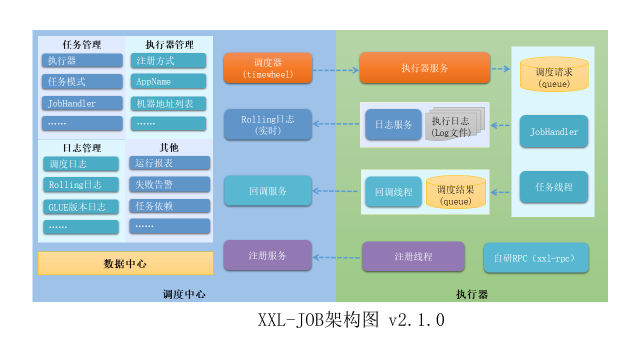
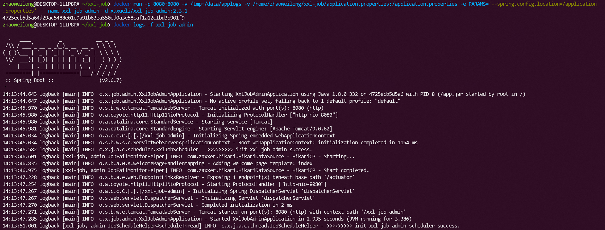
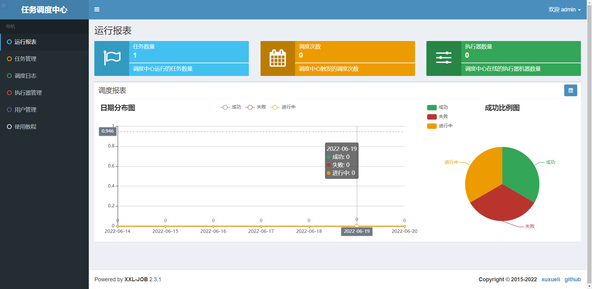
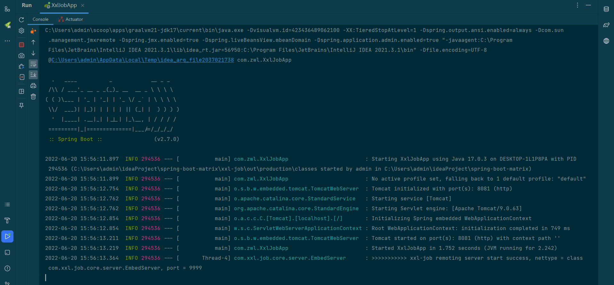
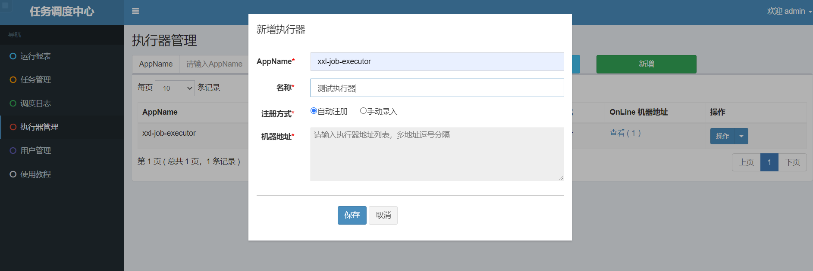
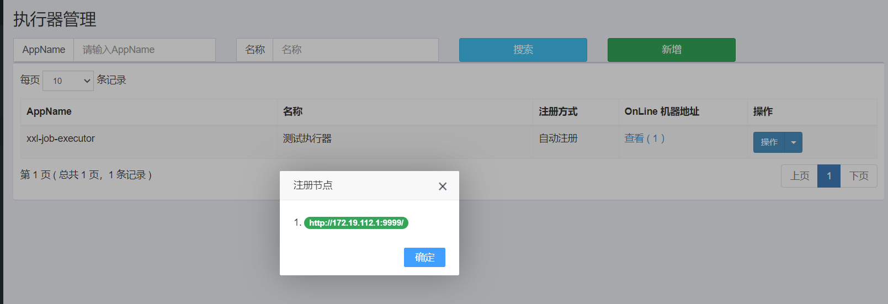
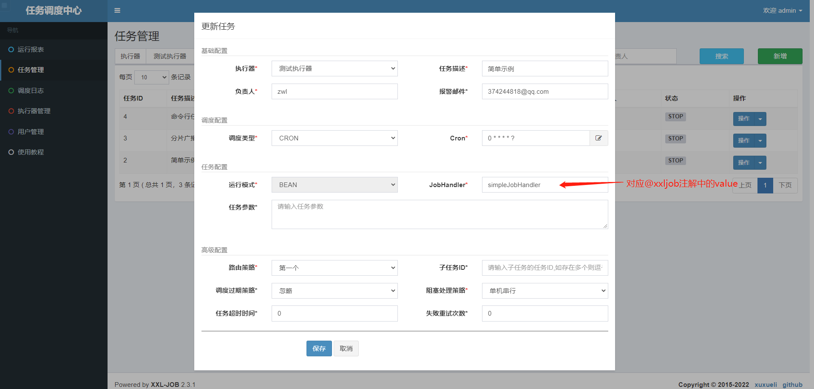
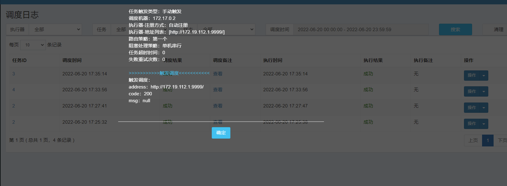
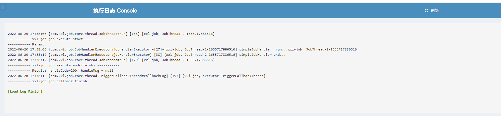
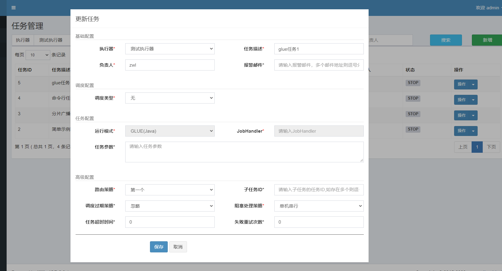

# xxl-job

## 介绍
XXL-JOB是一个分布式任务调度平台，其核心设计目标是开发迅速、学习简单、轻量级、易扩展。现已开放源代码并接入多家公司线上产品线，开箱即用。




### 特性

1、简单：支持通过Web页面对任务进行CRUD操作，操作简单，一分钟上手；

2、动态：支持动态修改任务状态、启动/停止任务，以及终止运行中任务，即时生效；

3、调度中心HA（中心式）：调度采用中心式设计，“调度中心”自研调度组件并支持集群部署，可保证调度中心HA；

4、执行器HA（分布式）：任务分布式执行，任务”执行器”支持集群部署，可保证任务执行HA；

5、注册中心: 执行器会周期性自动注册任务, 调度中心将会自动发现注册的任务并触发执行。同时，也支持手动录入执行器地址；

6、弹性扩容缩容：一旦有新执行器机器上线或者下线，下次调度时将会重新分配任务；

7、触发策略：提供丰富的任务触发策略，包括：Cron触发、固定间隔触发、固定延时触发、API（事件）触发、人工触发、父子任务触发；

8、调度过期策略：调度中心错过调度时间的补偿处理策略，包括：忽略、立即补偿触发一次等；

9、阻塞处理策略：调度过于密集执行器来不及处理时的处理策略，策略包括：单机串行（默认）、丢弃后续调度、覆盖之前调度；

10、任务超时控制：支持自定义任务超时时间，任务运行超时将会主动中断任务；

11、任务失败重试：支持自定义任务失败重试次数，当任务失败时将会按照预设的失败重试次数主动进行重试；其中分片任务支持分片粒度的失败重试；

12、任务失败告警；默认提供邮件方式失败告警，同时预留扩展接口，可方便的扩展短信、钉钉等告警方式；

13、路由策略：执行器集群部署时提供丰富的路由策略，包括：第一个、最后一个、轮询、随机、一致性HASH、最不经常使用、最近最久未使用、故障转移、忙碌转移等；

14、分片广播任务：执行器集群部署时，任务路由策略选择”分片广播”情况下，一次任务调度将会广播触发集群中所有执行器执行一次任务，可根据分片参数开发分片任务；

15、动态分片：分片广播任务以执行器为维度进行分片，支持动态扩容执行器集群从而动态增加分片数量，协同进行业务处理；在进行大数据量业务操作时可显著提升任务处理能力和速度。

16、故障转移：任务路由策略选择”故障转移”情况下，如果执行器集群中某一台机器故障，将会自动Failover切换到一台正常的执行器发送调度请求。

17、任务进度监控：支持实时监控任务进度；

18、Rolling实时日志：支持在线查看调度结果，并且支持以Rolling方式实时查看执行器输出的完整的执行日志；

19、GLUE：提供Web IDE，支持在线开发任务逻辑代码，动态发布，实时编译生效，省略部署上线的过程。支持30个版本的历史版本回溯。

20、脚本任务：支持以GLUE模式开发和运行脚本任务，包括Shell、Python、NodeJS、PHP、PowerShell等类型脚本;

21、命令行任务：原生提供通用命令行任务Handler（Bean任务，”CommandJobHandler”）；业务方只需要提供命令行即可；

22、任务依赖：支持配置子任务依赖，当父任务执行结束且执行成功后将会主动触发一次子任务的执行, 多个子任务用逗号分隔；

23、一致性：“调度中心”通过DB锁保证集群分布式调度的一致性, 一次任务调度只会触发一次执行；

24、自定义任务参数：支持在线配置调度任务入参，即时生效；

25、调度线程池：调度系统多线程触发调度运行，确保调度精确执行，不被堵塞；

26、数据加密：调度中心和执行器之间的通讯进行数据加密，提升调度信息安全性；

27、邮件报警：任务失败时支持邮件报警，支持配置多邮件地址群发报警邮件；

28、推送maven中央仓库: 将会把最新稳定版推送到maven中央仓库, 方便用户接入和使用;

29、运行报表：支持实时查看运行数据，如任务数量、调度次数、执行器数量等；以及调度报表，如调度日期分布图，调度成功分布图等；

30、全异步：任务调度流程全异步化设计实现，如异步调度、异步运行、异步回调等，有效对密集调度进行流量削峰，理论上支持任意时长任务的运行；

31、跨语言：调度中心与执行器提供语言无关的 RESTful API 服务，第三方任意语言可据此对接调度中心或者实现执行器。除此之外，还提供了 “多任务模式”和“httpJobHandler”等其他跨语言方案；

32、国际化：调度中心支持国际化设置，提供中文、英文两种可选语言，默认为中文；

33、容器化：提供官方docker镜像，并实时更新推送dockerhub，进一步实现产品开箱即用；

34、线程池隔离：调度线程池进行隔离拆分，慢任务自动降级进入”Slow”线程池，避免耗尽调度线程，提高系统稳定性；

35、用户管理：支持在线管理系统用户，存在管理员、普通用户两种角色；

36、权限控制：执行器维度进行权限控制，管理员拥有全量权限，普通用户需要分配执行器权限后才允许相关操作；


## 部署调度中心


xxl-job项目地址：<https://github.com/xuxueli/xxl-job>


1、运行数据库脚本，<https://github.com/xuxueli/xxl-job/blob/master/doc/db/tables_xxl_job.sql>


2、运行xxl-job-admin镜像


使用docker容器部署xxl-job-admin


官方容器镜像：`xuxueli/xxl-job-admin`


首先定义一个application.properties配置文件，配置文件可以在<https://github.com/xuxueli/xxl-job/blob/master/xxl-job-admin/src/main/resources/application.properties>找到

修改其中的相关配置，更改成自己的,然后运行容器，配置文件路径修改为自己对应，这里使用版本为2.3.1

```shell
docker run -p 8080:8080 -v /tmp:/data/applogs -v /home/zhaoweilong/xxl-job/application.properties:/application.properties -e PARAMS='--spring.config.location=/application.properties'  --name xxl-job-admin -d xuxueli/xxl-job-admin:2.3.1
```


通过`--spring.config.location=/application.properties`指定配置文件启动，通过-v将本地的配置文件映射到容器中





访问admin：<http://localhost:8080/xxl-job-admin/>,账号admin,密码123456



## 搭建执行器项目


执行器实际上是一个内嵌的Server，默认端口9999（配置项：xxl.job.executor.port）。

在项目启动时，执行器会通过“@JobHandler”识别Spring容器中“Bean模式任务”，以注解的value属性为key管理起来。

“执行器”接收到“调度中心”的调度请求时，如果任务类型为“Bean模式”，将会匹配Spring容器中的“Bean模式任务”，然后调用其execute方法，执行任务逻辑。如果任务类型为“GLUE模式”，将会加载GLue代码，实例化Java对象，注入依赖的Spring服务（注意：Glue代码中注入的Spring服务，必须存在与该“执行器”项目的Spring容器中），然后调用execute方法，执行任务逻辑

### 环境准备

- jdk17
- gradle7.4.2
- springboot2.7.0


添加xxl-job-core依赖

```
    implementation 'com.xuxueli:xxl-job-core:2.3.1'
```


配置xxl-job

```java

@ConfigurationProperties(prefix = XxlJobProperties.PREFIX)
@Configuration
@Data
public class XxlJobProperties implements Serializable {

    private static final long serialVersionUID = 1L;

    public static final String PREFIX = "xxl-job";

    /**
     * 是否开启xxl-job
     */
    private Boolean enable;

    /**
     * 调度中心地址
     */
    private String adminAddresses;

    private String accessToken;

    /**
     * 执行器AppName[选填]:执行器心跳注册分组依据,为空则关闭自动注册(xxl-job executor app name)
     */
    private String executorAppName;

    /**
     * 执行器注册[选填]:优先使用该配置作为注册地址,为空时使用内嵌服务 IP:PORT 作为注册地址
     * 从而更灵活的支持容器类型执行器动态IP和动态映射端口问题
     */
    private String executorAddress;


    /**
     * 执行器IP[选填]:默认为空表示自动获取IP,多网卡时可手动设置指定IP,该IP不会绑定Host仅作为通讯实用.
     * 地址信息用于'执行器注册'和'调度中心请求并触发任务'.
     */
    private String executorIp;

    /**
     * 执行器端口号[选填]:小于等于0则自动获取,默认端口为9999,单机部署多个执行器时,注意要配置不同执行器端口.
     */
    private int executorPort;

    /**
     * 执行器运行日志文件存储磁盘路径[选填]:需要对该路径拥有读写权限,为空则使用默认路径.
     */
    private String executorLogPath;

    /**
     * 执行器日志文件保存天数[选填],过期日志自动清理,限制值大于等于3时生效;否则,如-1,关闭自动清理功能.
     */
    private int executorLogRetentionDays;

}
```

注入`XxlJobSpringExecutor`执行器

```java
@Configuration
@ConditionalOnProperty(prefix = XxlJobProperties.PREFIX, name = "enable", havingValue = "true")
public class XxlJobAutoConfig {

    @Autowired
    private XxlJobProperties xxlJobProperties;

    @Bean
    public XxlJobSpringExecutor xxlJobSpringExecutor() {
        XxlJobSpringExecutor xxlJobSpringExecutor = new XxlJobSpringExecutor();
        xxlJobSpringExecutor.setAdminAddresses(xxlJobProperties.getAdminAddresses());
        xxlJobSpringExecutor.setAccessToken(xxlJobProperties.getAccessToken());
        xxlJobSpringExecutor.setAppname(xxlJobProperties.getExecutorAppName());
        xxlJobSpringExecutor.setAddress(xxlJobProperties.getExecutorAddress());
        xxlJobSpringExecutor.setIp(xxlJobProperties.getExecutorIp());
        xxlJobSpringExecutor.setPort(xxlJobProperties.getExecutorPort());
        xxlJobSpringExecutor.setLogPath(xxlJobProperties.getExecutorLogPath());
        xxlJobSpringExecutor.setLogRetentionDays(xxlJobProperties.getExecutorLogRetentionDays());
        return xxlJobSpringExecutor;
    }
}
```


application.yml配置：


```yaml

server:
  port: 8081

spring:
  application:
    name: xxl-job-executor
xxl-job:
  enable: true
  adminAddresses: http://localhost:8080/xxl-job-admin
  accessToken: default_token
  executorAppName: ${spring.application.name}
  executorLogPath: ${user.dir}/xxl-job/logs
  executorLogRetentionDays: 30
```


启动项目，可以看到执行器注册成功




新增一个执行器




刷新可以看到注册的地址了




## 运行任务

任务有两种模式

- Bean任务

每个Bean模式任务都是一个Spring的Bean类实例，它被维护在“执行器”项目的Spring容器中。任务类需要加“@JobHandler(value=”名称”)”注解，因为“执行器”会根据该注解识别Spring容器中的任务。任务类需要继承统一接口“IJobHandler”，任务逻辑在execute方法中开发，因为“执行器”在接收到调度中心的调度请求时，将会调用“IJobHandler”的execute方法，执行任务逻辑。

- GLUE任务

每个 “GLUE模式(Java)” 任务的代码，实际上是“一个继承自“IJobHandler”的实现类的类代码”，“执行器”接收到“调度中心”的调度请求时，会通过Groovy类加载器加载此代码，实例化成Java对象，同时注入此代码中声明的Spring服务（请确保Glue代码中的服务和类引用在“执行器”项目中存在），然后调用该对象的execute方法，执行任务逻辑。


另外还执行Shell、python、php、nodejs、powershell脚本任务


### Bean任务


新增三个job任务


```java
@Component
@Slf4j
public class JobHandlerExecutor {


    /**
     * 简单示例
     */
    @XxlJob(value = "simpleJobHandler", init = "init", destroy = "destroy")
    public void jobHandlerExecutor() {
        XxlJobHelper.log("simpleJobHandler  run...{}", Thread.currentThread().getName());

        for (int i = 0; i < 3; i++) {
            log.info("beat at:{}", i);
            try {
                TimeUnit.SECONDS.sleep(2);
            } catch (InterruptedException e) {
                e.printStackTrace();
            }
        }

        XxlJobHelper.log("simpleJobHandler end...");
    }


    /**
     * 分片广播示例
     */
    @XxlJob(value = "shardingJobHandler")
    public void shardingJobHandler() {
        log.info("shardingJobHandler  run...{}", Thread.currentThread().getName());
        // 分片参数
        int shardIndex = XxlJobHelper.getShardIndex();
        int shardTotal = XxlJobHelper.getShardTotal();

        XxlJobHelper.log("分片参数：当前分片序号 = {}, 总分片数 = {}", shardIndex, shardTotal);
        // 业务逻辑
        for (int i = 0; i < shardTotal; i++) {
            if (i == shardIndex) {
                XxlJobHelper.log("第 {} 片, 命中分片开始处理", i);
            } else {
                XxlJobHelper.log("第 {} 片, 忽略", i);
            }
        }
    }


    /**
     * 命令行参数示例
     */
    @XxlJob(value = "commandJobHandler")
    public void commandJobHandler() {
        XxlJobHelper.log("commandJobHandler  run...{}", Thread.currentThread().getName());
        String jobParam = XxlJobHelper.getJobParam();
        XxlJobHelper.log("commandJobHandler param:{}", jobParam);
        String str = RuntimeUtil.execForStr(jobParam);
        XxlJobHelper.log("commandJobHandler result:{}", str);
    }


    private void init() {
        log.info("init...");
    }

    private void destroy() {
        log.info("destroy...");
    }

}

```


在admin中新增三个bean任务





立即执行一次，查看调度日志




日志输出



以上是基于注解的方法bean模式

优点：
每个任务只需要开发一个方法，并添加”@XxlJob”注解即可，更加方便、快速。
支持自动扫描任务并注入到执行器容器。

缺点：要求Spring容器环境；

### GLUE任务

任务以源码方式维护在调度中心，支持通过Web IDE在线更新，实时编译和生效，因此不需要指定JobHandler


这种可以动态的更新维护定时任务，不需要重启执行器


调度中心，新建调度任务




在操作中打开GLUE IDE,编写任务类,可以引入执行器中的类，或注入spring中的类

```java
public class DemoJobHandler extends IJobHandler {

    private static final Logger log = LoggerFactory.getLogger(JobHandlerExecutor.class);


    @Override
    public void execute() throws Exception {

        long jobId = XxlJobHelper.getJobId();
        String jobParam = XxlJobHelper.getJobParam();

        log.info("DemoJobHandler jobId:{}, jobParam:{}", jobId, jobParam);
        XxlJobHelper.log("demoJobHandler jobId:{}, jobParam:{}", jobId, jobParam);

        String exec = RuntimeUtil.execForStr(jobParam);

        XxlJobHelper.handleSuccess(exec);

        XxlJobHelper.log("demoJobHandler exec：{}", exec);
        log.info("demoJobHandler exec:{}", exec);

    }
}
```


执行任务，可以在调度日志中查看


原理：每个 “GLUE模式(Java)” 任务的代码，实际上是“一个继承自“IJobHandler”的实现类的类代码”，“执行器”接收到“调度中心”的调度请求时，会通过Groovy类加载器加载此代码，实例化成Java对象，同时注入此代码中声明的Spring服务（请确保Glue代码中的服务和类引用在“执行器”项目中存在），然后调用该对象的execute方法，执行任务逻辑。


### 分片广播 & 动态分片

执行器集群部署时，任务路由策略选择”分片广播”情况下，一次任务调度将会广播触发对应集群中所有执行器执行一次任务，同时系统自动传递分片参数；可根据分片参数开发分片任务；

“分片广播” 以执行器为维度进行分片，支持动态扩容执行器集群从而动态增加分片数量，协同进行业务处理；在进行大数据量业务操作时可显著提升任务处理能力和速度。

“分片广播” 和普通任务开发流程一致，不同之处在于可以获取分片参数，获取分片参数进行分片业务处理。


- index：当前分片序号(从0开始)，执行器集群列表中当前执行器的序号；
- total：总分片数，执行器集群的总机器数量；


该特性适用场景如：

1、分片任务场景：10个执行器的集群来处理10w条数据，每台机器只需要处理1w条数据，耗时降低10倍；
2、广播任务场景：广播执行器机器运行shell脚本、广播集群节点进行缓存更新等


其他功能详细请查看官网文档说明，文档写的很不错，对照官方的文档入手<https://www.xuxueli.com/xxl-job/>