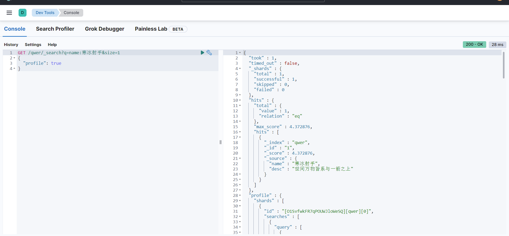

# ElasticSearch学习笔记

> Elasticsearch 是一个分布式的开源搜索和分析引擎，适用于所有类型的数据，包括文本、数字、地理空间、结构化和非结构化数据。Elasticsearch 在 Apache Lucene 的基础上开发而成，由
> Elasticsearch N.V.（即现在的 Elastic）于 2010 年首次发布。Elasticsearch 以其简单的 REST 风格 API、分布式特性、速度和可扩展性而闻名，是 Elastic Stack
> 的核心组件；Elastic Stack 是适用于数据采集、充实、存储、分析和可视化的一组开源工具。人们通常将 Elastic Stack 称为 ELK Stack（代指 Elasticsearch、Logstash 和
> Kibana），目前
> Elastic Stack 包括一系列丰富的轻量型数据采集代理，这些代理统称为 Beats，可用来向 Elasticsearch 发送数据

## 安装

?> 参考我的博客[elk实践.md](/blog/elk实践.md),使用docker安装elk组件,使用的es版本为当前最新8.2.0

## 基本概念

### Index（索引）

?> 索引是 对应mysql的database，**名称必须全部小写**

### Document（文档）

?> 文档就是Index里面的单条记录，对应mysql数据表的一条记录

document使用json数据格式

> [!note]
> type 类型在8.0完全移除了，不支持该类型

一个document的格式如下：

```json
{
  "_index": "spring-logstash-2022.05.12",
  "_id": "K8vRt4ABqrht7muPa8mk",
  "_version": 1,
  "_score": 1,
  "_source": {
    "thread_name": "scheduling-1",
    "logger_name": "com.zwl.ElkApp",
    "level_value": 20000,
    "@timestamp": "2022-05-12T10:29:56.664Z",
    "@version": "1",
    "level": "INFO",
    "message": "当前时间:2022-05-12 18:29:56,线程名称:scheduling-1"
  }
}
```

- `_index` 文档所属索引名称。

- `_id` Doc的主键。在写入的时候，可以指定该Doc的ID值，如果不指定，则系统自动生成一个唯一的UUID值。

- `_version` 文档的版本信息。Elasticsearch通过使用version来保证对文档的变更能以正确的顺序执行，避免乱序造成的数据丢失。

- `_score` 文档的分数。

- `_source` 文档的原始JSON数据。例如保存的日志信息。

### 数据类型

| 类型       | 说明 |
|----------|--------------------------------|
| 字符串      | text |
| 数值类型     | short、integer、Long 、byte、double、float、halt_float、scaled_float |
| 日期       | date |    
| 布尔       | boolean |
| 二进制      | binary |
| 范围数据类型   |integer_range、float_range、long_range、double_range、date_range |

## 中文分词插件

使用ik,[elasticsearch-analysis-ik](https://github.com/medcl/elasticsearch-analysis-ik)

或者使用elasticSearch官方的:[analysis-smartcn](https://github.com/elastic/elasticsearch-analysis-smartcn)

安装ik插件,我是用docker安装的，

```shell
docker exec -it elasticsearch /bin/bash && ./bin/elasticsearch-plugin install https://github.com/medcl/elasticsearch-analysis-ik/releases/download/v8.2.0/elasticsearch-analysis-ik-8.2.0.zip
```

如果是在本地安装，可以使用以下命令，注意对应es的版本

在es的安装目录下执行以下命令

```
./bin/elasticsearch-plugin install https://github.com/medcl/elasticsearch-analysis-ik/releases/download/v8.2.0/elasticsearch-analysis-ik-8.2.0.zip
```

安装smartcn插件

```shell
sudo bin/elasticsearch-plugin install analysis-smartcn
```

移除插件

```shell
sudo bin/elasticsearch-plugin remove analysis-smartcn
```

## elasticsearch REST API

> ES通过rest api来操作数据,主要学习以下几种

- Index APIs
- Document APIs
- Search APIs
- SQL APIs
- cat APIs
- Cluster APIs
- Data stream APIs
- Info API
- EQL search APIs

可以对比参考[es官方文档](https://www.elastic.co/guide/en/elasticsearch/reference/current/index.html)，建议学习最新版本文档


### 索引API

#### 创建索引

请求格式：

`PUT /<index>`

例如：

```
GET /qwer
```

可选参数有：

- aliases

> 索引的别名

```json
{
  "aliases": {
    "alias_1": {},
    "alias_2": {
      "filter": {
        "term": {
          "user.id": "kimchy"
        }
      },
      "routing": "shard-1"
    }
  }
}
```

- mappings

> 映射是定义文档及其包含的字段如何存储和索引的过程。
> 映射索引中的字段，包括字段名称、字段类型等其他特性

```json
{
  "settings": {
    "number_of_shards": 1
  },
  "mappings": {
    "properties": {
      "field1": {
        "type": "text"
      }
    }
  }
}
```

- settings

> 索引设置，number_of_shards分片数，number_of_replicas副本数

```json
{
  "settings": {
    "index": {
      "number_of_shards": 3,
      "number_of_replicas": 2
    }
  }
}

```


#### 查看索引列表

```
GET /_cat/indices?v
```


#### 查看索引详细信息

请求格式：

`GET /<index>`

> 支持 `_all` 或者 `*`查询所有

```
GET /qwer
```

#### 更新索引设置

请求格式：

`put /<target>/<action>`

> target就是对应索引名称，action支持

- _settings: 索引设置
- _mapping：映射设置

例如:

```
PUT /qwer/_settings
{
  "index":{
    "number_of_replicas":1
  }
}
```

#### 删除索引

请求格式：

`DELETE /<target>`

### 文档API

#### 创建更新文档

请求格式：

`PUT /<target>/_doc/<_id>`

`POST /<target>/_doc/`

`PUT /<target>/_create/<_id>`

`POST /<target>/_create/<_id>`

put用于更新，post新增，`POST /<target>/_doc/<_id >`可以指定id，不指定id的话会自动生成

```
POST /qwer/_doc/1
{
 "name":"寒冰射手",
 "desc":"世间万物皆系与一箭之上"
}
```


#### 查询文档

请求格式：

`GET <index>/_doc/<_id>`

`HEAD <index>/_doc/<_id>`

`GET <index>/_source/<_id>`

`HEAD <index>/_source/<_id>`

```
GET /qwer/_doc/1
```


#### 删除文档

`DELETE /<index>/_doc/<_id>`

### 搜索API

请求格式：

`GET /<target>/_search`

`GET /_search`

`POST /<target>/_search`

`POST /_search`

search的查询参数非常多，具体可以参考官网文档说明，我列下几个比较常用的

#### query parameter:

| 参数名     | 说明                                                                                                                                                                                              |
|---------|-------------------------------------------------------------------------------------------------------------------------------------------------------------------------------------------------|
| from    | 起始文档偏移量。需要为非负数，默认为0.                                                                                                                                                                            |
| size    | 定义要返回的命中数。默认为10.默认情况下，您不能使用from和 size参数对超过 10,000 个匹配进行分页。要翻阅更多点击，请使用该 [search_after](https://www.elastic.co/guide/en/elasticsearch/reference/current/paginate-search-results.html#search-after)参数 |
| sort    | 以逗号分隔的 <field>:<direction> 对列表排序。                                                                                                                                                               |
| _source | 指示为匹配文档返回哪些源字段。这些字段在hits._source搜索响应的属性中返回。默认为true. （字符串）要返回的源字段的逗号分隔列表。支持通配符 `*` 模式。                                                                                                           |
| q       | 以 Lucene query DSL 语法进行查询,                                                                                                                                                                      |                                                                                                                                                                            |

```
GET /qwer/_search?q=name:寒冰射手&size=1
{
  "profile": true
}
```



上面这种URL search用的比较少，重要使用request Body search，也就是DSL语法

#### Query DSL

> Elasticsearch 提供了基于 JSON 的完整 Query DSL（Domain Specific Language）来定义查询。将查询 DSL 视为查询的 AST（抽象语法树），由两种类型的子句组成：

- 叶查询子句

叶查询子句在特定字段中查找特定值，例如 match、term或 range查询。这些查询可以自己使用。

- 复合查询子句

复合查询子句包装其他叶或复合查询，并用于以逻辑方式组合多个查询（例如 boolordis_max查询），或改变它们的行为（例如 constant_score查询）。
查询子句的行为不同，具体取决于它们是在 查询上下文还是过滤器上下文中使用。

##### 全文搜索

###### intervals query

> 根据匹配词的顺序和接近度返回文档
> 隔查询使用匹配规则，由一小组定义构成。然后将这些规则应用于指定字段中的术语。
> 这些定义产生了跨越文本正文中术语的最小间隔序列。这些间隔可以由父源进一步组合和过滤

```
POST _search
{
  "query": {
    "intervals":{
      "name":{
        "match":{
          "query":"寒冰"
        }
      }
    }
  }
}
```

支持以下几种组合：

- match 对搜索条件进行分词然后查询匹配
- prefix 对前缀匹配
- wildcard 正则表达式匹配
- fuzzy 模糊匹配
- all_of 返回所有规则组合的匹配项
- any_of 返回任意一个子规则的匹配项

这里不展开说明了，太多了，自行去官网查看

###### match query

> 返回与提供的文本、数字、日期或布尔值匹配的文档。在匹配之前分析提供的文本
> match查询是执行全文搜索的标准查询，包括模糊匹配选项

```
GET /qwer/_search
{
  "query":{
    "match": {
      "name": {
        "query": "射手",
        "operator": "and"
      }
    }
  }
}
```

###### match_bool_prefix query

> 匹配布尔前缀

```
GET /qwer/_search
{
  "query": {
    "match_bool_prefix": {
      "desc": "世"
    }
  }
}
```

###### match_phrase query

> 短语查询匹配

```
GET /qwer/_search
{
  "query": {
    "match_phrase": {
      "name": "手"
    }
  }
}
```

###### match_phrase_prefix query

> 短语前缀匹配

```
GET /qwer/_search
{
  "query": {
    "match_phrase": {
      "name": "手"
    }
  }
}
```

###### multi_match query

> 多字段匹配

```
GET /qwer/_search
{
  "query": {
    "multi_match": {
      "query": "手",
      "fields": ["name","desc"]
    }
  }
}
```

###### combined_fields query

###### query_string query

> 查询字符串,使用 query_string 查询来创建包含通配符、跨多个字段的搜索等的复杂搜索

```
GET /qwer/_search
{
  "query": {
    "query_string": {
      "query": "name:冰"
    }
  }
}
```

查询字段语法:

模糊匹配：字段包含a

- 字段:a

条件匹配：字段包含a或者b

- 字段(a or b)

精确匹配：字段肯定包含a

- 字段:"a"

正则匹配：所有字段包含a

- *:(a)

```
GET /qwer/_search
{
  "query": {
    "query_string": {
      "query":"*:手"
    }
  }
}
```

通配符

- 使用`?`替换单个字符，`*`替换零个或多个字符

不为空：desc字段不为空

- _exists_:desc

###### simple_query_string query

#### response

- took 本次查询花费的时间
- timed_out 是否超时
- _shards 找了几个分片

### SQL Search API

> 可以使用sql语法对文档进行搜索，使用起来也非常方便

例如

```
GET _sql?format=json
{
  "query": """
  SELECT * FROM "qwer"
  """
}
```

支持POST和GET format支持多种数据格式，如csv、txt、yaml等


## 集群、节点、分片及副本

?> es天然支持分布式，支持搭建集群，主要两大特性:

__高可用性：__

- 服务可用性，允许节点停止服务
- 数据可用性，部分节点丢失，不会丢失数据

__可扩展性：__

- 可以将数据分布到其他节点，实现水平扩展

一个集群中包含一个或多个节点

__集群健康值__

- green：所有主要分片和复制分片都可用
- yellow：所有主要分片可用，但不是所有复制分片都可用
- red：不是所有的主要分片都可用

__节点：__

一个节点对应一个es示例，本质上就是一个java进程，正常一个主机一个节点

__分片：__

Primary Shard(主分片）

一个index有多个分片，默认为一个，相当于水平分表，一个分片就是一个es实例，一个索引中的数据保存在多个分片中

__副本__(__replica shard__)：

副本保证只有有节点有副本数据，只要不是存储数据的node全挂，数据就不会丢失，有了副本可以进行并行搜索，提高查询效率

## 倒排索引

> es是基于lucene，lucene就是使用了倒排索引


- Term（单词）：一段文本经过分析器分析以后就会输出一串单词，这一个一个的就叫做Term（直译为：单词）

- Term Dictionary（单词字典）：顾名思义，它里面维护的是Term，可以理解为Term的集合

- Term Index（单词索引）：为了更快的找到某个单词，我们为单词建立索引

- Posting List（倒排列表）：倒排列表记录了出现过某个单词的所有文档的文档列表及单词在该文档中出现的位置信息，每条记录称为一个倒排项(Posting)
  。根据倒排列表，即可获知哪些文档包含某个单词。（PS：实际的倒排列表中并不只是存了文档ID这么简单，还有一些其它的信息，比如：词频（Term出现的次数）、偏移量（offset）等，可以想象成是Python中的元组，或者Java中的对象）

> （PS：如果类比现代汉语词典的话，那么Term就相当于词语，Term Dictionary相当于汉语词典本身，Term Index相当于词典的目录索引）

关于排序规则:

- TF(term frequency),词频,term在当前document中出现的频率,一个term在当前document中出现5次要比出现1次更相关,打分也会更高
- IDF(inverse doucment frequency),逆向文档频率,term在所有document中出现的频率,这个频率越高,该term对应的分值越低
- 字段长度归一值,简单来说就是字段越短,字段的权重越高, 比如 term `我`在匹配 `我123`和`我123456`时,`我123`的得分会更高.
