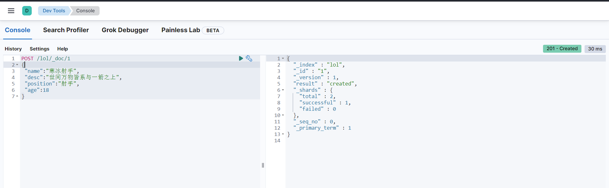
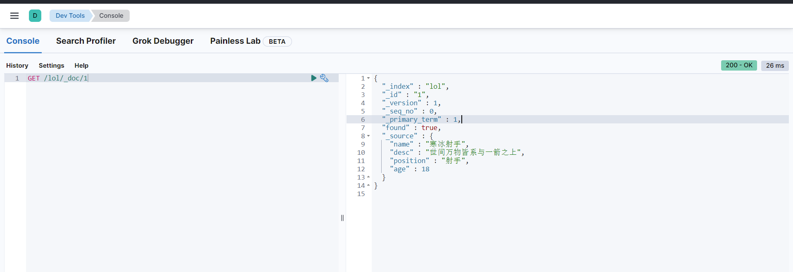

# ElasticSearch学习笔记

> Elasticsearch 是一个分布式的开源搜索和分析引擎，适用于所有类型的数据，包括文本、数字、地理空间、结构化和非结构化数据。Elasticsearch 在 Apache Lucene 的基础上开发而成，由
> Elasticsearch N.V.（即现在的 Elastic）于 2010 年首次发布。Elasticsearch 以其简单的 REST 风格 API、分布式特性、速度和可扩展性而闻名，是 Elastic Stack
> 的核心组件；Elastic Stack 是适用于数据采集、充实、存储、分析和可视化的一组开源工具。人们通常将 Elastic Stack 称为 ELK Stack（代指 Elasticsearch、Logstash 和
> Kibana），目前
> Elastic Stack 包括一系列丰富的轻量型数据采集代理，这些代理统称为 Beats，可用来向 Elasticsearch 发送数据

## 安装

?> 参考我的博客[elk实践.md](/blog/elk实践.md),使用docker安装elk组件,使用的es版本为当前最新8.2.0

## 基本概念

### Index（索引）

?> 索引是 对应mysql的database，**名称必须全部小写**

### Document（文档）

?> 文档就是Index里面的单条记录，对应mysql数据表的一条记录

document使用json数据格式

> [!note]
> type 类型在8.0完全移除了，不支持该类型

一个document的格式如下：

```json
{
  "_index": "spring-logstash-2022.05.12",
  "_id": "K8vRt4ABqrht7muPa8mk",
  "_version": 1,
  "_score": 1,
  "_source": {
    "thread_name": "scheduling-1",
    "logger_name": "com.zwl.ElkApp",
    "level_value": 20000,
    "@timestamp": "2022-05-12T10:29:56.664Z",
    "@version": "1",
    "level": "INFO",
    "message": "当前时间:2022-05-12 18:29:56,线程名称:scheduling-1"
  }
}
```

- _index 文档所属索引名称。

- _id Doc的主键。在写入的时候，可以指定该Doc的ID值，如果不指定，则系统自动生成一个唯一的UUID值。

- _version 文档的版本信息。Elasticsearch通过使用version来保证对文档的变更能以正确的顺序执行，避免乱序造成的数据丢失。

- _score 文档的分数。

- _source 文档的原始JSON数据。例如保存的日志信息。

### 数据类型

| 类型       | 说明 |
|----------|--------------------------------|
| 字符串      | text |
| 数值类型     | short、integer、Long 、byte、double、float、halt_float、scaled_float |
| 日期       | date |    
| 布尔       | boolean |
| 二进制      | binary |
| 范围数据类型   |integer_range、float_range、long_range、double_range、date_range |

## 中文分词插件

使用ik,[elasticsearch-analysis-ik](https://github.com/medcl/elasticsearch-analysis-ik)

或者使用elasticSearch官方的:[analysis-smartcn](https://github.com/elastic/elasticsearch-analysis-smartcn)

安装ik插件,我是用docker安装的，

```shell
docker exec -it elasticsearch /bin/bash && ./bin/elasticsearch-plugin install https://github.com/medcl/elasticsearch-analysis-ik/releases/download/v8.2.0/elasticsearch-analysis-ik-8.2.0.zip
```

如果是在本地安装，可以使用以下命令，注意对应es的版本

在es的安装目录下执行以下命令

```
./bin/elasticsearch-plugin install https://github.com/medcl/elasticsearch-analysis-ik/releases/download/v8.2.0/elasticsearch-analysis-ik-8.2.0.zip
```

安装smartcn插件

```shell
sudo bin/elasticsearch-plugin install analysis-smartcn
```

移除插件

```shell
sudo bin/elasticsearch-plugin remove analysis-smartcn
```

## elasticsearch REST API

> ES通过rest api来操作数据，支持的操作有：

* index：创建索引
* get：获取文档
* search：搜索文档
* update：更新文档
* delete：删除文档

使用ElasticVue扩展插件操作es

### 创建索引

```
GET /qwer 
```


### 查看所有索引

```
GET /_cat/indices?v
```


### 创建文档

可以指定id，不指定id的话会自动生成

```
POST /qwer/_create/1
{
 "name":"寒冰射手",
 "desc":"世间万物皆系与一箭之上"
}
```



### 更新文档

```

```



### 删除文档

```

```


### 查询文档

```

```


## DSL语法

## 集群、节点、分片及副本

?> es天然支持分布式，支持搭建集群，主要两大特性:

__高可用性：__

- 服务可用性，允许节点停止服务
- 数据可用性，部分节点丢失，不会丢失数据

__可扩展性：__

- 可以将数据分布到其他节点，实现水平扩展

一个集群中包含一个或多个节点

__集群健康值__

- green：所有主要分片和复制分片都可用
- yellow：所有主要分片可用，但不是所有复制分片都可用
- red：不是所有的主要分片都可用

__节点：__

一个节点对应一个es示例，本质上就是一个java进程，正常一个主机一个节点

__分片：__

Primary Shard(主分片）

一个index有多个分片，默认为一个，相当于水平分表，一个分片就是一个es实例，一个索引中的数据保存在多个分片中

__副本__(__replica shard__)：

副本保证只有有节点有副本数据，只要不是存储数据的node全挂，数据就不会丢失，有了副本可以进行并行搜索，提高查询效率

## 倒排索引

> es是基于lucene，lucene就是使用了倒排索引


- Term（单词）：一段文本经过分析器分析以后就会输出一串单词，这一个一个的就叫做Term（直译为：单词）

- Term Dictionary（单词字典）：顾名思义，它里面维护的是Term，可以理解为Term的集合

- Term Index（单词索引）：为了更快的找到某个单词，我们为单词建立索引

- Posting List（倒排列表）：倒排列表记录了出现过某个单词的所有文档的文档列表及单词在该文档中出现的位置信息，每条记录称为一个倒排项(Posting)
  。根据倒排列表，即可获知哪些文档包含某个单词。（PS：实际的倒排列表中并不只是存了文档ID这么简单，还有一些其它的信息，比如：词频（Term出现的次数）、偏移量（offset）等，可以想象成是Python中的元组，或者Java中的对象）

> （PS：如果类比现代汉语词典的话，那么Term就相当于词语，Term Dictionary相当于汉语词典本身，Term Index相当于词典的目录索引）

关于排序规则:

- TF(term frequency),词频,term在当前document中出现的频率,一个term在当前document中出现5次要比出现1次更相关,打分也会更高
- IDF(inverse doucment frequency),逆向文档频率,term在所有document中出现的频率,这个频率越高,该term对应的分值越低
- 字段长度归一值,简单来说就是字段越短,字段的权重越高, 比如 term `我`在匹配 `我123`和`我123456`时,`我123`的得分会更高.
