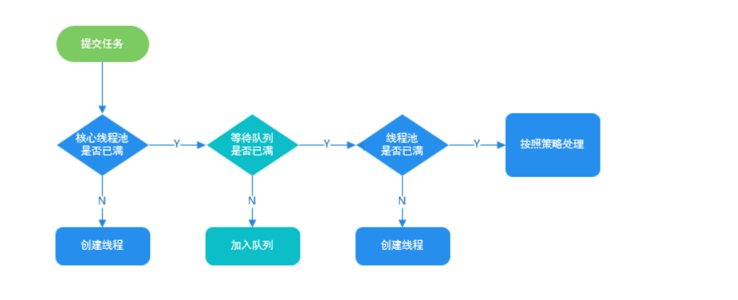
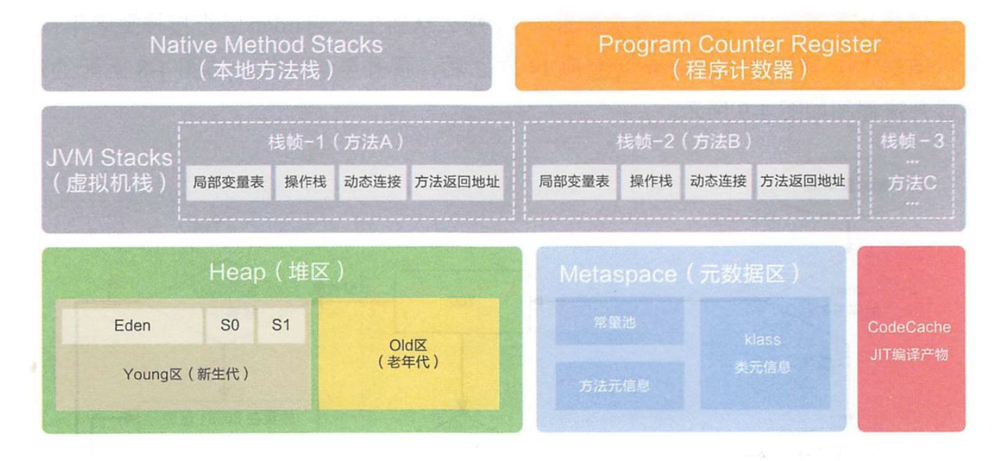
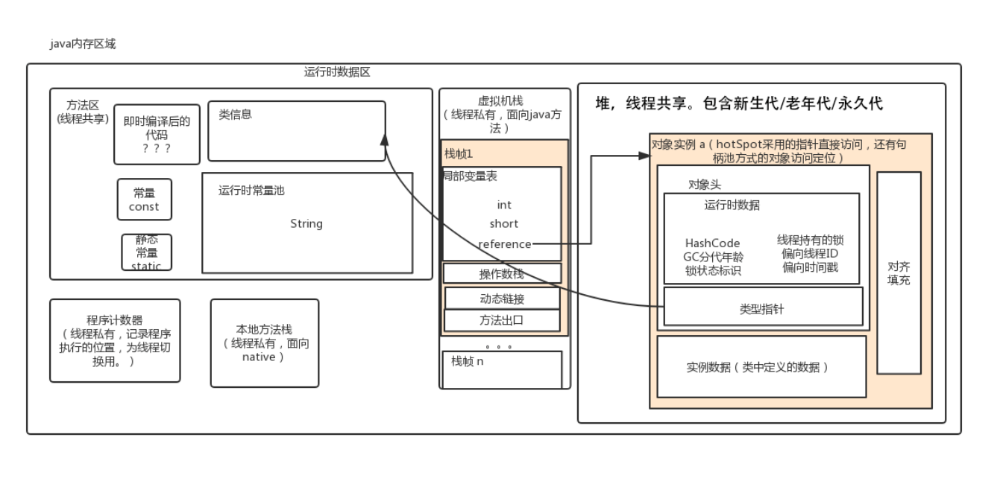
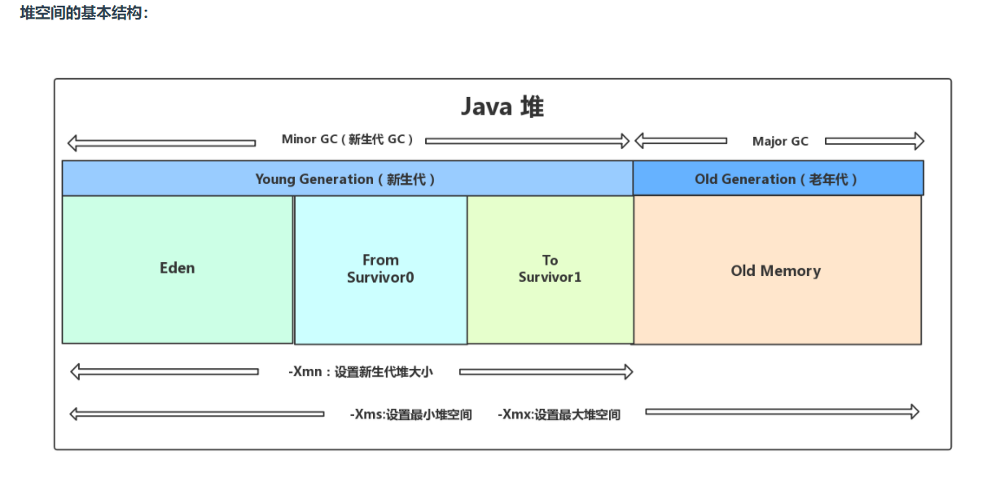
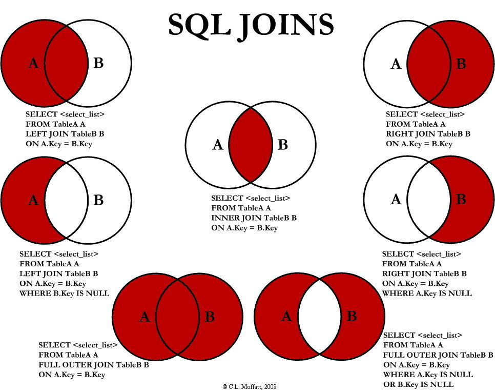

 # Java笔记
 
## 基础

#### 重载和重写的区别？

重载：相同的方法名，参数不同，返回类型不同的两个或多个方法叫重载
重写：子类重写父类的方法

#### 抽象类和接口的区别？
- 抽象类单继承，接口多实现
- 抽象类可以有默认实现方法，jdk1.7之前接口没有，1.8可以有
- 接口除了static、final不能有其他变量，而抽象类不一定
- 接口方法默认修饰符是public，抽象方法可以有public、private、protected、default

####  ==与equals的区别？
> 对于基本数据类型，==比较的是值，对于引用数据类型，重写equals情况下，比较的是值，否则比较的是内存地址

#### 两个对象的hashCode()相同，则 equals()是否也一定为 true？
> 不一定，hashcode值只是为了提高性能，hash碰撞有可能相同，所以需要重写equals方法

#### 类初始的执行顺序？
- 始化化父类静态变量、执行父类的静态代码快
- 初始化子类静态变量、执行子类的静态代码快
- 初始化父类普通成员、执行父类代码块
- 执行父类的构造函数
- 初始化子类普通成员、执行子类的非静态代码快
- 执行子类的构造函数


#### Java关键字volatile作用？
>volatile关键字可以保证变量的可见性，读到的数据永远都是最新的数据
>禁止指令重排

#### 什么是反射?
在运行状态中，对于任意一个类，都能知道这个类的方法、属性，对于任意一个对象，都能够调用他的任意一个方法和属性。这种动态获取信息以及动态调用对象方法的功能称为Java语言的反射机制

#### 代理模式有哪几种？
- 静态代理
静态代理在编译时就将接口、实现类、代理类变成了一个个实际的class文件

- 动态代理
动态代理不需要针对每个目标类都单独创建一个代理类，也不需要必须实现接口，从jvm的角度来说，动态代理实在运行时动态生成类字节码，并加载到jvm，实现有jDK动态代理，CGLIB代理

-JDK 动态代理和 CGLIB 动态代理对比
JDK 动态代理只能只能代理实现了接口的类，而 CGLIB 可以代理未实现任何接口的类。 另外， CGLIB 动态代理是通过生成一个被代理类的子类来拦截被代理类的方法调用，因此不能代理声明为 final 类型的类和方法。就二者的效率来说，大部分情况都是 JDK 动态代理更优秀，随着 JDK 版本的升级，这个优势更加明显

#### 创建对象的几种方式？
- new关键字
- 反射
- 克隆
- 序列化

#### Java是值传递还是引用传递？
参数传递实际上是赋值操作，不管是基本数据类型还是引用数据类型

#### 什么是浅拷贝、深拷贝？
基本数据类型都是值
- 浅拷贝：引用类型是同一个引用，指向的是同一个内存地址
- 深拷贝：会创建新的对象，指向的是不同的内存地址

#### 类加载器有哪些？
- 启动类加载器（Bootstrap Classloader） 
- 扩展类加载器
- 系统（应用）类加载器
- 自定义类加载器

#### 类加载机制？
- 加载
类加载器通过类的全限定类名查找此类字节码文件，利用字节码创建一个class对象
- 连接
> 验证、准备、解析
验证：class文件的字节流中包含信息是否符合当前虚拟机要求，文件格式验证、元数据验证、字节码验证、符号引用验证
准备：为类变量（static）分配内存，实例变量不会，实例变量会随着对象的实例化一块分配到java堆中
解析：将常量池中的符号引用替换为直接引用
- 初始化
假设该类还没有没加载和连接，则先加载该类
假设该父类还没有被初始化，则先初始化该父类
假设类中有初始化语句则先执行初始化语句，为实例对象分配内存

#### forName和loaderClass区别
- Class.forName()得到的class是已经初始化完成的
- Classloader.loaderClass得到的class是还没有连接的。


#### 什么是双亲委派模型？
>双亲委派模型除了顶层的启动类加载器外，其余的类加载器都应当要有自己的父类加载器
>如果一个类加载器收到类加载请求，它并不会自己去加载，而是交由父类加载器加载，依次递归，最终到达顶层类加载器，如果父类加载器可以加载，就成功返回，若无法加载，则由子类加载器自己去加载

- 这种层级关系，避免了类的重复加载，其次是安全，Java核心API定义的类不能随意替换

#### IO流有哪些？
>按输入方向分为：输入流、输出流
>按操作单元拆分：字节流、字符流

- 字节流
inputStream、outputStream
- 字符流
Read、Write

#### 字节流怎么转换为字符流？
>InputStreamReader是字节流通向字符流的桥梁
>OutputStreamWrite是字符流通向字节流的桥梁

#### 
## 集合

#### 集合框架
>Java中除Map类以外，其余都实现了Collection接口
>Collection的四大集合，List、queue、Dequeue、Set
>Map的实现类，HashMap、HashTable、TreeMap


#### ArrayList和LinkedList区别？
- 数据结构不同，arraylist采用的是数组结构，linkedlist是链表结构
- arraylist查询快，增删慢，linkedlist查询慢，增删快


#### HashMap和HashTable的区别？
- HashMap不是线程安全的，hashtable是
- hashmap可以存放null的key和null的value，hashtable不可以
- hashmap初始容量为16，之后每次扩容为原来的两倍，hashtable初始容量为11，每次扩容为原来的2n+1
- 数据结构，java8以后，当链表i=长度大于8时，将链表自动转换为红黑树，hashtable没有这种机制

#### List、Set、Map的区别？
- List是有序的、可重复的
- Set是无序、不可重复的
- Map是Key-Value的键值对映射，key是无序、不可重复的，value是无序、可重复的


#### HashMap的底层实现？
jdk1.7采用数组+链表实现，jdk1.8采用数组+链表/红黑树实现的，默认初始容量16，负载因子0.75，当链表长度大于8，并且数组长度大于64，会将链表转换为红黑树减少搜索时间，当数组长度大于16*0.75=12时，数组会进行扩容，每次扩容为之前的两倍


#### ConcurrentHashMap 和 Hashtable 的区别？
>主要体现在实现线程安全的方式上
- 底层数据结构:
JDK1.7之前，concurrentHashMap采用分段的数据+链表实现，JDK1.8采用的结构跟HashMap1.8是完全一样的，数据+链表/红黑二叉树
- 实现线程安全的方式：
JDK1.7,concurrentHashMap采用分段锁，Jdk1.8则采用了synchronized 和CAS操作，看起来就像是优化过且线程安全的的HashMap，
Hashtable使用synchronized加锁，效率低下

#### 栈和队列的区别？
- 栈插入和删除元素都是一端进行的，队列是尾部添加，头部删除
- 栈是先进后出，队列是先进先出

#### 并发容器
- CopyOnWriteArrayList
一般用于读多写少
- ConcurrentHashMap
- ConcurrentlinkedQueue
线程安全的非阻塞队列
- ConcurrentSkipListMap
调表的实现，查找效率很高
- BlockQueue
ArrayBlockingQueue
有界阻塞队列，默认情况下保证公平性，
LinkedBlockingQueue 
有界/无界的阻塞队列，可以指定其大小，未指定默认为integer.MAX_VALUE
PriorityBlockingQueue
支持的优先级的无解阻塞队列，默认按自然排序，也可以通过compareTo()实现排序，可指定容量，不够的话会自动扩容


## 多线程

#### 线程的生命周期？
- 新建-就绪-运行-阻塞-销毁

#### 创建线程的几种方式

- 继承Thread类
- 实现Runable接口
- 实现Callable接口

#### 线程间如何通信？
- 使用 volatile 关键字
多个线程同时监听一个变量，由于保证了可见性，当变量改变时，其他线程可以感知
- 使用Object的wait和notify方法
wait和 notify必须配合synchronized使用，wait方法释放锁，notify方法不释放锁
- 使用JUC工具类 CountDownLatch
**CountDownLatch**基于AQS框架，相当于也是维护了一个线程间共享变量state
- 使用LockSupport实现线程间的阻塞和唤醒
LockSupport 是一种非常灵活的实现线程间阻塞和唤醒的工具，使用它不用关注是等待线程先进行还是唤醒线程先运行，但是得知道线程的名字

#### sleep、wait、yield、join方法的区别？
- sleep
属于Thread类的方法，休眠当前正在执行的线程，不会释放锁，让出cpu，会阻塞线程，不考虑线程优先级
- yield
属于Thread类的方法，都是暂停当前执行线程，不会释放锁，让出cpu，不会阻塞线程，而是进入就绪状态，只有具有相同优先级的其他线程可以运行
- wait
属于Object类的方法，wait过程中线程会释放对象锁，必须在synchronization代码块中使用，对应notify方法同理，否则抛出异常
- join
等待调用join的线程方法执行之后，再继续执行，一般用于等待异步线程执行结果才继续运行的情况


#### 创建线程池的几种方式？
- newCachedThreadPool，创建一个可缓存的线程池，可灵活回收空闲线程，若无线程，则新建线程
- newFixedThreadPool，创建一个指定数量的线程池
- newSingleThreadPool。创建一个单线程的线程池
- newScheduleThreadPool，创建一个定长的。定时、周期性的线程池，执行定时、周期任务执行

FixedThreadPool、SingleThreadPool使用无界队列，可能导致OOM（内存溢出）
CachedThreadPool、ScheduleThreadPool，

#### ThreadPoolExecutor
>推荐使用ThreadPoolExecutor创建线程池
>
Executors 返回线程池对象的弊端如下：
FixedThreadPool 和 SingleThreadExecutor ： 允许请求的队列长度为 Integer.MAX_VALUE,可能堆积大量的请求，从而导致 OOM。CachedThreadPool 和 ScheduledThreadPool ： 允许创建的线程数量为 Integer.MAX_VALUE ，可能会创建大量线程，从而导致 OOM。
- corePoolSize：最小核心线程数
- maximumPoolSize：最大线程数
- workQueue：任务队列，当运行的线程数量达到最大线程数时，会加入到队列中

**拒绝策略**
- AbortPolicy 抛出RejectedExecutorException异常
- CallerrRunsPolicy 调用执行自己的线程执行任务，也就是调用executor的线程执行，如果执行线程已关闭，则直接丢弃
- DiscardPolicy 直接丢弃任务
- DiscardOldestPolicy 丢弃最早的未处理的任务

**执行流程**



- execute()方法用于提交不需要返回值的任务，所以无法判断任务是否被线程池执行成功与否；
- submit()方法用于提交需要返回值的任务。线程池会返回一个 Future 类型的对象，通过这个 Future 对象可以判断任务是否执行成功，并且可以通过 Future 的 get()方法来获取返回值，get()方法会阻塞当前线程直到任务完成，而使用 get（long timeout，TimeUnit unit）方法则会阻塞当前线程一段时间后立即返回，这时候有可能任务没有执行完。
#### synchronized和lock的区别？
- synchronization是java关键字，是jvm层面的，lock是一个类
- synchronization获取不到锁的线程会一直阻塞，lock可以中断
- synchronization中出了异常会自动释放锁，lock需要手动释放锁，在finally代码块中释放
- synchronization是可重入，不可中断，非公平的，lock是可重入，可中断，可公平的
- 一般根据线程执行时间选择对应的锁，执行时间短的，适合synchronized，执行时间长的适合lock


**synchronized实现原理**
可以把任意一个非null对象作为“锁”，即对象监视器，Object monitor

1、当作用在方法上，监视器锁时对象实例
2、当作用在静态方法上，监视器锁是对象的class实例，因为class存在于永久代
3、作用在一个同步代码块，锁是括号中的对象

执行步骤：
线程执行monitorenter指令尝试获取锁，如果标志位状态为0，则获取成功，标志位+1，否则获取失败，根据锁的状态使用自锁或者阻塞方式等待，线程执行玩之后，执行monitorexit指令，标志位减1，如果减1后变为0，则线程退出monitor


#### 锁
- 乐观锁/悲观锁
乐观锁：在并发操作时，认为不会存在竞争，所以不会上锁，在更新数据时，使用版本号机制判断是否修改，适用于多读的应用类型，
Java中java.util.concurrent.atomic就是使用乐观锁的一种实现方式CAS实现的
悲观锁：在并发操作时，认为总是存在竞争，所以每次操作操作都要加锁

- 独享锁/共享锁
独享锁：该锁一次只能被一个线程所持有
共享锁：该锁可被多个线程持有

- 互斥锁/读写锁
跟独享锁/共享锁是一种广义的说法
互斥锁在Java中的具体实现就是ReentrantLock。
读写锁在Java中的具体实现就是ReadWriteLock

- 可重入锁
又名递归锁，值同一个线程在外层获得锁后，进行内层方法会自动获得锁

- 公平锁/非公平锁
公平锁：按照申请锁的顺序获得锁
非公平锁：多个线程获得锁的顺序不是按照申请锁的顺序
ReentranLock和synchronization都是非公平锁，ReentrantLock可以设置为公平锁

- 分段锁
是一种锁的设计，ConcurrentHashMap的分段锁称为segment，即内部拥有一个entry数组，数组中的每个元素又是一个链表，同时又是一个ReentrantLock，
当put操作时，通过HashCode知道放在哪一个分段中，对这个分段加锁，多线程操作时，只要不是放在一个分段中，就实现了并行插入

- 偏向锁/轻量级锁/重量级锁
是三种时锁的状态，并且是针对synchronization的
偏向锁时指同一段代码块一直被同一个线程访问，那么该线程会自动获取锁，降低获取锁的代价
轻量级锁：在偏向锁的前提下，被另一个线程访问，偏向锁会升级为轻量级锁，其他线程会通过自旋的方式获取锁，提高性能
重量级锁：在轻量级锁的前提下，当线程自旋到一定次数时，还没获得锁，则线程进入阻塞状态，该锁升级为重量级锁，其他线程会进入阻塞状态，性能降低

- 自旋锁
在线程尝试获取锁的过程中，不会立即阻塞，而是采用循环的方式去获得锁，这样的好处是减少线程的上下文切换，缺点是会消耗cpu

#### AQS
> AbstractQuenedSynchronizer抽象的队列式同步器,是除了java自带的synchronized关键字之外的锁机制
> 是基于CLH队列实现的一种锁机制，即将暂时获取不到锁的线程加入到队列中，用volatile修饰共享变量state，线程通过CAS去改变状态符，成功则获取锁成功，失败则进入等待队列
> ***AQS是自旋锁，实现了AQS的锁有:自旋锁、互斥锁、读锁写锁、条件产量、信号量、栅栏*

#### CAS
>compare and swap 即比较再交换
>CAS是一种无锁算法，乐观锁机制，  CAS有三个值，内存值V，旧的预期值A，新的预期值B，当且仅当预期值A和内存值V相同时，将内存值修改为B，否则什么都不干，这两步在CPU层面保证了原子性

- CAS缺点
1、循环时间长，cpui开销大
2、只能保证一个共享变量
3、ABA问题
假设内存值是A，一个线程将值修改为B，又将值修改为A，另一个线程修改时发现内存值和他的旧的预期值相同，就认为没有被修改过，虽然结果是正确的，但不代表过程没有问题。
解决方法：使用版本号机制，automicStampedReference类就是采用了版本号机制，属于JUC包下的类

#### JUC
>JUC是java.util.concurrent工具包的简称，这是一个处理线程的工具类


#### Semaphore（信号量）
允许多个线程同时访问


#### CountDownLatch（倒计时器）
>CountDownLatch允许count个线程阻塞在一个地方，直至所有的线程执行完毕

CountDownLatch是共享锁的一种实现,它默认构造 AQS 的 state 值为 count。当线程使用countDown方法时,其实使用了tryReleaseShared方法以CAS的操作来减少state,直至state为0就代表所有的线程都调用了countDown方法。当调用await方法的时候，如果state不为0，就代表仍然有线程没有调用countDown方法，那么就把已经调用过countDown的线程都放入阻塞队列Park,并自旋CAS判断state == 0，直至最后一个线程调用了countDown，使得state == 0，于是阻塞的线程便判断成功，全部往下执行

#### CyclicBarrier（循环栅栏）
>CountDownLatch的实现是基于AQS的，而CycliBarrier是基于 ReentrantLock(ReentrantLock也属于AQS同步器)和 Condition 的.
让一组线程到达一个屏障时阻塞，直到最后一个线程到达屏障，屏障才会开门，所有被拦截的线程才会继续运行，默认参数表示屏障拦截的线程数量，每个线程调用await阻塞等待屏障放行

两者区别：CountDownLatch只能使用一次，而CyclicBarrier可以循环使用

#### 介绍下ThreadLocal及应用场景？
>threadlocal提供了线程局部变量，每个线程拥有一份自己的副本变量，多个线程互不干扰

threadlocal有一个静态内部类ThreadLocalMap,存放了每个线程的变量，key是线程的引用，value是数据

**ThreadLocal带来的问题**
内存泄露：本该回收的对象没有回收
弱引用一定程度上回收了无用对象，但前提是手动清理掉对象的强引用，只要线程一直不死，ThreadLocalMap的key-value会一直增加


## JVM

#### JVM内存模型？

- jdk1.8之后

分为：程序计数器、本地方法栈、虚拟机栈、堆、元数据区



- jdk1.8之前



- 线程私有的
程序计数器、本地方法栈、虚拟机栈
- 线程共享的
堆、方法区、直接内存

- 程序计数器
用于记录当前线程执行位置，依次读取指令，实现流程控制

- 虚拟机栈
虚拟机栈由一个个栈帧组成，每个栈帧又包含了：局部变量表、操作数栈、动态链接、方法出口等信息

栈出现的两种异常，stackOverFlowError、outofMemoryError

- 堆
Java 虚拟机所管理的内存中最大的一块，Java 堆是所有线程共享的一块内存区域，在虚拟机启动时创建。此内存区域的唯一目的就是存放对象实例，几乎所有的对象实例以及数组都在这里分配内存。
Java 堆是垃圾收集器管理的主要区域，因此也被称作GC 堆（Garbage Collected Heap）.从垃圾回收的角度，由于现在收集器基本都采用分代垃圾收集算法，所以 Java 堆还可以细分为：新生代和老年代：再细致一点有：Eden 空间、From Survivor、To Survivor 空间等。进一步划分的目的是更好地回收内存，或者更快地分配内存。

#### JVM垃圾回收



>大部分情况下，对象首先在eden分配内存，在一次新生代垃圾回收后，则会进入s0或s1，并且对象的年龄增加，当对象的年龄增加到一定次数，就会晋升到老年代

堆内存常见分配策略
- 对象优先在eden区分配
- 大对象直接进入老年代
- 长期存活的对象进入老年代

**垃圾回收算法**
- 标记-清除
首先标记所有不需要回收的对象，在标记完成后统一回收所有没有被标记的对象
缺点:1、效率问题，2、空间问题
- 复制
为了解决效率问题，出现了复制算法，他将内存分为大小相同的两块，每次使用其中的一块，当这一半的内存使用完了后，就将还存活的对象复制到另一半内存中，然后再把使用前的空间清理掉
- 标记-整理
根据老年代的特点提出的一种算法，标志所有不需要回收的对象，让所有存活的对象向一端移动，然后清理边界以外的内存
- 分代收集
根据对象的存活周期将内存分为新生代和老年代，这样就可以根据各个年代的特点选择合适的垃圾回收算法
比如新生代中，每次收集都有大量对象的死去，可以使用复制算法，对于老年代则可以使用标记-清除，标记-整理算法


**垃圾收集器**

serial

parNew

paraller scavenge
>jdk1.8默认收集器，使用复制算法的错线程收集器，新生代采用复制算法，老年代使用标记-整理算法

**CMS**

CMS（Concurrent Mark Sweep）收集器是一种以获取最短回收停顿时间为目标的收集器。它非常符合在注重用户体验的应用上使用。
CMS（Concurrent Mark Sweep）收集器是 HotSpot 虚拟机第一款真正意义上的并发收集器，它第一次实现了让垃圾收集线程与用户线程（基本上）同时工作。

采用标记-清除算法，并发收集、低停顿

**G1**

G1 (Garbage-First) 是一款面向服务器的垃圾收集器,主要针对配备多颗处理器及大容量内存的机器. 以极高概率满足 GC 停顿时间要求的同时,还具备高吞吐量性能特征.


## 网络编程

#### 网络模型有哪几层？
>七层模型：从下往上依次是，物理层、数据链路层、网络层、传输层、会话层、表示层、应用层
>五层模型：从下到上，物理层、数据链路层、网络层、传输层、应用层


#### 讲讲TCP协议的三次握手和四次挥手？
- 三次握手
>三次握手的目的是建立可靠的通信，双方确认自己与对方的发送和接收都是正常的

第一次握手：客户端发送SYN标志的数据包，服务器端确认接收正常
第二次握手：服务端发送SYN/ACK标志的数据包，客户端确认发送、接收正常
第三次握手：客户端发送ACK标志的数据包，服务端确认发送正常


- 四次挥手

第一次：客户端发送一个FIN，用来关闭客户端与服务器的连接
第二次：服务端收到FIN，发回ACK报文确认，确认序号为收到的序号加1
第三次：服务端发送FIN，用来关闭服务端与客户端的连接
第四次：客户端收到FIN，发回ACK报文确认，并将确认的序号加1


#### TCP和UDP的区别？

TCP是面向连接的，可靠的传输协议，一般用于文件传输，发送和接收邮件
UDP是无连接的，不可靠的传输协议，一般用于音频、视频传输

#### TCP如何保证可靠的传输

- 应用数据被分割成 TCP 认为最适合发送的数据块。TCP 给发送的每一个包进行编号，接收方对数据包进行排序，把有序数据传送给应用层。
- 校验和： TCP 将保持它首部和数据的检验和。这是一个端到端的检验和，目的是检测数据在传输过程中的任何变化。如果收到段的检验和有差错，TCP 将丢弃这个报文段和不确认收到此报文段。TCP 的接收端会丢弃重复的数据。
- 流量控制： TCP 连接的每一方都有固定大小的缓冲空间，TCP的接收端只允许发送端发送接收端缓冲区能接纳的数据。当接收方来不及处理发送方的数据，能提示发送方降低发送的速率，防止包丢失。TCP 使用的流量控制协议是可变大小的滑动窗口协议。 （TCP 利用滑动窗口实现流量控制）
- 拥塞控制： 当网络拥塞时，减少数据的发送。
- ARQ协议： 也是为了实现可靠传输的，它的基本原理就是每发完一个分组就停止发送，等待对方确认。在收到确认后再发下一个分组。
- 超时重传： 当 TCP 发出一个段后，它启动一个定时器，等待目的端确认收到这个报文段。如果不能及时收到一个确认，将重发这个报文段。


#### 滑动窗口和流量控制
TCP利用滑动窗口实现流量控制，流量控制是为了控制发送方的发送速率，保证接受方来的及接收

#### http协议和https协议的区别？
- 端口：https默认是443端口，http默认是80端口
- 安全性和资源消耗：http是建立在tcp之上的，所有传输的内容都是明文，客户端和服务端无法验证双方身份，存在中间人攻击，https是建立在SSL/TSL之上的http协议，SSL/TSL协议是TCP之上的，所有内容都经过加密，采用对称加密，但对称加密的密钥用服务器的证书进行了非对称加密，https比http更安全，但资源消耗也高

#### 什么是tcp粘包、拆包？
1、应用程序写入的数据大于套接字缓冲区大小，这将会发生拆包。 
2、应用程序写入数据小于套接字缓冲区大小，网卡将应用多次写入的数据发送到网络上，这将会发生粘包。 
3、进行MSS（最大报文长度）大小的TCP分段，当TCP报文长度-TCP头部长度>MSS的时候将发生拆包。 
4、接收方法不及时读取套接字缓冲区数据，这将发生粘包。

解决方法

TCP本身是面向流的，作为网络服务器，如何从这源源不断涌来的数据流中拆分出或者合并出有意义的信息呢？通常会有以下一些常用的方法：1、发送端给每个数据包添加包首部，首部中应该至少包含数据包的长度，这样接收端在接收到数据后，通过读取包首部的长度字段，便知道每一个数据包的实际长度了。2、发送端将每个数据包封装为固定长度（不够的可以通过补0填充），这样接收端每次从接收缓冲区中读取固定长度的数据就自然而然的把每个数据包拆分开来。3、可以在数据包之间设置边界，如添加特殊符号，这样，接收端通过这个边界就可以将不同的数据包拆分开。

#### BIO、NIO、AIO有什么区别？
- BIO
是同步阻塞IO，线程的读取写入必须阻塞在一个线程内完成
- NIO
同步非阻塞IO，基于通道channel，面向缓存流的，通过通道将数据写入缓存区，从缓存区通过通道读取
- AIO
是BIO的改进版，是异步非阻塞IO，基于事件和回调机制实现的


## 数据结构/算法

### 数组
### 链表
### 队列
### 栈
### 树

#### 二叉树
>最多两个节点的树，左子树小于等于根节点，右子树大于等于根节点

**二叉树的遍历**
- 前序遍历
先访问根节点，再访问左子树，最后访问右子树
- 中序遍历
先访问左子树，再访问根节点，最后访问右子树
- 后序遍历
先访问左子树，在访问右子树，最后访问根节点

#### 满二叉树
> 二叉树的每个节点都达到最大值,节点数为2k-1，k为树的最大深度

#### 完全二叉树
> 叶节点只出现在最下层和此下层，并且最下层的节点都集中在该层最左边的若干位置的二叉树


#### 平衡二叉树

### B+、B-、红黑树

### 图

## Spring、SpringMVC、SpringBoot

#### 什么是Ioc和AOP？
Ioc是控制反转，是一种设计思想，即将需要手动创建的对象交由Spring框架管理，IoC 容器实际上就是个Map（key，value）,Map 中存放的是各种对象。
AOP：面向切面编程，能够将那些业务无关，却为业务所公用的逻辑或责任封装起来，减少重负代码，降低系统耦合性，利用维护和扩展

#### spring bean的生命周期？
1、首先解析xml配置文件中Bean的定义
2、根据xml文件中定义的bean，利用放射机制创建实例
3、如果涉及到属性，利用set方法设置属性值
4、如果Bean实现了BeanNameAware接口，调用setBeanName()方法，设置Bean的名称
5、如果Bean实现了BeanClassLoad接口，调用setBeanClassLoad方法，传入ClassLoader对象的实例
6、如果实现了其他的Aware接口，调用相应方法
7、如果有加载这个Bean的Spring容器的BeanPostProsessor对象，执行postProcessBeforeInitialization方法
8、如果Bean实现initializingBean接口，执行afterPropertiesSet方法
9、如果Bean在配置文件中的定义包含了init-method属性，执行相应的方法
10、如果有加载这个Bean的spring容器的BeanPostProcessor对象，则执行postProcessAfterInitialization方法
11、当要销毁的时候，如果Bean实现DisposableBean，执行destroy方法
12、销售的时候，如果在xml配置文件定义了destroy-method属性，执行对应的方法

#### springMVC的执行流程?
- 客户端发送请求，请求到dispatchServlet前端控制器
- dispatcherServlet根据请求调用handlerNapping，解析对应的handler
- 解析到对的handler，也就是controller，开始由handlerAdapter适配器处理
- handlerAdapter会根据handler调用处理器处理，并处理相应的业务逻辑
- 处理器处理后会返回一个ModelAndView对象
- dispatcherServlet调用ViewResolver，查找对应的的view返回
- dispatcgerServlet将model数据传给view，视图渲染
- 最后把view返回给客户端


#### Spring事务

##### spring管理事务的几种方式
1、编程时事务
2、声明式事务

##### **spring事务隔离级别**

TransactionDefinition 接口中定义了五个表示隔离级别的常量：
1、default，使用数据库默认隔离级别，mysql是repretable_read，oracle采用read_commit
2、读未提交，可能导致幻读、脏读、不可重复读
3、读已提交，可能导致
4、可重复读
5、串行化

#### spring事务的传播行为？


#### springboot是怎么实现自动装配的？
@SpringBootApplication注是一个复合注解，包含
- @ComponentScan注解
自动扫描项目目录下的所有Bean，注入到Spring容器中

- @enableAutoConfiguration注解
开启了自动配置的注解，enableAutoConfigurationImportSelector给容器导入组件，会扫面所有jar包类路径下MATE-INF/Spring.factories里面配置的自动配置类，通过加载这些自动配置类，从而实现自动装配

 
 ## MySQL
 
 #### 索引
 >mysql索引使用到的数据结构有BTree和hash
 **BTREE索引**
 >BTree有叫多路平衡搜索树，一颗m叉的特性如下
 - 。。。略

Innodb的索引采用B+树的数据结构，所有数据存放在叶子节点，非叶子节点不存储任何数据，每个相邻的叶子节点增加链表指针，提高区间访问效率

**索引分类**
- 单值索引：即一个索引只包含单个列，一张表有多个单值索引
- 唯一索引：索引列的值必须唯一，但允许有空值
- 复合索引：即一个索引包含多个列

**索引语法**

- 创建索引
create index 索引名称 表名(字段名);
- 查看索引
show index from 表名\G;
- 删除索引
drop index 索引名称 on 表名


#### 视图
>视图是一种虚拟的表，就是一条sql执行返回的结果集
- 简单
- 安全
- 数据独立

- 创建视图
create view 视图名称 as sql语句
- 查看视图
show tables;

#### 存储过程和存储函数
- 储存过程和函数的区别在于有没有返回值

- 创建存储过程

delimiter $
create procedure pro_test()
begin
sql语句
end$

- 调用存储过程

call procedure_name();

- 查看储存过程

``` mysql
-- 查询db_name中所有的存储过程
select name from mysql.proc where db='db_name'

-- 查询储存过程的状态信息
show procedure status

-- 查询某个储存过程的定义
show create procedure test.pro_test1 \G;
```

 #### mysql事务的隔离级别?
 - 读未提交，存在脏读、幻读、不可重复读
 - 读已提交，存在幻读、不可重复读
 - 可重复读，存在幻读
 - 串行化，最安全的隔离级别
 #### MyISAM和Innodb的区别？
 - MyISAM不支持事务，innodb支持
 - MYISAM不支持外键，innodb支持
 - MYISAM只支持表锁，innodb支持行锁
 - MYISAM不支持MVCC，innodb支持
 #### mysql有哪些优化方法？
 
 - 查询sql执行频率

show global status like 'com_______'

- 慢查询日志

- show processlist

- explain分析sql执行计划

- show profiles

**避免索引失效**

1、like以%开头，索引失效
>解决办法是使用覆盖索引

2、or语句前后没有同时使用索引，索引失效
3、使用复合索引，不使用第一列的索引，索引失效
4、数据类型出现隐式转换，如varchar不加单引号的话会自动转换为int型，索引失效
5、索引字段上使用not、<>、 !=，不等于操作符不会使用索引
6、对索引字段进行计算操作、字段上使用函数
7、当全表扫面比索引快的时候，优先使用全表扫描
8、in走索引，not in 不走索引

**SQL优化**

1、使用全值匹配
2、最左前缀法则
>如果索引有多列，不能跳过索引列

3、范围查询右边的列，不使用索引，索引失效
4、不要再索引列上进行运算操作，索引失效
5、字符串不加单引号，索引失效
6、尽量使用覆盖索引，避免select *
7、使用or时，前面的条件有索引，后面的提交没有索引，那么整个索引失效
8、模糊匹配，%在前索引失效，可以使用覆盖索引
9、尽量使用in，不要使用not in


**SQL连接图解**



#### mysql中Innod使用到的锁？
- 表锁
- 行锁
- 共享锁
- 排他锁
- 间隙锁
- 自增锁

 ## Mybatis
 
 #### 什么是mybatis？
 >mybatis是一个半自动的ORM框架，能将数据库中的表结构映射为JavaBean对象，支持定制化、存储过程、高级映射的持久层框架
 
 #### mybatis的执行过程？
 
 #### #{}和${}的区别？
 ${} 是变量占位符，属于静态文本替换，存在sql注入的风险
 
 #{} 是参数占位符，mybatis会将参数替换为？，在sql执行前会调用preparedStatement的参数设置方法，按序给？设置参数值 ，可以防止sql注入
 
 #### mybatis的一级缓存和二级缓存？
 - 一级缓存
 sqlSession级别的缓存，每个sqlsession之间的缓存互相不能读取
 - 二级缓存
 二级缓存是mapper级别的缓存，多个sqlsession去操作同一个mapper的sql语句，多个sqlSession可以共用二级缓存，可以在mybatis的配置文件中开启二级缓存
 ## Redis
 #### redis作用及使用场景？
 Redis是一款高性能的Key-value数据库，一般用于缓存服务器
 
 #### Redis为什么这么快？Redis采用多线程有哪些问题？
 - 是内存操作
 - 采用IO多路复用技术
 - 数据结构简单，key-value类型，无关联关系

为啥用单线程?
官方是这么说的：
因为Redis的瓶颈不是cpu的运行速度，往往是网络带宽和机器内存大小，再说了，单线程切换开销小，既然单线程容器实现，那就顺理成章的使用单线程了
 
 #### redis的有哪几种数据类型?数据结构?
 - String、List、Hash、set、zset 
 
#### Redis的锁的原子性操作？Redis内部是怎么实现的？ 
 
 #### 什么是缓存击穿、缓存穿透、缓存雪崩？对应有哪些解决方法？
 - 缓存穿透
 缓存穿透是指定一直访问一个数据库不存在的key，导致每次查询都要访问数据库，造成数据库的压力很大
 
解决办法：查询返回不存在数据的key也作为缓存，设置过期时间，或者使用布隆过滤器，过滤器中不存在的数据一定不存在，存在的数据有可能不存在
 - 缓存击穿
 一个key失效时，突然有大量的请求访问，造成数据库突然的压力增加
 解决办法：
 对key分为冷、热key，热点key可以设置永不过期，冷key可以设置随机时间
 - 缓存雪崩
 大量的key在同一段时间失效，也会造成数据的压力
 
 #### Redis持久化策略？
 - RDB
 将某个时间点的所有数据都存放在硬盘上，可以将快照复制到其他服务器
 缺点是:
1、 如果服务器故障，会丢失最后一次创建快照之后的数据
2、如果数据量很大，保存的快照的时间会很长
 - AOF
 将写命令添加到AOF文件的末尾，将写命令存储到缓存区，再根据一定时间将缓存区写入到磁盘
 有三个同步选项
 always：每次写命令都要同步一次，降低服务器的性能
 everysec：每秒同步一次，一般这个比较合适，保证失败崩溃只丢失一秒的左右的数据
 on：重写机制，去重AOF文件中冗余的命令
 #### Redis过期策略？
 volatile-lru：从已设置过期时间的数据中挑选最近最少使用的数据淘汰
 volatile-ttl：从已设置过期时间的数据中挑选将要过期的数据淘汰
 volatile-random：从已设置过期时间的数据中任意淘汰数据
 allkeys-lru：所有中最少使用的key淘汰
 allkeys-random：所有数据中任意淘汰
 noevication：禁止驱逐数据
#### Redis宕机怎么恢复？
 

## Linux
有可能会问
#### 怎么查看服务器cpu？

#### cpu百分之百怎么排查？
 
 ## Docker
 
 基本没问过
 
 #### 什么是dokcer？
 
 #### docker常用命令？
 
 ## 消息队列
 
 #### 什么是消息队列？使用场景？
 
>RcoketMQ 是一款低延迟、高可靠、可伸缩、易于使用的消息中间件。具有以下特性：支持发布/订阅（Pub/Sub）和点对点（P2P）消息模型在一个队列中可靠的先进先出（FIFO）和严格的顺序传递支持拉（pull）和推（push）两种消息模式单一队列百万消息的堆积能力支持多种消息协议，如 JMS、MQTT 等分布式高可用的部署架构,满足至少一次消息传递语义提供 docker 镜像用于隔离测试和云集群部署提供配置、指标和监控等功能丰富的 Dashboard

- 相关概念

**NameServer**
消息服务中心，管理broker
**Producer**
消息的发送者
**Comsumer**
消息消费者
**Broker**
暂存和传输消息
**Topic**
区分消息的种类，一个发送者可以发送给给一个或多个topic，一个消费者可ui订阅一个或多个topic消息
**Message Queue**
 相当于topic的分区，用于并行发送和接受消息
 
 **工作流程**
 - 启动NameServer，监听端口，等待Broker、producer、consumer连接
 - Broker启动，跟每个NameServer建立长连接，定时发送心跳包，心跳i包包含当前broker信息（IP+端口）以及存储所有topic信息，注册成功后，Nameserver集群中就有topic跟broker的映射关系了
 - 收发消息前，先创建topic，创建topic需要指定该topic存储在那些broker上，也可以在发送消息时自动创建topic
 - producer发送消息，启动时先跟Namserver集群中任意一台建立长连接，并从NameServer中获取当前发送的topic存在那些 broker上，轮询从队列列表选择一个队列，然后与队列所在的broker建立长连接从而向broker发送消息
 - consumer跟producer类似，跟其中一台NameServer建立长连接，获取当前topic存在那些broker上，然后直接跟broker建立长连接，开始消费数据

 **消息样例**
 - 基本样例
 - 顺序消息
 - 延时消息
 - 批量消息
 - 过滤消息
 - 事务消息
 
 
 **消息模式**
 - 负载均衡
 - 广播模式
 
 
 消息储存
 
 - commitlog
 - consumerQueue
 - indexFile
 
 刷盘机制
 
- 同步刷盘
- 异步刷盘

消息同步机制

- 同步复制
- 异步复制

 
死信队列
>将那些无法被消息者消息的消息放入一个队列中，这个列队叫死信队列

消费幂等性
 >对于消费者来说，不管是消费一次还是消费多次，最终的结果都是一样的

如何保证? 
 对于生产者而言，消息重发是不可避免的，所以需要在消息者处理，做幂等性校验，每次消费前，需要判断消息是否已经消费国过，比如通过记录消息的状态来判断
 
  ## SpringCloud
 
 #### 什么是springcloud？
 
 #### springcloud核心组件有哪些？
 
 
 ## ElasticSearch
 
 #### 什么是elasticsearch?
 
 ## 其他
 
 
 
 
