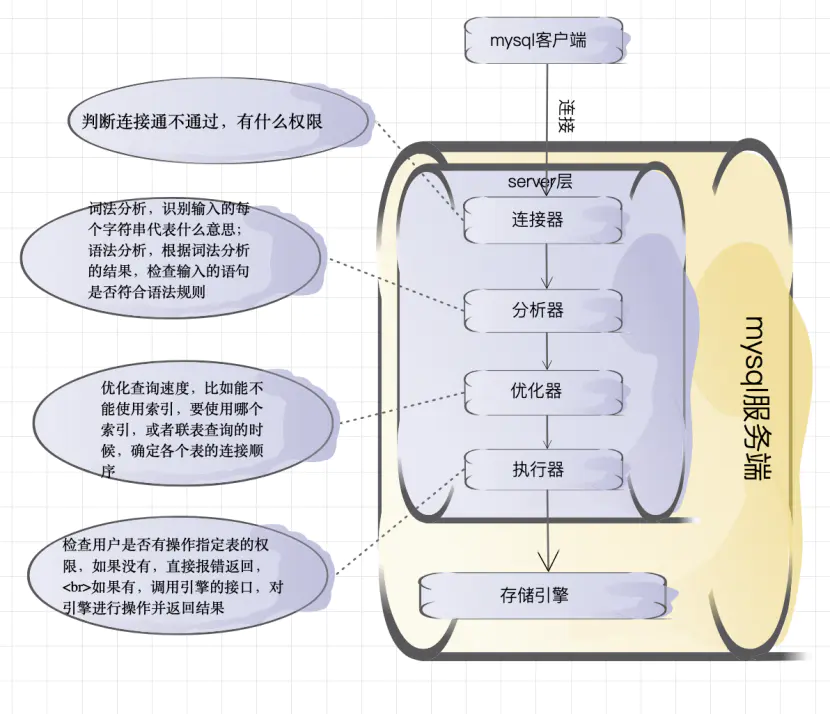
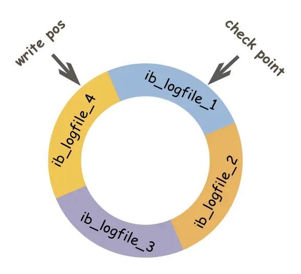
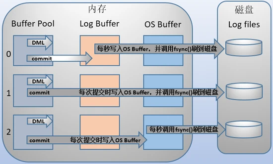

<!-- START doctoc generated TOC please keep comment here to allow auto update -->
<!-- DON'T EDIT THIS SECTION, INSTEAD RE-RUN doctoc TO UPDATE -->
**Table of Contents**  *generated with [DocToc](https://github.com/thlorenz/doctoc)*

- [MySQL](#mysql)
  - [MySQL架构](#mysql%E6%9E%B6%E6%9E%84)
    - [mysql查询和更新执行流程](#mysql%E6%9F%A5%E8%AF%A2%E5%92%8C%E6%9B%B4%E6%96%B0%E6%89%A7%E8%A1%8C%E6%B5%81%E7%A8%8B)
  - [MySQL索引](#mysql%E7%B4%A2%E5%BC%95)
  - [MySQL隔离级别](#mysql%E9%9A%94%E7%A6%BB%E7%BA%A7%E5%88%AB)
  - [redo log、bin log、undo log](#redo-logbin-logundo-log)
    - [redo log（重做日志）](#redo-log%E9%87%8D%E5%81%9A%E6%97%A5%E5%BF%97)
    - [bin log（归档日志）](#bin-log%E5%BD%92%E6%A1%A3%E6%97%A5%E5%BF%97)
    - [undo log（回滚日志）](#undo-log%E5%9B%9E%E6%BB%9A%E6%97%A5%E5%BF%97)
  - [MVCC](#mvcc)
    - [一致性非锁定读](#%E4%B8%80%E8%87%B4%E6%80%A7%E9%9D%9E%E9%94%81%E5%AE%9A%E8%AF%BB)
    - [锁定读](#%E9%94%81%E5%AE%9A%E8%AF%BB)

<!-- END doctoc generated TOC please keep comment here to allow auto update -->

# MySQL

## MySQL架构

mysql主要分为

- 连接层

处理tcp连接、授权认证

- 服务层

主要核心层，包含查询解析、分析、优化、缓存、触发器、存储过程、视图等

- 引擎层

服务层通过API与引擎层通信，负责数据的储存和提取

- 储存层

将数据写入文件系统中，完成与储存引擎的交互

### mysql查询和更新执行流程

**查询流程**

- 连接器处理客户端连接
- 根据语句查询缓存，有缓存直接返回
- 分析器对语句进行分析，是否合法，生成解析树
- 优化器根据生成的解析树，查询最优方案
- 执行器根据优化器方案执行，调用储存引擎API
- 储存引擎从文件系统查询数据返回

## MySQL索引

**索引分类**

- 普通索引 对关键字没有限制
- 唯一索引：索引列的值必须唯一，但允许有空值
- 主键索引，主键索引唯一且不能为null
- 全文索引

**索引数据结构**

- hash

通过计算hashcode值，存放在不同位置

- BTree

Innodb的索引采用B+树的数据结构，所有数据存放在叶子节点，非叶子节点不存储任何数据，每个相邻的叶子节点增加链表指针，提高区间访问效率，这种索引也叫**聚簇索引**

**覆盖索引**

如果一个索引包含了所有需要查询的字段，称之为覆盖索引

**避免索引失效**

1、like以%开头，索引失效
> 解决办法是使用覆盖索引

2、or语句前后没有同时使用索引，索引失效

3、使用复合索引，不使用第一列的索引，索引失效

4、数据类型出现隐式转换，如varchar不加单引号的话会自动转换为int型，索引失效

5、索引字段上使用not、<>、 !=，不等于操作符不会使用索引

6、对索引字段进行计算操作、字段上使用函数

7、当全表扫面比索引快的时候，优先使用全表扫描

8、in走索引，not in 不走索引

**SQL优化**

1、使用全值匹配

2、最左前缀法则
> 如果索引有多列，不能跳过索引列

3、范围查询右边的列，不使用索引，索引失效

4、不要再索引列上进行运算操作，索引失效

5、字符串不加单引号，索引失效

6、尽量使用覆盖索引，避免select *

7、使用or时，前面的条件有索引，后面的提交没有索引，那么整个索引失效

8、模糊匹配，%在前索引失效，可以使用覆盖索引

9、尽量使用in，不要使用not in

10、避免使用select *

11、对where、join order by字段建立索引能够提高查询效率

## MySQL隔离级别

- READ-UNCOMMITTED(读取未提交)： 最低的隔离级别，允许读取尚未提交的数据变更，可能会导致脏读、幻读或不可重复读。
- READ-COMMITTED(读取已提交)： 允许读取并发事务已经提交的数据，可以阻止脏读，但是幻读或不可重复读仍有可能发生。
- REPEATABLE-READ(可重复读)： 对同一字段的多次读取结果都是一致的，除非数据是被本身事务自己所修改，可以阻止脏读和不可重复读，但幻读仍有可能发生。
- SERIALIZABLE(可串行化)： 最高的隔离级别，完全服从 ACID 的隔离级别。所有的事务依次逐个执行，这样事务之间就完全不可能产生干扰，也就是说，该级别可以防止脏读、不可重复读以及幻读。

## redo log、bin log、undo log

### redo log（重做日志）

> redo log是mysql中用于记录事务对数据页做了哪些修改，保证数据持久性

由innodb引擎实现的，采用采用大小固定，循环写入的方式，当写入到结尾时，会回到开头循环写日志

有了redo log,如果数据库发生宕机，可通过redo log将未落盘的数据恢复，保证已提交的数据不会丢失

redo log包含两部分，redo log buffer、redo log file

redo log buffer写入redo log file实际上是先写入OS Buffer，然后通过调用fsyn()将其刷入到redo log file

**刷盘时机**

通过innodb_flush_log_at_trx_commit参数配置

- 0（延迟写）: 每秒写入OS buffer，并调用fsync()写入redo log file中
- 1（实时写，实时刷）: 实时写入OS buffer，并调用发fsync()写入redo log file
- 2（实时写，延迟刷）: 写入到OS buffer，每秒调用fsync()写入redo log file

**执行过程**

- 执行开始事务，查询buffer pool是否存在缓存，没有则将数据加载到缓存
- 修改缓存中的数据，写入redo log日志，状态为`prepared`阶段，返回执行结果
- 执行提交事务，写入bin log日志，将redo log的日志状态修改为`commit`,提交事务完成

redo log设置commit阶段发生异常，那会不会回滚事务呢？
> 只要bin log写入成功，数据就不会回滚，mysql会提交事务恢复数据

### bin log（归档日志）

> bin log是mysql用于记录数据库执行的写入性操作（不包含查询）信息，以二进制的形式保存在磁盘中，保证数据一致性

bin log由server层负责，铜鼓文件追加的方式写入，放文件超过指定大小后，会生成新的文件来保存日志

**使用场景**

- 主从复制，master将bin log发送给slave，slave重放bin log日志达到数据一致性
- 数据恢复，使用mysqlbinlog工具恢复数据

**刷盘时机**

mysql通过sync_binlog控制刷盘bin log的刷盘时机，取值范围是0-n

- 0：由系统自行判断何时写入
- 1：每次commit的时候都要写入
- n，每N个事务，才会将bin log写入磁盘

**日志格式**

- statement

基于sqk语句的复制，每一条修改的sql语句会记录到bin log中，5.7.7以前默认格式

- row

基于行的复制，仅记录哪条sql语句被修改了

- mixed

混合模式，一般情况使用statement模式，statement无法复制则使用row模式保存

### undo log（回滚日志）

> undo log的两个作用，提供回滚和多个行版本控制(MVCC）,保证数据原子性

数据修改的时候不仅记录了redo，还记录的undo，事务执行失败或回滚，客通古undo log回滚

当执行insert时，会记录delete语句，执行update时，记录相反的update语句

## MVCC

### 一致性非锁定读

一致性非锁定读通过版本号机制实现，通过增加一个版本号或时间戳，更新时将版本号+1或更新时间戳，查询时，将当前可见的版本号与记录的版本号对比，记录的版本号小于可见版本号，则代表记录可见

### 锁定读

