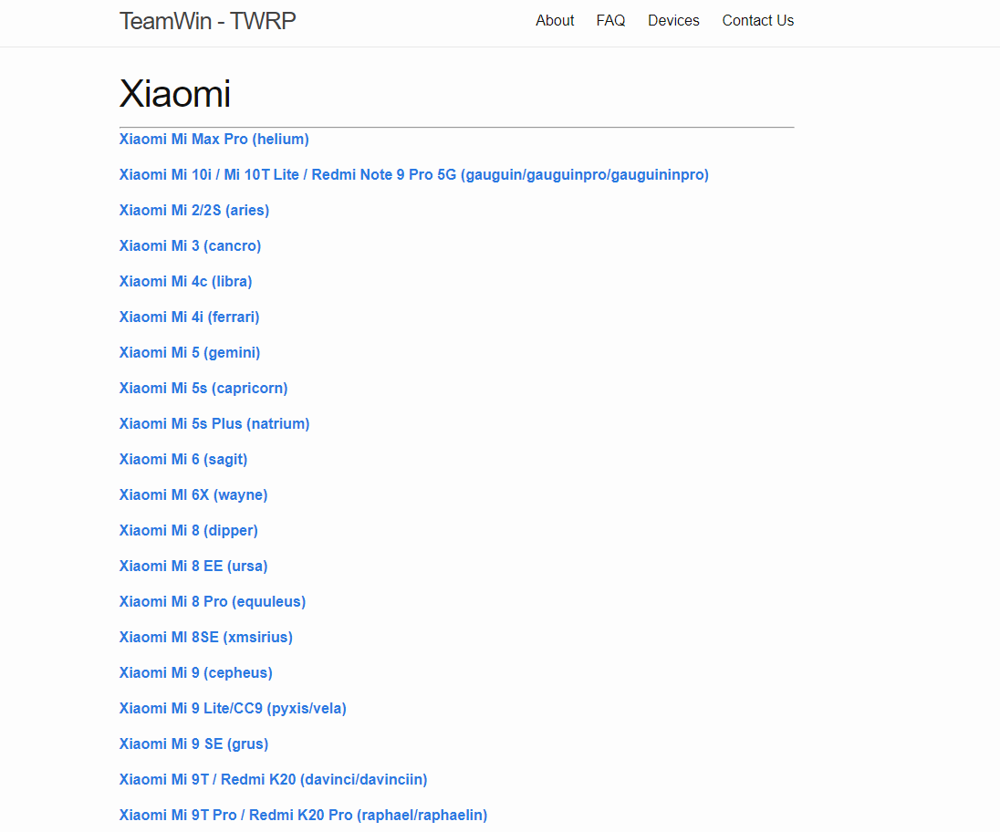

# 如何刷机获得Root权限

> 以下介绍小米手机获得root权限的办法，其他品牌同理

!> 注意，手机获得root权限有一定安全风险，可能导致手机变砖（无法开机），手机数据丢失，请在root前仔细备份手机数据

## 准备

?> 目前刷机的方式有两种，一种是卡刷，一种是线刷

> **需要了解的一些概念**

- **ROM**

ROM 是 ROM image（只读内存镜像）的简称，常用于手机定制系统玩家的圈子中。 一般手机刷机的过程，就是将只读内存镜像（ROM
image）写入只读内存（ROM）的过程。 常见的 ROM
image 有 img、zip 等格式，前者通常用 fastboot 程序通过数据线刷入（线刷），后者通常用 recovery 模式从 sd刷入（卡刷），故 img
镜像也被称为线刷包，zip
镜像也被称为卡刷包。 国内的定制系统开发者，经常会陷入自己的产品究竟是应该称为 OS还是 UI的争论，为了避免此类争论和表示谦虚，会自称为
ROM。很多定制系统玩家也会统一将定制系统称为 ROM
--引用百度百科

- **bootloader**

Boot Loader
是在操作系统内核运行之前运行的一段小程序。通过这段小程序，我们可以初始化硬件设备、建立内存空间的映射图，从而将系统的软硬件环境带到一个合适的状态，以便为最终调用操作系统内核准备好正确的环境。通常，Boot
Loader 是严重地依赖于硬件而实现的，特别是在嵌入式世界

小米手机的bootloader是加了锁的，需要手动进行解锁，具体解锁步骤请详细查看[小米如何解锁bootloader](https://zhuanlan.zhihu.com/p/100606502)
,bootloader就和电脑bios是一个东西，他所作的事情就是初始化硬件，cpu时钟之类的，以及加载内核文件等

- **fastboot**

它是bootloader后期进入的一个特殊阶段。可以通过数据线与电脑连接，然后在电脑上执行一些命令，如刷系统镜像到手机上。fastboot可以理解为实现了一个简单的通信协议，接收命令并更新镜像文件，其他什么的干不了，**
小米手机关机后，开机时按住电源键+音量下键进入fastboot模式**

- **recovery**

如果没有进入fastboot，bootloader继续执行，如果又发现有特殊的按键组合，**小米手机关机后，开机时按住电源键+音量上键进入recovery模式
**
，recovery相当于一个小型的操作系统，默认是官方的，可以自己刷入第三方的recovery，也就是REC，比如[TWRP](https://twrp.me/)
,下面主要演示刷入第三方REC，在recovery模式下，会加载了部分文件系统，所以才可以读sdcard中的update.zip进行刷机，当然，也可以清除cache和用户数据。

- **卡刷**

卡刷一般是在recovery里进行的，有直接刷镜像的比如kernel部分，但像system都是挂载system分区后再个别的更新里面的文件（差分或者直接覆盖），而不是像线刷那样把整个system镜像重刷一次

- **线刷**

通过数据线连接电脑来进行刷机，系统底包，一般是 tg 压缩文件，里面是一大堆 img
文件，某些底包里也有文件夹。也就是通过fastboot模式刷入ROM，小米的线刷可以到[小米社区](https://www.miui.com/download.html)
下载对应的版本进行线刷，不过线刷都只能刷入稳定版，而稳定版是没有root权限的


# 下面正式开始进入root教程

在开始之前再次提醒你做好备份，手机数据会被全部清空，将手机数据备份到云或电脑

## 1、解除BL锁

参考官方<https://web.vip.miui.com/page/info/mio/mio/detail?postId=17936575&app_version=dev.20051>

## 2、刷入第三方REC

> 第三方的Recovery[TWRP](https://twrp.me/)

!> 再次提醒，请做好手机数据备份，**root有风险，刷机需谨慎**
，在开始前请[解锁bootloader](https://zhuanlan.zhihu.com/p/100606502),其他手机品牌请到官方查找解决方法

首先到[TWRP官方](https://twrp.me/Devices/)找到你的对应手机版本的TWRP,目前主流的手机品牌都支持,我这里使用的是小米9SE



然后下载，因为是外网所以比较慢，建议开代理下载

- 下载完成后，使用数据线连接手机，手机关机，然后在关机状态后按住电源键+音量下键进入**fastboot模式**，此时fastboot已是解锁状态了

- 下载[fastboot工具](https://dl.google.com/android/repository/platform-tools-latest-windows.zip)

- 打开cmd，进入fastboot工具的下载目录，将下载的twrp复制到此目录，执行以下命令

```shell
fastboot boot recovery  twrp.img
```

(twrp.img替换成刚才下载的镜像名称)

等待出现 **finished total time** 后表示刷入成功。

这是手机会进入twrp的界面，这是twrp的临时使用的

接下来,在setting中先将twrp的语言修改为中文

在**清楚**选项中清楚data目录，不然等下安装会提示unable mount的报错

然后在**高级**选择`刷入当前twrp`，等待执行成功，刷入后先不要重启，后面需要继续刷入magisk

## 刷入Magisk

> Magisk是一套开放源代码的Android（4.2及以上版本）自定义工具套组，内置了Magisk
>
Manager（图形化管理界面）、Root、启动脚本、SElinux补丁和启动时认证/dm-verity/强制加密移除功能。Magisk同时提供了在无需修改系统文件的情况下更改/system或/vendor分区内容的接口，利用与Xposed类似的模块系统，开发者可以对系统进行修改或对所安装的软件功能进行修改等。
>
>除此之外，Magisk可以对其他验证系统完整性的应用程序进行隐藏（称为Magisk Hide），使得用户可在获取Root权限的情况下使用如向导宝可梦GO、Fate/Grand
> Order一类的应用程序或开启支付宝、微信的指纹支付功能

前面已经成功刷入第三方的rec了，借助第三方的rec，我们就可以卡刷了，然后开始刷入magisk，首先到GitHub下载最新版本的[magisk](https://github.com/topjohnwu/Magisk)
,并下载安装[magisk
manager](https://github.com/topjohnwu/MagiskManager)，自己记下magisk文件下载的位置

接上面安装twrp成功后，将下载的magisk.apk修改为magisk.zip放入到[fastboot工具目录下]，执行以下命令推送到sd卡


> 从 Magisk 22 开始，不再区分刷写用的 .zip 包与安装管理器用到的 .apk 应用安装包，二者合一且只有后缀的区别，默认提供 .apk 包，更改后缀为 .zip 后即可被刷写

```shell
adb push .\Magisk-v25.2.zip /sdcard
```

然后在**安装**选择`magisk-v25.2.zip`刷入镜像，刷入成功选择左边的清楚cache/dalvik,然后重启系统，自此大功告成


可以在magisk manager在线安装第三方的框架，像Riru Xposed 这鞋强大的框架

## 安装太极

> 太极是一个能够运行 Xposed 模块的框架，模块能通过它改变系统和应用的行为。太极既能以传统的 Root/刷机方式运作，也能免 Root/
> 免刷机运行；并且它支持 Android 5.0 ~ 11。
>
>简单来说，太极就是一个 类 Xposed框架，它能够加载 Xposed 模块、修改系统和 APP、拦截方法，执行 hook 逻辑等


[太极](https://taichi.cool/zh/)
一个免root运行类的Xposed框架，显然可以免Root，但功能都比较鸡肋，有两个版本，太极阴和太极阳，太极阴免Root运行，太极阳则是Root运行，这里使用太极阳版本

- 下载太极阳版本，官方没有提供太极阳的下载地址，需要到太极的公众号回复太极阳下载

- 下载太极的zip包，接下来就可以使用magisk manager安装了，在magisk manager的安装界面，选择从**本地安装**,选择下载的taichi-magisk
  zip包，安装成功后然后重启

- 开始玩机 太极提供了许多的模块，消息防撤回、自动强红包、虚拟定位、运动修改器等等，大大提高了可玩性


## 结语

剩下的就靠你自己探索了，更多的可玩性，比如还可以安装Riru
Xposed框架等，有了root权限，可以完全控制自己的手机，app广告不存在的，微信登陆确认不存在的，垃圾app频繁自启动不存在的，微信消息撤回、微信内置浏览器等等，功能非常强大，剩下的就交给你们自己了
