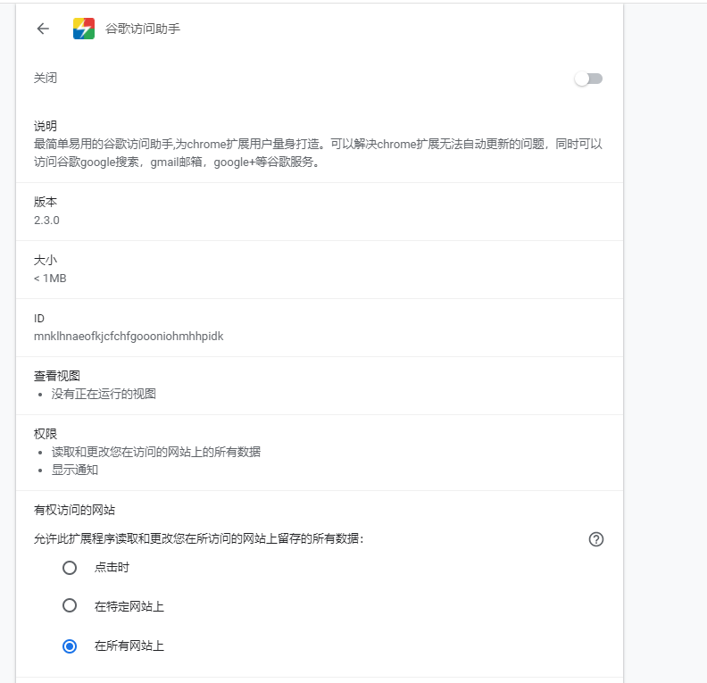
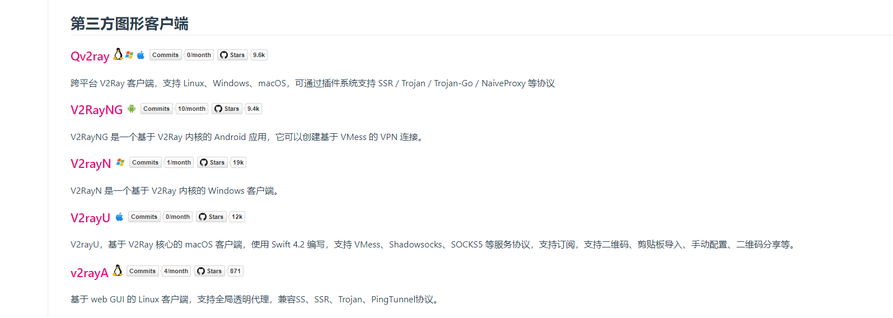
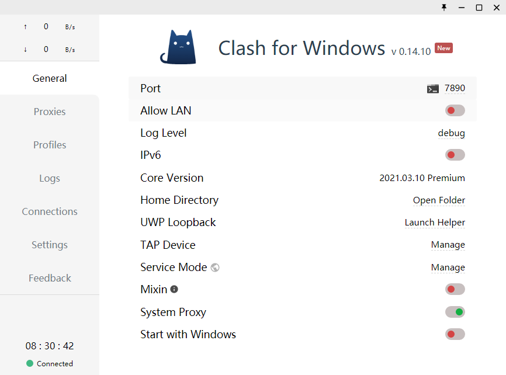

# 科学上网的正确姿势

> 下面是我折腾代理的记录了，搞开发不开代理的话如同回到了2G时代，是真的慢，访问github stackOverFlow、google没有代理都不行,接下来教你如何使用代理，不过想要稳定速度快一定的话都要收费，也不知道我这篇文章会不会被和谐，大家且行且珍惜

- 代理的种类，网上整理的

1、 Http代理 ：最常用的代理，代理客户机的http访问，主要代理浏览器访问网页，它的端口一般为80、8080、3128等。

2、SSL代理也叫 HTTPS代理 ，支持最高128位加密强度的http代理，可以作为访问加密网站的代理。加密网站是指以https//开始的网站。ssl的标准端口为443。

3、HTTPCONNECT代理：允许用户建立TCP连接到任何端口的 代理服务器 ，这种代理不仅可用于HTTP，还包括FTP、IRC、RM流服务等。

4、POP3代理：代理客户机上的邮件软件用pop3方式收邮件，其端口一般为110。

5、TUNNEL代理：经HTTPTunnet程序转换的数据包封装成http请求(Request)来穿透防火墙，允许利用HTTP服务器做任何TCP可以做的事情，功能相当于Socks5。

6、Telnet代理：能够代理通信机的telnet，用于远程控制，入侵时经常使用。其端口一般为23。

7、Socks代理：是全能代理，就像有很多跳线的转接板，它只是简单地将一端的系统连接到另外一端。支持多种协议，包括http、ft国内 IP代理
p请求及其它类型的请求。它分socks4和socks5两种类型，socks4只支持TCP协议而socks5支持TCP/UDP协议，还支持各种身份验证机制等协议。其标准端口为1080。

8、FTP代理：代理客户机上的ftp软件访问ftp服务器，其端口一般为21、2121。9、Ssso代理：代理客户机上的ssso程序访问远程网站，具有SSL加密强度的超级代理，支持socks。

10、Flat代理：代理客户机上的flatsurfer程序访问远程网站，具有高强度加密数据流的特殊代理，支持socks，最大可设置三次级联，可以设置穿越代理。其端口一般为6700。

11、文献代理：可以用来查询数据库的代理，通过这些代理，可以获得互联网的相关科研学术的数据库资源，例如查询Sciencedirect网站(简称SD)
、AcademicPress、IEEE，SPRINGER等数据库。

12、SoftE代理：代理客户机上的SoftEther程序访问远程网ip代理软件站，应用虚拟集线器HUB和虚拟网卡技术，具备VPN功能及多种认证方式的代理，符合https协议。

13、教育网代理：指学术教育机构局域网通过特定的代理服务器可使无出国权限或无访问某IP段权限的计算机访问相关资源。

14、跳板代理：应用于跳板程序，可以看作一种具有动态加密的特殊socks5代理，也可直接用于PSD软件。

## 使用google访问助手插件

这个针对使用google浏览器的，可以通过安装该插件实现代理，不过速度都比较慢，一般用来同步google账户、查看邮箱之类的，看网页的话就算了还是比较慢

## 使用SSR客户端

> Shadowsocks（简称SS）是一种基于Socks5代理方式的加密传输协议，也可以指实现这个协议的各种开发包。目前包使用Python、C、C++、C#、Go语言、Rust等编程语言开发，大部分主要实现（iOS平台的除外）采用Apache许可证、GPL、MIT许可证等多种自由软件许可协议开放源代码。Shadowsocks分为服务器端和客户端，在使用之前，需要先将服务器端程序部署到服务器上面，然后通过客户端连接并创建本地代理。

在中国大陆，本工具广泛用于突破防火长城（GFW），以浏览被封锁、遮蔽或干扰的内容。2015年8月22日，Shadowsocks原作者Clowwindy称受到了中华人民共和国政府的压力，宣布停止维护此计划（项目）并移除其个人页面所存储的源代码

为了避免关键词过滤，网民会根据谐音将ShadowsocksR称为“酸酸乳”[注 1]
（SSR），将Shadowsocks称为“酸酸”（SS）。另外Shadowsocks的标志为纸飞机，而专门提供Shadowsocks或类似软件（如V2Ray）服务器的网站也被称为“机场”。

因为这个项目源码被删除了，现在网上都是备份的版本，可以试试，个人就不推荐使用了

## 使用V2Ray客户端

> V2Ray（也简称V2），是Victoria Raymond开发的Project V下的一个工具。Project V是一个工具集合，号称可以帮助其使用者打造专属的基础通信网络。Project V的核心工具称为V2Ray，其主要负责网络协议和功能的实现，与其它Project V通信。V2Ray可以单独运行，也可以和其它工具配合，以提供简便的操作流程。开发过程主要使用Go语言，Core采用MIT许可证并开放源代码。

在中国大陆，本工具广泛用于突破防火长城（GFW），以访问被封锁和屏蔽的内容

V2Ray的运行原理与其他代理工具基本相同，使用特定的中转服务器完成数据传输。例如，用户无法直接访问Google，YouTube等网站，但代理服务器可以访问，且用户可以直接连接代理服务器，那么用户就可以通过特定软件连接代理服务器，然后由代理服务器获取网站内容并回传给用户，从而实现代理上网的效果。服务器和客户端软件会要求提供密码和加密方式，双方一致后才能成功连接。连接到服务器后，客户端会在本机构建一个本地Socks5代理（或VPN、透明代理等）。浏览网络时，客户端通过这个Socks5（或其他形式）代理收集网络流量，然后再经混淆加密发送到服务器端，以防网络流量被识别和拦截，反之亦然。其他代理工具定位只是一个简单的代理工具，而
V2Ray 定位为一个平台，任何开发者都可以利用 V2Ray 提供的模块开发出新的代理软件

在Github上[下载v2ray](https://github.com/v2fly/v2ray-core)的客户端程序

目前v2Ray有许多版本，X版的，U版的，N版的，A版的,[自行下载](https://www.v2fly.org/awesome/tools.html#%E5%9C%A8%E7%BA%BF%E5%B7%A5%E5%85%B7)对应版本

## 使用Clash客户端

> Clash是一款用 Go开发的支持 Linux/MacOS/Windows等多平台的代理工具，支持 ss/v2ray/snell（不支持 ssr），支持规则分流（类似于 Surge 的配置）

- 项目地址

core:[clash](https://github.com/Dreamacro/clash)

clash form
windows/macOS: [clash for windows](https://github.com/Fndroid/clash_for_windows_pkg/releases)

clash for android : [clash for android](https://github.com/Kr328/ClashForAndroid)

详细请移步[官方文档](https://docs.cfw.lbyczf.com/contents/quickstart.html)

还有ClashR版本，支持trojan

- trojan
  trojan是近两年兴起的网络工具，[项目官网](https://github.com/trojan-gfw)。与强调加密和混淆的SS/SSR等工具不同，trojan将通信流量伪装成互联网上最常见的https流量，从而有效防止流量被检测和干扰。在敏感时期，基本上只有trojan和
  v2ray伪装 能提供稳如狗的体验。

- v2ray和trojan有如下区别及特点：

v2ray是一个网络框架，功能齐全；trojan只是一个绕过防火墙的工具，轻量级、功能简单；都使用TLS加密的情况下，理论上trojan比V2ray性能更好；
v2ray和trojan都能实现https流量伪装； v2ray内核用go语言开发，trojan是c++实现；
v2ray名气大，使用的人多，客户端很好用；trojan关注和使用的人少，官方客户端简陋，生态完善度不高。

## 免费SSR/v2ray

客户端有了还不行，得有账号啊，下面给几个免费分享ssr的项目

- 放牧的风 [free-ssr](https://github.com/ThinkDevelop/Free-SS-SSR)

- 公益ssr [share-ssr-v2ray](https://github.com/selierlin/Share-SSR-V2ray)

当然最好还是购买付费的，半年九十左右，一个月平均十五
