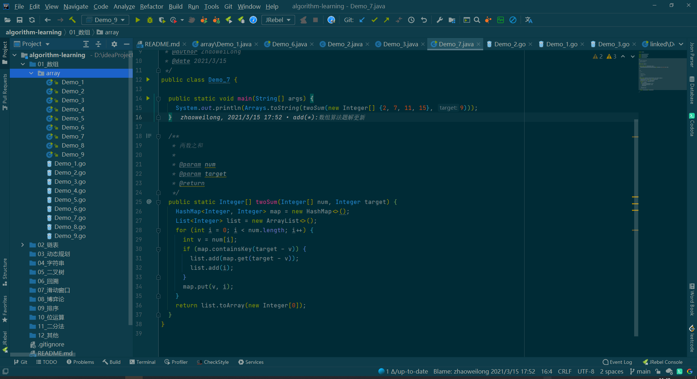

<!-- START doctoc generated TOC please keep comment here to allow auto update -->
<!-- DON'T EDIT THIS SECTION, INSTEAD RE-RUN doctoc TO UPDATE -->
**Table of Contents**  *generated with [DocToc](https://github.com/thlorenz/doctoc)*

- [IDEA常用插件](#idea%E5%B8%B8%E7%94%A8%E6%8F%92%E4%BB%B6)
  - [主题Solarized Thems](#%E4%B8%BB%E9%A2%98solarized-thems)
  - [Alibaba Java Coding Guidelines](#alibaba-java-coding-guidelines)
  - [CodeGlance](#codeglance)
  - [Codota](#codota)
  - [EasyCode](#easycode)
  - [GenerateAllSetter](#generateallsetter)
  - [google-java-format](#google-java-format)
  - [GitToolBox](#gittoolbox)
  - [JRebel](#jrebel)
  - [Json parse](#json-parse)
  - [Json2Pojo](#json2pojo)
  - [leetcode editor](#leetcode-editor)
  - [maven helper](#maven-helper)
  - [mybatisX](#mybatisx)
  - [translation](#translation)
  - [Shifter](#shifter)
  - [VisualVM](#visualvm)
  - [lombok](#lombok)
  - [GitHub Copilot](#github-copilot)
  - [Codota Ai](#codota-ai)

<!-- END doctoc generated TOC please keep comment here to allow auto update -->

# IDEA常用插件

> 分享下日常开发过程中使用到的插件

## 主题Solarized Thems

## Alibaba Java Coding Guidelines

> 阿里代码规范插件

## CodeGlance

> 可以在右边显示代码的缩略图

## Codota

> 智能代码提示，写代码非常的智能

## EasyCode

> mybatis自动生成代码插件，可以生成dao、entity、service、controller代码，还可以自定义生成模板

## GenerateAllSetter

> 在变量class上通过alt+enter生成对class所有setter方法的调用
> 当两个对象具有相同的字段时，生成一个转换器
> 当returnType为List Set Map时，生成默认值
> 对所有getter方法生成assertThat调用
> 就像用户类有setName、setPassword方法一样

## google-java-format

> google代码格式化插件

## GitToolBox

> git工具插件

## JRebel

> 一个热更新的插件，无需重启应用即可更新代码

## Json parse

> json解析插件

## Json2Pojo

> 将实体类生成 json字符串

## leetcode editor

> 力扣刷题插件

## maven helper

> 查看maven结构，解决依赖冲突

## mybatisX

> mybatis plus官方的生成器

## translation

> 翻译插件

## Shifter

> 移位器插件

## VisualVM

> 实时查看虚拟机运行状态，要到官方下载对应的VisualVM

## lombok

> 简化对象封装

## GitHub Copilot

> 非常强大的代码提示插件，可以根据注解生成代码

## Codota Ai

> 也是一个代码提示插件，自动生成常用片段代码

- 其他的

像docker、elasticsearch、kubernates等一些官方都提供了idea的插件，可自行搜索下载
