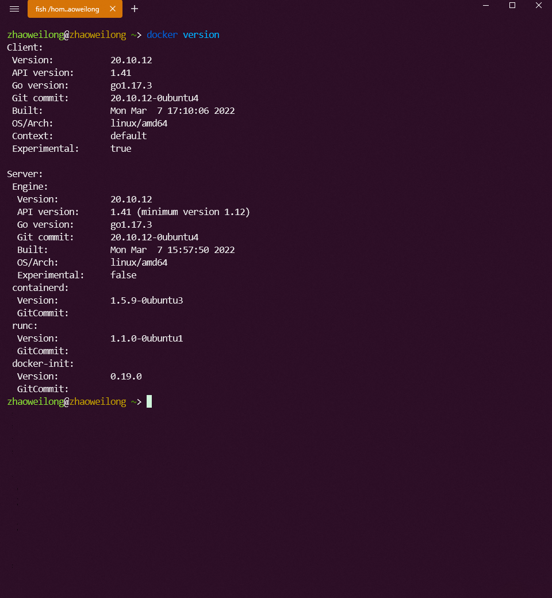

# Ubuntu22.04安装docker

## 更新软件镜像源

使用阿里的镜像源

编辑source.list文件

```shell
sudo vim /etc/apt/sources.list
```

vim命令替换镜像源

```
:%s/cn.archive.ubuntu.com/mirrors.aliyun.com/g
```


更新镜像

```
sudo apt update
```

## 安装docker

```shell
sudo apt install docker.io
```

启动docker服务

```shell
sudo systemctl start docker.service
```

开启开机自启动

```shell
sudo systemctl enable docker.service
```

以root身份运行docker

```shell
sudo usermod -aG docker $USER
```

重启生效

```shell
reboot
```

查看docker版本



配置docker镜像源

```shell
sudo vim /etc/docker/daemon.json
```

配置以下镜像，也可以配置自己阿里云的镜像地址，可以在阿里云的镜像仓库查看

```json
{
  "registry-mirrors": [
    "http://hub-mirror.c.163.com",
    "https://docker.mirrors.ustc.edu.cn",
    "https://registry.docker-cn.com"
  ]
}
```

重启docker服务

```shell
sudo service docker restart
```

运行hello-world，没有镜像会自动拉取镜像，默认版本为latest

```shell
docker run hello-world
```


安装Portainer docker管理工具，可以参考我的博客[portainer教程.md](/blog/portainer教程.md)

## 开启docker remote api

> 2375：未加密的docker socket,远程root无密码访问主机
>
> 2376：tls加密套接字,很可能这是您的CI服务器4243端口作为https 443端口的修改
>
> 2377：群集模式套接字,适用于群集管理器,不适用于docker客户端
>
> 5000：docker注册服务
>
> 4789和7946：覆盖网络


在/usr/lib/systemd/system/docker.service，配置远程访问。

```properties
[Service]
Type=notify
# the default is not to use systemd for cgroups because the delegate issues still
# exists and systemd currently does not support the cgroup feature set required
# for containers run by docker
ExecStart=/usr/bin/dockerd -H fd:// --containerd=/run/containerd/containerd.sock -H tcp://0.0.0.0:2375 -H unix://var/run/docker.sock
ExecReload=/bin/kill -s HUP $MAINPID
TimeoutSec=0
RestartSec=2
Restart=always
```

execStart加上`-H tcp://0.0.0.0:2375 -H unix://var/run/docker.sock`这两个参数

重启服务

```shell
sudo systemctl daemon-reload1
sudo systemctl restart docker
```

docker使用`-H`连接远程api，

```shell
docker -H tcp://localhost:2375 version
```


注意需要防火墙开启端口

```shell
sudo ufw allow 2375
```