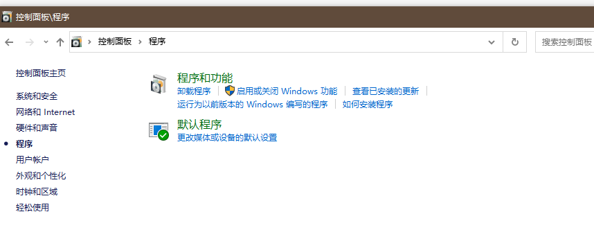
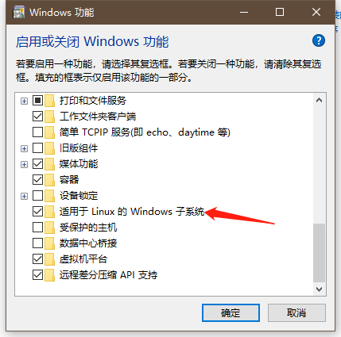
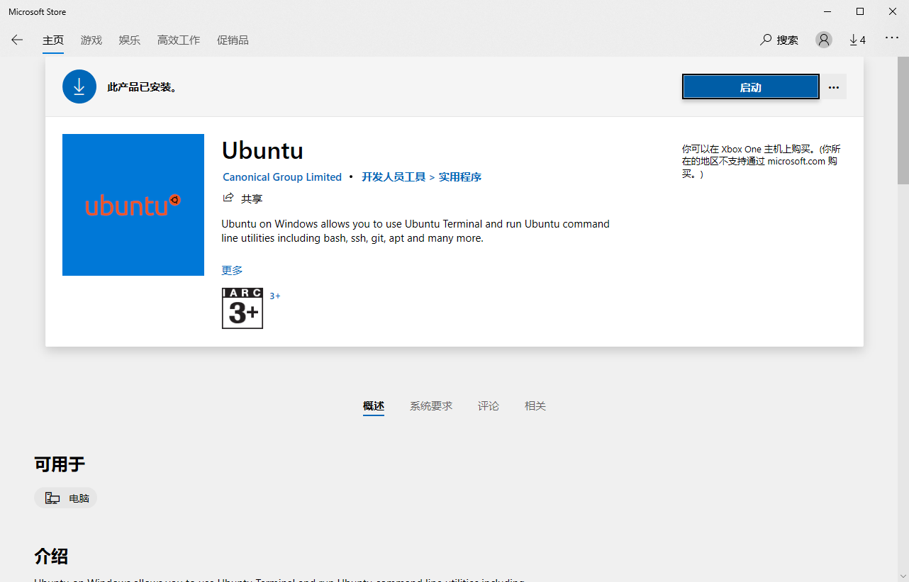

# window的linux子系统

> **适用于Linux的Windows子系统**（英语：Windows Subsystem for Linux，简称**WSL**）是一个为在[Windows 10](https://zh.wikipedia.org/wiki/Windows_10)和[Windows Server 2019](https://zh.wikipedia.org/wiki/Windows_Server_2019)上能够原生运行[Linux二进制可执行文件](https://zh.wikipedia.org/wiki/Linux)（[ELF](https://zh.wikipedia.org/wiki/可執行與可鏈接格式)格式）的[兼容层](https://zh.wikipedia.org/wiki/兼容层)。
>
> WSL提供了一个由[微软](https://zh.wikipedia.org/wiki/微软)开发的[Linux](https://zh.wikipedia.org/wiki/Linux)兼容的内核接口（不包含[Linux内核](https://zh.wikipedia.org/wiki/Linux内核)代码）[[1\]](https://zh.wikipedia.org/wiki/适用于Linux的Windows子系统#cite_note-1)，然后可以在其上运行[GNU](https://zh.wikipedia.org/wiki/GNU)[用户空间](https://zh.wikipedia.org/wiki/用户空间)，例如[Ubuntu](https://zh.wikipedia.org/wiki/Ubuntu)，[[2\]](https://zh.wikipedia.org/wiki/适用于Linux的Windows子系统#cite_note-2)[[3\]](https://zh.wikipedia.org/wiki/适用于Linux的Windows子系统#cite_note-3)[[4\]](https://zh.wikipedia.org/wiki/适用于Linux的Windows子系统#cite_note-4)[[5\]](https://zh.wikipedia.org/wiki/适用于Linux的Windows子系统#cite_note-5)[openSUSE](https://zh.wikipedia.org/wiki/OpenSUSE)，[[6\]](https://zh.wikipedia.org/wiki/适用于Linux的Windows子系统#cite_note-6)[SUSE Linux Enterprise Server](https://zh.wikipedia.org/wiki/SUSE_Linux_Enterprise_Server)，[[7\]](https://zh.wikipedia.org/wiki/适用于Linux的Windows子系统#cite_note-7)[[8\]](https://zh.wikipedia.org/wiki/适用于Linux的Windows子系统#cite_note-8)[[9\]](https://zh.wikipedia.org/wiki/适用于Linux的Windows子系统#cite_note-fall-9)[Debian](https://zh.wikipedia.org/wiki/Debian)[[10\]](https://zh.wikipedia.org/wiki/适用于Linux的Windows子系统#cite_note-10)和[Kali Linux](https://zh.wikipedia.org/wiki/Kali_Linux)。[[11\]](https://zh.wikipedia.org/wiki/适用于Linux的Windows子系统#cite_note-11)这样的用户空间可能包含[Bash](https://zh.wikipedia.org/wiki/Bash) shell和命令语言，使用本机GNU/Linux命令行工具（[sed](https://zh.wikipedia.org/wiki/Sed)，[awk](https://zh.wikipedia.org/wiki/Awk)等），编程语言解释器（Ruby，Python等），甚至是图形应用程序（使用主机端的[X窗口系统](https://zh.wikipedia.org/wiki/X窗口系统)）。[[12\]](https://zh.wikipedia.org/wiki/适用于Linux的Windows子系统#cite_note-ms-faq-12)

以上是维基百科的描述，下面教你如何使用wsl

- 准备工作

  打开控制面板-程序-启用或关闭windows功能

  

  

  选择然后打勾，然后重启

- 2 下载安装

  - 在microsoft store商店里找到ubuntu下载，最后打开就可以用了

    

- 3 更新wsl

  -  版本要求

  > 对于x64系统：**版本1903**或更高版本，以及**内部版本18362**或更高版本。
  >
  > 对于ARM64系统：**2004版**或更高版本，**内部****版本**19041或更高版本。
  >
  > 低于18362的内部版本不支持WSL2。使用[Windows Update Assistant](https://www.microsoft.com/software-download/windows10)来更新Windows版本。

  - 以管理员的身份打开PowerShell，运行以下命令启动虚拟机功能

    ~~~powershell
    dism.exe /online /enable-feature /featurename:VirtualMachinePlatform /all /norestart
    ~~~

    

  - 下载linux内核更新程序包

    > [用于x64机器的WSL2 Linux内核更新程序包](https://wslstorestorage.blob.core.windows.net/wslblob/wsl_update_x64.msi)

    下载完成后运行

  - 最后运行PowerShell命令

    ~~~powershell
    wsl --set-default-version 2
    ~~~

    将发行版本设置为WSL 1或WSL 2

    ~~~powershell
    wsl --set-version <distribution name> <versionNumber>
    ~~~

    确保`<distribution name>`用发行版的实际名称和`<versionNumber>`数字“ 1”或“ 2”代替。您可以随时通过运行与上述相同的命令将其替换为WSL 1，但将'2'替换为'1'。

    如：

    ~~~powershell
    wsl --set-version Ubuntu 2
    ~~~

  参考链接 [适用于Windows的Windows子系统Windows 10安装指南](https://docs.microsoft.com/en-us/windows/wsl/install-win10)