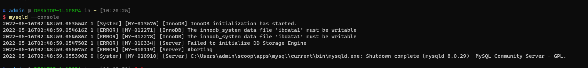
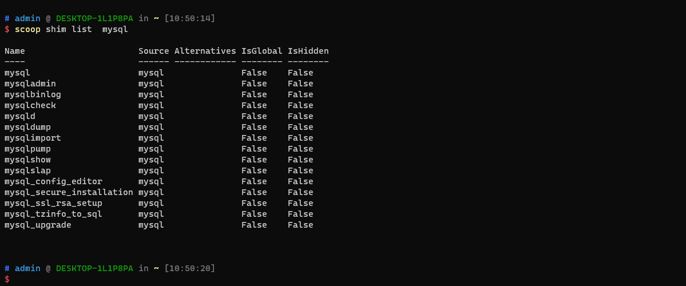

# Window的包管理器

> Scoop是Windows的命令行安装程序。 都知道window安装非常麻烦，每次安装软件要从官网下载可执行程序包，手动安装，安装开发环境更是麻烦的要死，像jdk、mysql、redis等等

而有了**scoop**包管理器之后，就只需一条命令即可安装完成，自动配置环境变量，非常的方便，话不多说，我们开始吧

**环境要求**
Windows 7 SP1 + / Windows Server 2008+ PowerShell 5（或更高版本，包括PowerShell Core）和.NET Framework
4.5（或更高版本） 必须为您的用户帐户启用PowerShell

## 安装scoop

先确保当前用户可以执行powershell脚本，执行以下命令

~~~powershell
Set-ExecutionPolicy -ExecutionPolicy RemoteSigned -Scope CurrentUser
~~~

运行以下脚本安装scoop

~~~powershell
Invoke-Expression (New-Object System.Net.WebClient).DownloadString('https://get.scoop.sh')

# or shorter
iwr -useb get.scoop.sh | iex
~~~

默认安装位置在C:\Users\<user>\scoop,全局的安装位置在C:\ProgramData\scoop

将scoop安装到自定义目录

~~~powershell
$env:SCOOP='D:\Applications\Scoop'
[Environment]::SetEnvironmentVariable('SCOOP', $env:SCOOP, 'User')
~~~

配置scoop全局安装的自定义目录

~~~powershell
$env:SCOOP_GLOBAL='F:\GlobalScoopApps'
[Environment]::SetEnvironmentVariable('SCOOP_GLOBAL', $env:SCOOP_GLOBAL, 'Machine')
~~~

## 使用ari2多线程下载

~~~powershell
scoop install ari2
~~~

## 添加储存库

- main 主库
- extras 扩展库
- games 游戏库
- nerd-fonts 字体库
- nirsoft Nirsoft程序库
- java java库
- jetbrains 安装jetbrains的IDE库
- nonportable 不可移植程序库
- php
- versions 替代版本库

使用以下命令添加储存库

~~~powershell
scoop bucket add bucketname
~~~

## 安装多jdk

使用scoop可以安装多个jdk，比如java8、java11、java15

使用命令切换不同的jdk

~~~powershell
scoop reset 对应的jdk版本
~~~

demo演示


## 其他命令

-查看 scoop list

-搜索 scoop search

-安装 scoop install

-卸载 scoop uninstall

-查看缓存 scoop cache show

-更新 scoop update

-清除老版本 scoop cleanup

## 按章MySQL

```shell
scoop install mysql
```

默认安装最新的MySQL版本，我这里的是8.0.29

安装成功后，使用管理员身份打开cmd

执行mysql初始化命令

```shell
mysqld --initialize-insecure
```

会发现程序在mysql的根目录下自动创建了data文件夹以及相关的文件

注册mysql服务,路径改成自己的配置文件路径

```shell
mysqld --install MySQL --defaults-file="C:\Users\admin\scoop\apps\mysql\current\my.ini"
```

启动mysql服务

```shell
net start mysql
```

修改mysql密码，进行mysql控制台,第一次不需要输入直接回车进入

```shell
mysql -u root -p
```

mysql8.0以上使用以下修改密码，先执行`use mysql;`再执行

```shell
alter user 'root'@'localhost' identified by '设置的新密码';
```

执行成功，刷新权限

```shell
flush priviliges;
```



查看mysql所有命令
