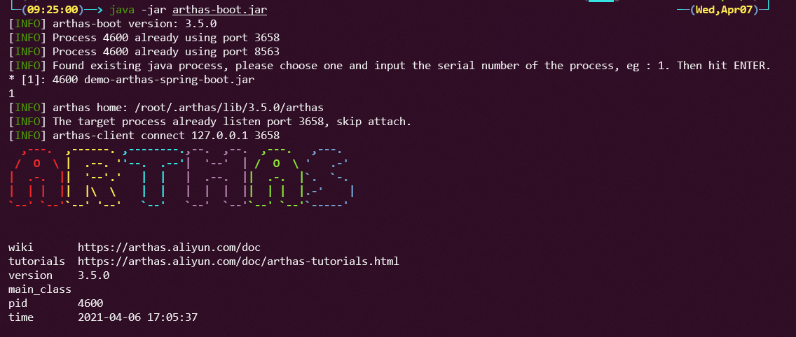
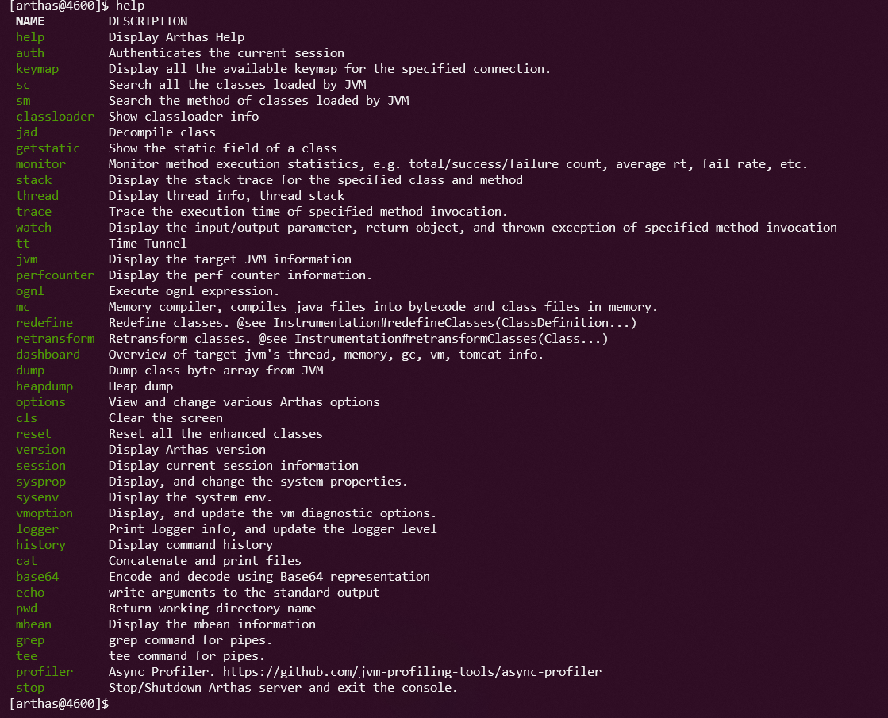

# 强大的Java诊断利器-Arthas

<!-- @import "[TOC]" {cmd="toc" depthFrom=1 depthTo=6 orderedList=false} -->

<!-- code_chunk_output -->

- [强大的Java诊断利器-Arthas](#强大的java诊断利器-arthas)
    - [介绍](#介绍)
    - [下载arthas-boot.jar](#下载arthas-bootjar)
    - [启动Arthas](#启动arthas)
    - [Arthas常用命令](#arthas常用命令)
        - [jvm相关](#jvm相关)
            - [dashbord](#dashbord)
            - [sysprop](#sysprop)
            - [sysenv](#sysenv)
            - [thread](#thread)
            - [jvm](#jvm)
            - [ognl](#ognl)
            - [vmoption](#vmoption)
            - [heapdump](#heapdump)
        - [class/classload相关](#classclassload相关)
            - [sc](#sc)
            - [sm](#sm)
            - [jad](#jad)
            - [mc](#mc)
            - [retransform](#retransform)
            - [classload](#classload)
        - [monitor/watch/trace相关](#monitorwatchtrace相关)
            - [monitor](#monitor)
            - [watch](#watch)
            - [stack](#stack)
            - [trace](#trace)
            - [tt](#tt)
        - [profile火焰图](#profile火焰图)
        - [web console](#web-console)
    - [其他](#其他)

<!-- /code_chunk_output -->

### 介绍

> Arthas是由阿里巴巴中间件团队开源的Java诊断工具。它在开发人员中被广泛采用和流行

**主要有以下几种特性:**

- 仪表板：实时查看系统运行状态
- 参数/返回值异常：查看方法参数，返回值和异常
- 在线热更新：jad/sc/redefine 一条龙热更新代码
- 类冲突：在几秒钟内解决类冲突问题，找到类加载路径
- 火焰图：快速定位应用程序热点并生成火焰图
- Web控制台：在线诊断

我之前了解但也没实际使用下，下面就记录下学习使用的过程，大家也可以查看[官方文档](https://arthas.aliyun.com/en-us/)，最好跟着[在线教程](https://arthas.aliyun.com/doc/arthas-tutorials.html?language=cn&id=arthas-basics)走一遍

### 下载arthas-boot.jar

- curl下载 `curl -O https://arthas.aliyun.com/arthas-boot.jar`

- 脚本下载  `curl -L https://arthas.aliyun.com/install.sh | sh` 脚本通过./as.sh启动

- maven仓库下载 <https://arthas.aliyun.com/download/latest_version?mirror=aliyun>

- github下载 <https://github.com/alibaba/arthas/releases>

- rpm/deb安装

  下载rpm/deb包 <https://github.com/alibaba/arthas/releases>

  安装rpm/deb包 `sudo rpm -i arthas*.rpm` `sudo dpkg -i arthas*.deb`

### 启动Arthas

启动arthas前需要有java进程，执行 `java -jar arthas-boot.jar` 输入需要诊断的进程序号，退出使用`quit`,但会在后台运行，关闭使用`stop`
,arthas会全部退出， 使用`history`查看所有历史命令

使用`help`查看所有arthas的命令

输入命令时按下`TAB`键自动补全，使用`-h`参数列出命令所有参数,如 `thread -h`

### Arthas常用命令

#### jvm相关

###### dashbord

arthas控制台，看到查看线程、内存、gc、运行环境信息，每隔一段时间自动刷新

###### sysprop

查看和修改当前jvm，可以使用管道符指定要查看的参数，如`sysprop |grep java`

修改或添加属性 `sysprop property-name property-value` ,如`sysprop user.country US`

###### sysenv

查看当前jvm的环境属性 `sysenv USER`

###### thread

查看当前线程信息，查看线程堆栈

- `thread -n m` 查看最忙的前m个线程并打印堆栈
- `thread -b`  查看阻塞线程
- `thread -i ` 指定cpu使用率的采样时间间隔，单位毫秒

###### jvm

查看当前 JVM 的信息,包含运行时信息，堆内存，类加载，线程，垃圾回收等信息

###### ognl

执行ognl表达式

###### vmoption

查看，更新VM诊断相关的参数

更新指定的option: ` vmoption PrintGCDetails true`

###### heapdump

dump java heap, 类似jmap命令的heap dump功能。

dump到指定文件 ： `heapdump /tmp/dump.hprof`

只dump live对象： `heapdump --live /tmp/dump.hprof`

dump到临时文件： `heapdump `

#### class/classload相关

###### sc

查看jvm已加载的类信息

参数名称|参数说明
-------|-------
class-pattern|    类名表达式匹配
method-pattern|    方法名表达式匹配
[d]    | 输出当前类的详细信息，包括这个类所加载的原始文件来源、类的声明、加载的ClassLoader等详细信息,如果一个类被多个ClassLoader所加载，则会出现多次
[E]    | 开启正则表达式匹配，默认为通配符匹配
[f]    | 输出当前类的成员变量信息（需要配合参数-d一起使用）
[x:] |    指定输出静态变量时属性的遍历深度，默认为 0，即直接使用 toString 输出
[c:] |    指定class的 ClassLoader 的 hashcode
[classLoaderClass:]    | 指定执行表达式的 ClassLoader 的 class name
[n:] |    具有详细信息的匹配类的最大数量（默认为100）

> class-pattern支持全限定名，如com.taobao.test.AAA，也支持com/taobao/test/AAA这样的格式，这样，我们从异常堆栈里面把类名拷贝过来的时候，不需要在手动把/替换为.啦。
>
>sc 默认开启了子类匹配功能，也就是说所有当前类的子类也会被搜索出来，想要精确的匹配，请打开options disable-sub-class true开关

###### sm

查看已加载类的方法信息

参数名称|参数说明
-------|-------
class-pattern |    类名表达式匹配
method-pattern    |方法名表达式匹配
[d]    |展示每个方法的详细信息
[E]    |开启正则表达式匹配，默认为通配符匹配
[c:]|    指定class的 ClassLoader 的 hashcode
[classLoaderClass:]|    指定执行表达式的 ClassLoader 的 class name
[n:]|    具有详细信息的匹配类的最大数量（默认为100）

###### jad

反编译指定已加载类的源码

参数名称|参数说明
-------|-------
class-pattern|    类名表达式匹配
[c:]|    类所属 ClassLoader 的 hashcode
[classLoaderClass:]    |指定执行表达式的 ClassLoader 的 class name
[E]    |开启正则表达式匹配，默认为通配符匹配

###### mc

Memory Compiler/内存编译器，编译.java文件生成.class，-c 指定classload -d 指定输出目录

可以结合retransform实现热更新代码

###### retransform

加载外部的.class文件，retransform jvm已加载的类。
> 限制:
>
>不允许新增加field/method 正在跑的函数，没有退出不能生效

###### classload

查看classloader的继承树，urls，类加载信息，使用classloader去getResource

#### monitor/watch/trace相关

###### monitor

方法执行监控

###### watch

方法执行数据观测

###### stack

输出当前方法被调用的调用路径

###### trace

方法内部调用路径，并输出方法路径上的每个节点上耗时

###### tt

方法执行数据的时空隧道，记录下指定方法每次调用的入参和返回信息，并能对这些不同的时间下调用进行观测

#### profile火焰图

#### web console

Arthas目前支持Web Console，用户在attach成功之后，可以直接访问：http://127.0.0.1:3658/。

可以使用参数`--target-ip`连接远程服务

### 其他

在docker中使用<https://arthas.aliyun.com/doc/docker.html>

整合springboot应用<https://arthas.aliyun.com/doc/spring-boot-starter.html#>

使用idea plugin集成<https://www.yuque.com/docs/share/fa77c7b4-c016-4de6-9fa3-58ef25a97948?#>

更新功能详细查看官方文档吧，官网文档已经很详细了，我这里整理下常用的