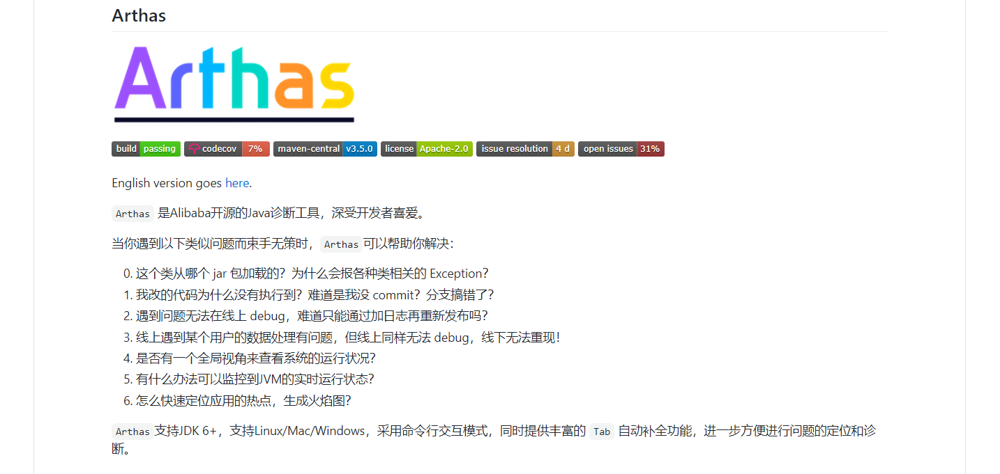

# 强大的Java诊断利器-Arthas

> Arthas是由阿里巴巴中间件团队开源的Java诊断工具。它在开发人员中被广泛采用和流行

**主要有以下几种特性:**

- 仪表板：实时查看系统运行状态
- 参数/返回值异常：查看方法参数，返回值和异常
- 在线热拔插：JAD / SC /重新定义在线热交换
- 类冲突：在几秒钟内解决类冲突问题，找到类加载路径
- 火焰图：快速定位应用程序热点并生成火焰图
- Web控制台：在线诊断

我之前了解但也没实际使用下，下面就记录下学习使用的过程，大家也可以查看[官方文档](https://arthas.aliyun.com/en-us/)，最好跟着[在线教程](https://arthas.aliyun.com/doc/arthas-tutorials.html?language=cn&id=arthas-basics)走一遍

业务繁忙，待更新...
