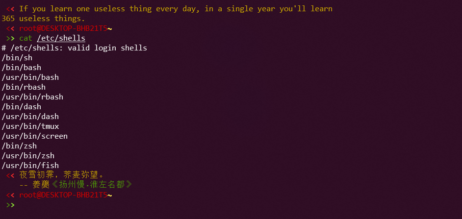
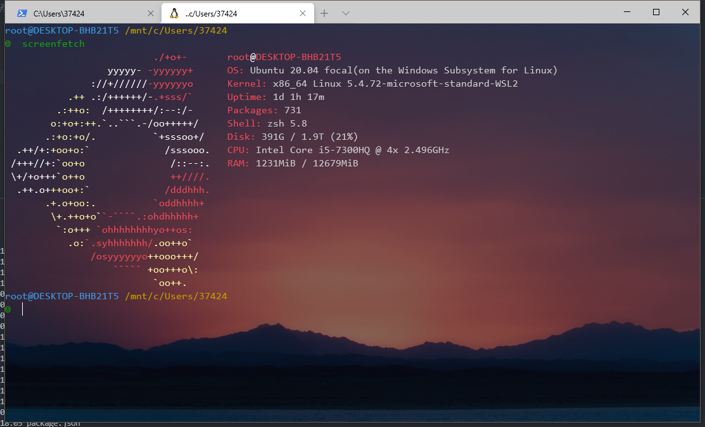
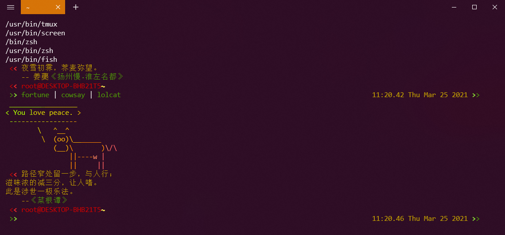

# 最好看的shell-zsh
> 常见的shell如bash、fish、sh、csh、ksh，但是都没有zsh这么好看

查看支持的shell
~~~shell
cat /etc/shells
~~~

## 安装zsh

ubuntu使用apt安装

~~~shell
sudo apt install zsh
~~~

将zsh设置为默认的shell

~~~shell
chsh -s /bin/zsh
~~~

## 安装oh my zsh
[github](https://github.com/ohmyzsh/ohmyzsh) [官网](https://ohmyz.sh/#install)

- 使用curl和wget命令安装

~~~shell
sh -c "$(curl -fsSL https://raw.github.com/ohmyzsh/ohmyzsh/master/tools/install.sh)"
~~~
或者
~~~shell
sh -c "$(wget https://raw.github.com/ohmyzsh/ohmyzsh/master/tools/install.sh -O -)"
~~~

- 使用git

克隆仓库
~~~shell
git clone git://github.com/robbyrussell/oh-my-zsh.git ~/.oh-my-zsh
cp ~/.oh-my-zsh/templates/zshrc.zsh-template ~/.zshrc
~~~

zsh的配置文件在~/.zshrc中

## 常用插件

接下来可以自定义主题插件，主题插件的位置在~/.oh-my-zsh文件夹的thems和plugins中

- **主题**
使用vim打开zshrc的文件
~~~shell
vim ~/.zshrc
~~~
找到这一行，修改主题配置，可以修改自己喜欢的主题，随机主题使用"random"
~~~
ZSH_THEME=”robbyrussell”
~~~

- **插件**

可以查看下官网文档说明这里就不一一展示了[插件说明](https://github.com/ohmyzsh/ohmyzsh/wiki/Settings#plugins)

- git
>这个是装好oh-my-zsh就默认已经开启的
>查看所有的git命令alias

~/.oh-my-zsh/plugins/git/git.plugin.zsh

- z
>这个是oh-my-zsh默认就装好的，需要自己开启。还有一个autojump的插件和z功能差不多，autojump需要单独装，
>如果z插件历史记录太多，并且有一些不是自己想要的，可以删除

z -x 不要的路径

- sublime

>又是一个自带的插件，同样需要自己开启，针对喜欢用sublime的小伙伴
>如果想要用sublime打开一个文件

st 文件路径
- vscode
>官网，随着Visual Studio Code越来越火，用的人也越来越多，可以装一下这个插件

 打开一个文件

vs 文件路径
~~~shell
git clone https://github.com/valentinocossar/vscode.git ${ZSH_CUSTOM:-~/.oh-my-zsh/custom}/plugins/vscode
~~~

- zsh-autosuggestions
>官网，非常好用的一个插件，会记录你之前输入过的所有命令，并且自动匹配你可能想要输入命令，然后按→补全

~~~shell
git clone https://github.com/zsh-users/zsh-autosuggestions ${ZSH_CUSTOM:-~/.oh-my-zsh/custom}/plugins/zsh-autosuggestions
~~~
- zsh-syntax-highlighting
>官网，命令太多，有时候记不住，等输入完了才知道命令输错了，这个插件直接在输入过程中就会提示你，当前命令是否正确，错误红色，正确绿色

~~~shell
git clone https://github.com/zsh-users/zsh-syntax-highlighting.git ${ZSH_CUSTOM:-~/.oh-my-zsh/custom}/plugins/zsh-syntax-highlighting
~~~
- sudo
>偶尔输入某个命令，提示没有权限，需要加sudo，这个时候按两下ESC，就会在命令行头部加上sudo

## 安装Terminal

- window terminal

在软件商店搜索 window terminal下载即可
window terminal支持自定义配置，包括背景图、字体、主题、透明度等等，具体可以看下官网说明

下面是我的配置，供参考

~~~json
{
    "$schema": "https://aka.ms/terminal-profiles-schema",

    "defaultProfile": "{61c54bbd-c2c6-5271-96e7-009a87ff44bf}",

    // You can add more global application settings here.
    // To learn more about global settings, visit https://aka.ms/terminal-global-settings

    // If enabled, selections are automatically copied to your clipboard.
    "copyOnSelect": false,

    // If enabled, formatted data is also copied to your clipboard
    "copyFormatting": false,

    // A profile specifies a command to execute paired with information about how it should look and feel.
    // Each one of them will appear in the 'New Tab' dropdown,
    //   and can be invoked from the commandline with `wt.exe -p xxx`
    // To learn more about profiles, visit https://aka.ms/terminal-profile-settings
    "profiles": {
        "defaults": {
            // Put settings here that you want to apply to all profiles.
        },
        "list": [{
                "guid": "{2c4de342-38b7-51cf-b940-2309a097f518}",
                "hidden": false,
                "name": "Ubuntu",
                "source": "Windows.Terminal.Wsl",
                "acrylicOpacity": 0.7,
                "backgroundImage": "E:/wallpaper/wallhaven-4x1gr3_1920x1080.png",
                "backgroundImageOpacity": 0.5,
                "closeOnExit": true,
                "colorScheme": "Campbell",
                "cursorColor": "#FFFFFF",
                "cursorShape": "bar",
                "fontFace": "Consolas",
                "fontSize": 12,
                "historySize": 9001,
                "padding": "0, 0, 0, 0",
                "snapOnInput": true,
                "tabTitle": "Ubuntu",
                "useAcrylic": false
            },
            {
                // Make changes here to the powershell.exe profile.
                "guid": "{61c54bbd-c2c6-5271-96e7-009a87ff44bf}",
                "name": "Windows PowerShell",
                "commandline": "powershell.exe",
                "hidden": false,
                "tabTitle": "PowerShell",
                "backgroundImage": "E:/wallpaper/wallhaven-4x1gr3_1920x1080.png",
                "acrylicOpacity": 1,
                "background": "#000000",
                "backgroundImageOpacity": 0.7,
                "colorScheme": "Campbell",
                "closeOnExit": true,
                "cursorColor": "#FFFFFF",
                "cursorShape": "bar",
                "fontFace": "Consolas",
                "fontSize": 12,
                "historySize": 9001,
                "padding": "0, 0, 0, 0",
                "snapOnInput": true,
                "startingDirectory": "%USERPROFILE%",
                "useAcrylic": false
            },
            {
                "guid": "{0caa0dad-35be-5f56-a8ff-afceeeaa6101}",
                "name": "CMD",
                "commandline": "cmd.exe",
                "hidden": false,
                "tabTitle": "CMD",
                "acrylicOpacity": 0.5,
                "backgroundImage": "E:/download/鬼刀18/鬼刀18/Aeolian3.jpg",
                "backgroundImageOpacity": 0.7,
                "closeOnExit": true,
                "cursorColor": "#FFFFFF",
                "cursorShape": "bar",
                "fontFace": "Consolas",
                "fontSize": 12,
                "historySize": 9001,
                "padding": "0, 0, 0, 0",
                "snapOnInput": true,
                "startingDirectory": "%USERPROFILE%",
                "useAcrylic": true
            },
            {
                "guid": "{b453ae62-4e3d-5e58-b989-0a998ec441b8}",
                "hidden": false,
                "name": "Azure Cloud Shell",
                "source": "Windows.Terminal.Azure"
            }

        ]
    },

    // Add custom color schemes to this array.
    // To learn more about color schemes, visit https://aka.ms/terminal-color-schemes
    "schemes": [],

    // Add custom keybindings to this array.
    // To unbind a key combination from your defaults.json, set the command to "unbound".
    // To learn more about keybindings, visit https://aka.ms/terminal-keybindings
    "keybindings": [
        // Copy and paste are bound to Ctrl+Shift+C and Ctrl+Shift+V in your defaults.json.
        // These two lines additionally bind them to Ctrl+C and Ctrl+V.
        // To learn more about selection, visit https://aka.ms/terminal-selection
        {
            "command": {
                "action": "copy",
                "singleLine": false
            },
            "keys": "ctrl+c"
        },
        {
            "command": "paste",
            "keys": "ctrl+v"
        },

        // Press Ctrl+Shift+F to open the search box
        {
            "command": "find",
            "keys": "ctrl+shift+f"
        },

        // Press Alt+Shift+D to open a new pane.
        // - "split": "auto" makes this pane open in the direction that provides the most surface area.
        // - "splitMode": "duplicate" makes the new pane use the focused pane's profile.
        // To learn more about panes, visit https://aka.ms/terminal-panes
        {
            "command": {
                "action": "splitPane",
                "split": "auto",
                "splitMode": "duplicate"
            },
            "keys": "alt+shift+d"
        }
    ]
}
~~~

- fluent terminal
>基于UWP和Web技术的终端仿真器

- 用于PowerShell, CMD, WSL或自定义shell的终端

- 内置的SSH和Mosh连接支持

- 支持选项卡和多个窗口

- 主题化和外观配置

- 导入/导出主题

- 摘要导入主题

- 全屏模式

- 编辑快捷键

- 搜索功能

- 配置shell配置文件，以便在不同的shell之间快速切换

- 资源管理器上下文菜单集成(安装脚本可以在这里找到)
